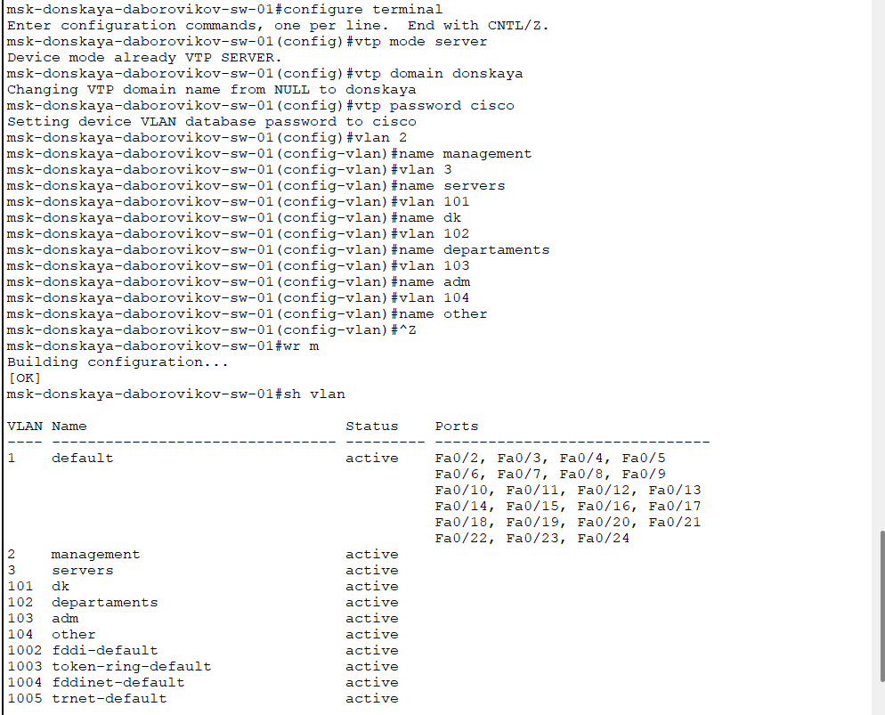
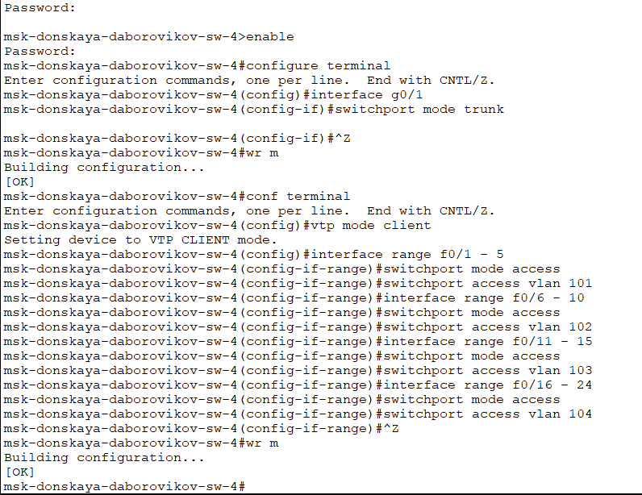
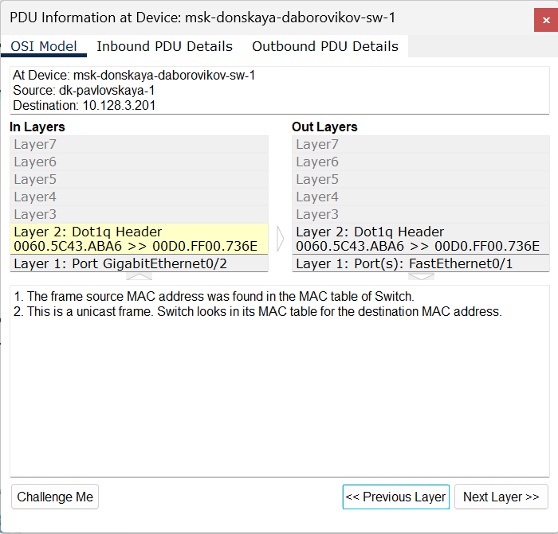
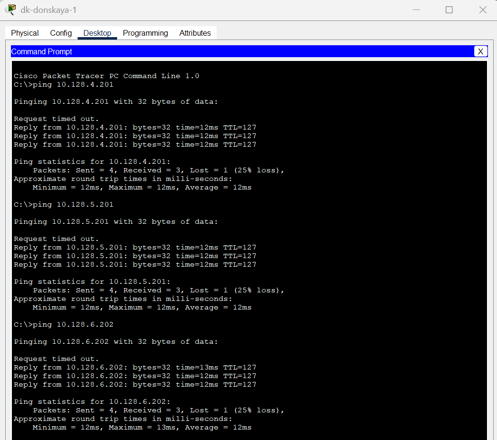
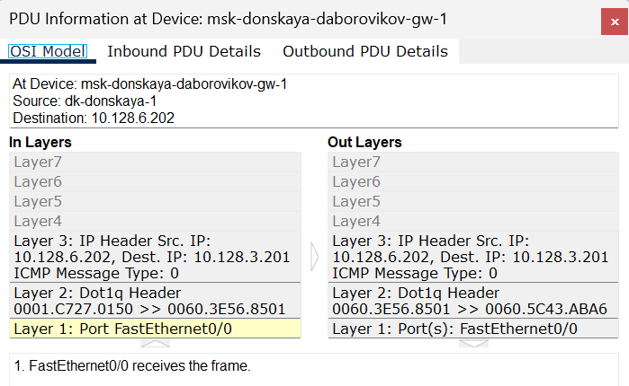

---
## Front matter
lang: ru-RU
title: Доклад №1 Конфигурирование VLAN. Статическая маршрутизация VLAN.
subtitle: Администрирование локальных сетей
author:
  - Боровиков Д.А.
institute:
  - Российский университет дружбы народов им. Патриса Лумумбы, Москва, Россия

## i18n babel
babel-lang: russian
babel-otherlangs: english

## Formatting pdf
toc: false
toc-title: Содержание
slide_level: 2
aspectratio: 169
section-titles: true
theme: metropolis
header-includes:
 - \metroset{progressbar=frametitle,sectionpage=progressbar,numbering=fraction}
 - '\makeatletter'
 - '\beamer@ignorenonframefalse'
 - '\makeatother'

## Fonts
mainfont: Arial
romanfont: Arial
sansfont: Arial
monofont: Arial
---

## Докладчик

  * Боровиков Даниил Александрович
  * НПИбд-01-22
  * Российский университет дружбы народов
  * [1132222006@pfur.ru]

## Введение

VLAN позволяют логически разделять сеть на сегменты без необходимости использования физически отдельных устройств. В сочетании с маршрутизацией, включая статическую маршрутизацию VLAN, это обеспечивает удобное управление трафиком между различными подсетями. В данном докладе рассматриваются основы VLAN, их преимущества, протокол VLAN Trunking Protocol (VTP), а также концепция статической маршрутизации VLAN. Практическая часть конфигурирования и примеры на оборудовании Cisco будут представлены отдельно.

## Что такое VLAN?

VLAN (Virtual Local Area Network) — это технология, которая позволяет разделять устройства в сети на логические группы, независимо от их физического расположения. VLAN функционируют на уровне 2 модели OSI (канальный уровень) и реализуются с помощью коммутаторов. Каждой VLAN присваивается уникальный идентификатор (VLAN ID), который используется для определения принадлежности трафика к конкретной виртуальной сети.

## Основные преимущества VLAN

1. **Сегментация сети**: VLAN уменьшают размер широковещательного домена, что снижает нагрузку на сеть и повышает её производительность.

2. **Безопасность**: Разделение пользователей и ресурсов на разные VLAN ограничивает доступ и повышает защиту данных.

3. **Гибкость**: Устройства могут быть перемещены в другую VLAN без изменения физической топологии сети.

4. **Упрощение управления**: Администраторы могут централизованно настраивать политики и правила для каждой VLAN.

## Типы VLAN

- **VLAN на основе портов**: Каждому порту коммутатора назначается определённая VLAN.

- **VLAN на основе MAC-адресов**: Привязка устройств к VLAN осуществляется по их MAC-адресам.

- **VLAN на основе протоколов**: Трафик разделяется в зависимости от используемого протокола (например, IP или IPX).

## VLAN Trunking Protocol (VTP)

VLAN Trunking Protocol (VTP) — это проприетарный протокол Cisco, предназначенный для автоматизации управления VLAN в сетях с несколькими коммутаторами. VTP позволяет синхронизировать информацию о VLAN (например, их идентификаторы и имена) между коммутаторами через транковые соединения, что упрощает администрирование в крупных сетях.

## Преимущества VTP

- Автоматизация управления VLAN в масштабируемых сетях.

- Снижение вероятности ошибок при ручной настройке на каждом коммутаторе.

- Упрощение добавления новых VLAN в сеть.

## Недостатки VTP

- Риск случайного удаления VLAN из-за некорректной конфигурации сервера.

- Необходимость тщательного планирования домена VTP для предотвращения конфликтов.

## Статическая маршрутизация VLAN

Статическая маршрутизация VLAN предполагает ручное задание маршрутов между подсетями VLAN на маршрутизаторе или многоуровневом коммутаторе (Layer 3 Switch). В отличие от динамической маршрутизации, где маршруты определяются автоматически с помощью протоколов (например, OSPF или RIP), статическая маршрутизация требует явного указания путей для передачи данных.

## Преимущества статической маршрутизации

- **Простота**: Не требует сложных протоколов и подходит для небольших сетей с предсказуемым трафиком.

- **Контроль**: Администратор полностью управляет маршрутами, что исключает нежелательное поведение сети.

- **Меньшая нагрузка**: Отсутствие необходимости в обработке динамических обновлений маршрутов снижает нагрузку на оборудование.

## Недостатки статической маршрутизации

- **Масштабируемость**: В больших сетях ручное управление маршрутами становится трудоёмким.

- **Отсутствие адаптивности**: При изменении топологии сети требуется ручная перенастройка маршрутов.

## Настройка транк портов

{#fig:001 width=70%}

## Настройка VTP-сервера

{#fig:002 width=60%}

## Настройка VTP-клиентов

{#fig:003 width=70%}

## Назначение IP-адресов

{#fig:004 width=60%}

## Проверка доступности

{#fig:005 width=70%}

## Анализ трафика в режиме симуляции

{#fig:006 width=60%}

## Анализ трафика в режиме симуляции

{#fig:007 width=70%}

## Конфигурация маршрутизатора

{#fig:008 width=60%}

## Настройка транкового порта

{#fig:009 width=70%}

## Настройка виртуальных интерфейсов

{#fig:010 width=60%}

## Проверка меж-VLAN доступности

{#fig:011 width=70%}

## Анализ трафика

{#fig:012 width=60%}

## Анализ трафика

{#fig:013 width=70%}

## Заключение

VLAN обеспечивают логическое разделение сети, повышая её безопасность и производительность, а протокол VTP упрощает управление VLAN в сложных топологиях. Статическая маршрутизация, в свою очередь, позволяет организовать взаимодействие между VLAN с минимальными затратами ресурсов. Несмотря на ограничения в масштабируемости, эти технологии остаются востребованными в небольших и средних сетях благодаря своей простоте и предсказуемости. 

