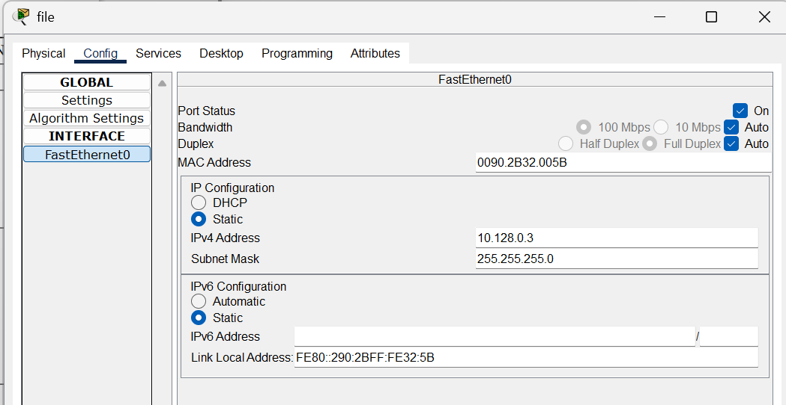
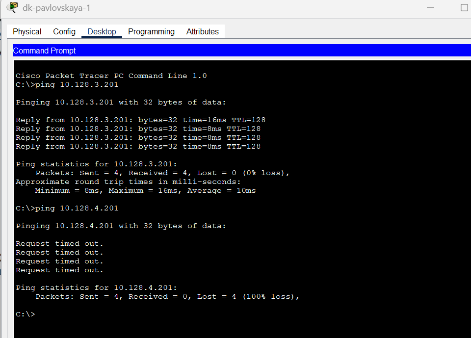
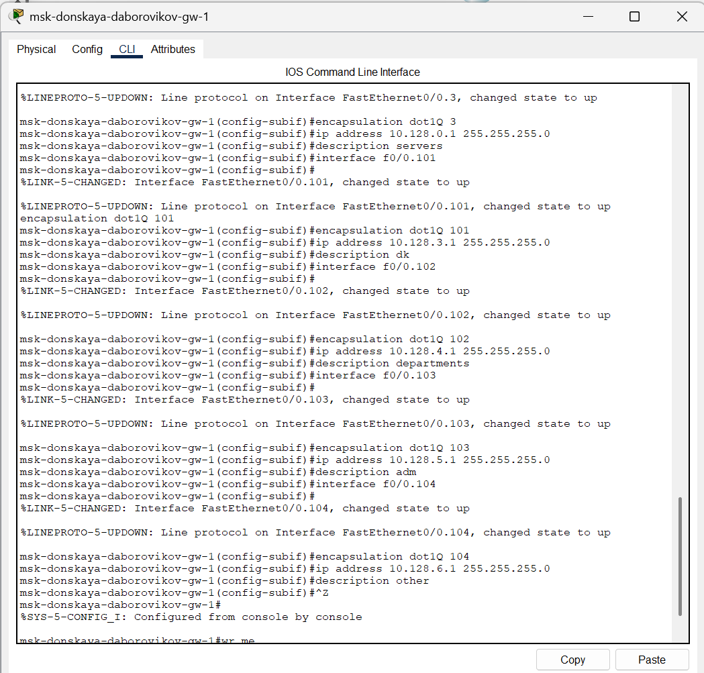
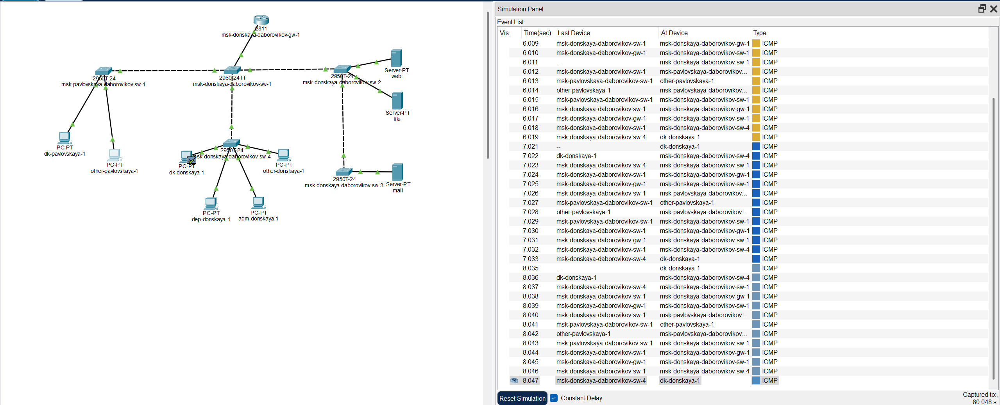

---
## Front matter
title: "Отчёт по докладу №1 Конфигурирование VLAN. Статическая маршрутизация VLAN."
subtitle: "Дисциплина: Администрирование локальных сетей"
author: "Боровиков Даниил Александрович НПИбд-01-22"

## Generic otions
lang: ru-RU
toc-title: "Содержание"

## Bibliography
bibliography: bib/cite.bib
csl: pandoc/csl/gost-r-7-0-5-2008-numeric.csl

## Pdf output format
toc: true # Table of contents
toc-depth: 2
lof: true # List of figures
lot: true # List of tables
fontsize: 12pt
linestretch: 1.5
papersize: a4
documentclass: scrreprt
## I18n polyglossia
polyglossia-lang:
  name: russian
polyglossia-otherlangs:
  name: english
## I18n babel
babel-lang: russian
babel-otherlangs: english
## Fonts
mainfont: Arial
romanfont: Arial
sansfont: Arial
monofont: Arial
mainfontoptions: Ligatures=TeX
romanfontoptions: Ligatures=TeX
sansfontoptions: Ligatures=TeX,Scale=MatchLowercase
monofontoptions: Scale=MatchLowercase,Scale=0.9
## Biblatex
biblatex: true
biblio-style: "gost-numeric"
biblatexoptions:
  - parentracker=true
  - backend=biber
  - hyperref=auto
  - language=auto
  - autolang=other*
  - citestyle=gost-numeric
## Pandoc-crossref LaTeX customization
figureTitle: "Рис."
tableTitle: "Таблица"
listingTitle: "Листинг"
lofTitle: "Список иллюстраций"
lotTitle: "Список таблиц"
lolTitle: "Листинги"
## Misc options
indent: true
header-includes:
  - \usepackage{indentfirst}
  - \usepackage{float} # keep figures where there are in the text
  - \floatplacement{figure}{H} # keep figures where there are in the text
---

# Введение

Современные компьютерные сети требуют гибкости, безопасности и эффективности в управлении трафиком. Одним из ключевых инструментов для достижения этих целей является использование виртуальных локальных сетей (VLAN). VLAN позволяют логически разделять сеть на сегменты без необходимости использования физически отдельных устройств. В сочетании с маршрутизацией, включая статическую маршрутизацию VLAN, это обеспечивает удобное управление трафиком между различными подсетями. В данном докладе рассматриваются основы VLAN, их преимущества, протокол VLAN Trunking Protocol (VTP), а также концепция статической маршрутизации VLAN. Практическая часть конфигурирования и примеры на оборудовании Cisco будут представлены отдельно.

# Что такое VLAN?

VLAN (Virtual Local Area Network) — это технология, которая позволяет разделять устройства в сети на логические группы, независимо от их физического расположения. VLAN функционируют на уровне 2 модели OSI (канальный уровень) и реализуются с помощью коммутаторов. Каждой VLAN присваивается уникальный идентификатор (VLAN ID), который используется для определения принадлежности трафика к конкретной виртуальной сети.

## Основные преимущества VLAN

1. **Сегментация сети**: VLAN уменьшают размер широковещательного домена, что снижает нагрузку на сеть и повышает её производительность.

2. **Безопасность**: Разделение пользователей и ресурсов на разные VLAN ограничивает доступ и повышает защиту данных.

3. **Гибкость**: Устройства могут быть перемещены в другую VLAN без изменения физической топологии сети.

4. **Упрощение управления**: Администраторы могут централизованно настраивать политики и правила для каждой VLAN.

## Типы VLAN

- **VLAN на основе портов**: Каждому порту коммутатора назначается определённая VLAN.

- **VLAN на основе MAC-адресов**: Привязка устройств к VLAN осуществляется по их MAC-адресам.

- **VLAN на основе протоколов**: Трафик разделяется в зависимости от используемого протокола (например, IP или IPX).

## VLAN Trunking Protocol (VTP)

VLAN Trunking Protocol (VTP) — это проприетарный протокол Cisco, предназначенный для автоматизации управления VLAN в сетях с несколькими коммутаторами. VTP позволяет синхронизировать информацию о VLAN (например, их идентификаторы и имена) между коммутаторами через транковые соединения, что упрощает администрирование в крупных сетях.

### Режимы работы VTP

1. **Сервер (Server)**: Коммутатор в этом режиме может создавать, изменять и удалять VLAN, а также распространять эти изменения на другие устройства в домене VTP.

2. **Клиент (Client)**: Коммутатор принимает обновления VLAN от сервера, но не может самостоятельно изменять конфигурацию VLAN.

3. **Прозрачный (Transparent)**: Коммутатор не участвует в синхронизации VLAN через VTP, но передаёт VTP-сообщения другим устройствам, сохраняя собственную независимую конфигурацию.

### Преимущества VTP

- Автоматизация управления VLAN в масштабируемых сетях.

- Снижение вероятности ошибок при ручной настройке на каждом коммутаторе.

- Упрощение добавления новых VLAN в сеть.

### Недостатки VTP

- Риск случайного удаления VLAN из-за некорректной конфигурации сервера.

- Необходимость тщательного планирования домена VTP для предотвращения конфликтов.

VTP работает только на транковых соединениях, использующих протоколы, такие как IEEE 802.1Q или ISL (Inter-Switch Link), и требует правильной настройки для обеспечения стабильной работы сети.

# Статическая маршрутизация VLAN

Для того чтобы устройства в разных VLAN могли обмениваться данными, необходимо использовать маршрутизацию. Статическая маршрутизация VLAN предполагает ручное задание маршрутов между подсетями VLAN на маршрутизаторе или многоуровневом коммутаторе (Layer 3 Switch). В отличие от динамической маршрутизации, где маршруты определяются автоматически с помощью протоколов (например, OSPF или RIP), статическая маршрутизация требует явного указания путей для передачи данных. [@tanenbaum_networks:bash]

## Преимущества статической маршрутизации

- **Простота**: Не требует сложных протоколов и подходит для небольших сетей с предсказуемым трафиком.

- **Контроль**: Администратор полностью управляет маршрутами, что исключает нежелательное поведение сети.

- **Меньшая нагрузка**: Отсутствие необходимости в обработке динамических обновлений маршрутов снижает нагрузку на оборудование.

## Недостатки статической маршрутизации

- **Масштабируемость**: В больших сетях ручное управление маршрутами становится трудоёмким.

- **Отсутствие адаптивности**: При изменении топологии сети требуется ручная перенастройка маршрутов.

## Конфигурирование VLAN

В этом разделе описан процесс настройки VLAN на оборудовании Cisco [@cisco_ccna:bash] с использованием Packet Tracer. Цель — создать функциональную сеть с несколькими VLAN и проверить их работу.

### Настройка транк портов

На всех коммутаторах необходимо настроить транк (Trunk) порты на соответствующих интерфейсах для передачи данных между VLAN.  

{ #fig:001 width=70% }

### Настройка VTP-сервера

Коммутатор, соединённый со всеми другими, настраивается как VTP-сервер. На нём задаются номера и названия VLAN с использованием следующей последовательности команд: 
 
{ #fig:002 width=70% }

### Настройка VTP-клиентов

Остальные коммутаторы настраиваются как VTP-клиенты. На их интерфейсах указывается принадлежность к соответствующим VLAN:  

{ #fig:003 width=70% }

### Назначение IP-адресов

На оконечных устройствах задаются статические IP-адреса в соответствии с их VLAN:
  
{ #fig:004 width=70% }

### Проверка доступности

С помощью команды `ping` проверяется доступность устройств внутри одного VLAN и недоступность между разными VLAN:  

{ #fig:005 width=70% }

### Анализ трафика в режиме симуляции

Используя режим симуляции в Packet Tracer, можно наблюдать процесс передвижения пакета ICMP по сети:
  
{ #fig:006 width=70% }  

Дополнительно анализируется содержимое пакета и заголовки задействованных протоколов: 
 
{ #fig:007 width=70% }

## Статическая маршрутизация VLAN на практике

Этот раздел демонстрирует настройку статической маршрутизации между VLAN с использованием маршрутизатора Cisco для обеспечения связи между подсетями. [@cisco_docs:bash]

### Конфигурация маршрутизатора

На маршрутизаторе задаётся имя, пароль для доступа к консоли и настраивается удалённое подключение по SSH:  

{ #fig:008 width=70% }

### Настройка транкового порта

Порт 24 коммутатора, соединённого с маршрутизатором, настраивается как транк:  

{ #fig:009 width=70% }

### Настройка виртуальных интерфейсов

На маршрутизаторе создаются виртуальные интерфейсы, соответствующие номерам VLAN, и задаются IP-адреса:  

{ #fig:010 width=70% }

### Проверка меж-VLAN доступности

Проверяется доступность устройств из разных VLAN с помощью команды `ping`: 
 
{ #fig:011 width=70% }

### Анализ трафика

В режиме симуляции Packet Tracer отслеживается процесс передвижения пакета ICMP между VLAN:
  
{ #fig:012 width=70% }  

Также изучается содержимое пакета и заголовки протоколов:  

{ #fig:013 width=70% }

# Заключение

Технология VLAN и статическая маршрутизация являются важными инструментами в арсенале сетевых администраторов. VLAN обеспечивают логическое разделение сети, повышая её безопасность и производительность, а протокол VTP упрощает управление VLAN в сложных топологиях. Статическая маршрутизация, в свою очередь, позволяет организовать взаимодействие между VLAN с минимальными затратами ресурсов. Несмотря на ограничения в масштабируемости, эти технологии остаются востребованными в небольших и средних сетях благодаря своей простоте и предсказуемости. Практическая реализация на оборудовании Cisco демонстрирует их эффективность в реальных условиях.

# Список литературы{.unnumbered}

::: {#refs}
:::

