---
## Front matter
lang: ru-RU
title: Лабораторная Работа №13. Статическая маршрутизация в Интернете. Планирование
subtitle: Администрирование локальных сетей
author:
  - Боровиков Д.А.
institute:
  - Российский университет дружбы народов им. Патриса Лумумбы, Москва, Россия

## i18n babel
babel-lang: russian
babel-otherlangs: english

## Formatting pdf
toc: false
toc-title: Содержание
slide_level: 2
aspectratio: 169
section-titles: true
theme: metropolis
header-includes:
 - \metroset{progressbar=frametitle,sectionpage=progressbar,numbering=fraction}
 - '\makeatletter'
 - '\beamer@ignorenonframefalse'
 - '\makeatother'

## Fonts
mainfont: Arial
romanfont: Arial
sansfont: Arial
monofont: Arial
---

## Докладчик

  * Боровиков Даниил Александрович
  * НПИбд-01-22
  * Российский университет дружбы народов
  * [1132222006@pfur.ru]

## Цели и задачи

Провести подготовительные мероприятия по организации взаимодействия
через сеть провайдера посредством статической маршрутизации локальной
сети с сетью основного здания, расположенного в 42-м квартале в Москве,
и сетью филиала, расположенного в г. Сочи.

## Внесение изменений в схему L1 сети

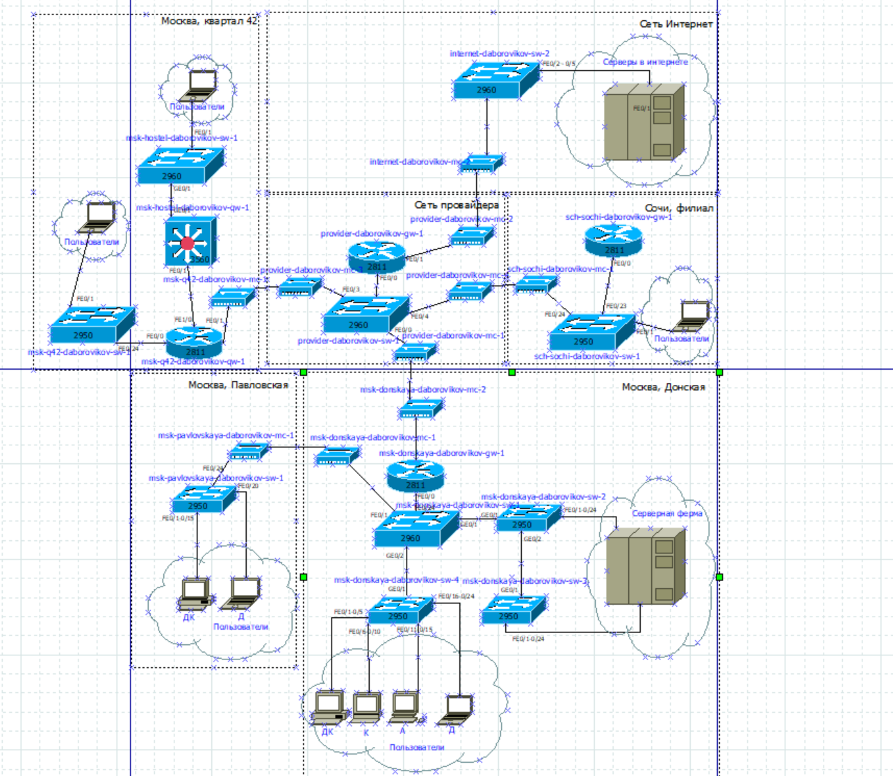{#fig:001 width=50%}

## Таблица VLAN

{#fig:002 width=60%}

## Таблица IP

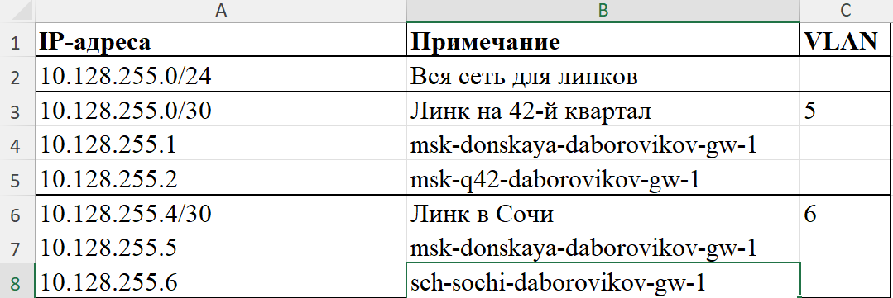{#fig:003 width=70%}

## Таблица IP

{#fig:004 width=60%}

## Таблица IP

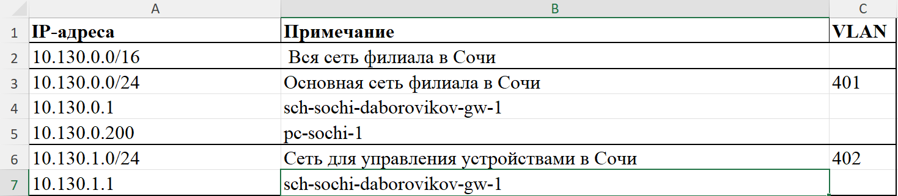{#fig:005 width=70%}

## Размещение необходимого оборудования

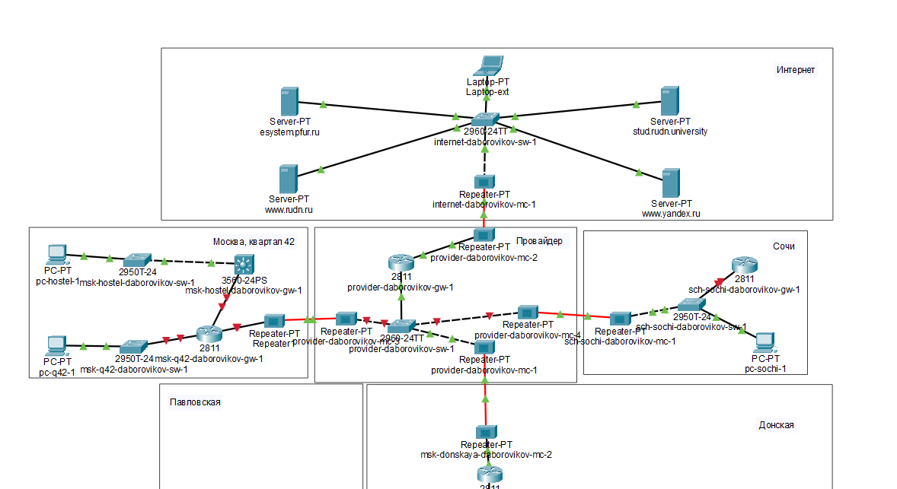{#fig:006 width=60%}

## Замена модулей

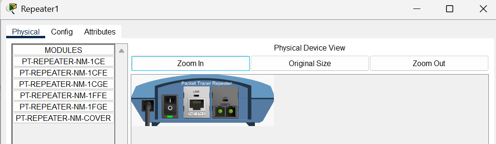{#fig:007 width=70%}

## NM-2FE2W

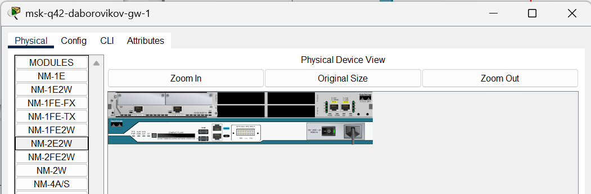{#fig:008 width=60%}

## Добавление в физической рабочей области

{#fig:009 width=70%}

## Добавление в физической рабочей области города Сочи

{#fig:010 width=60%}

## Перенос из сети «Донская»

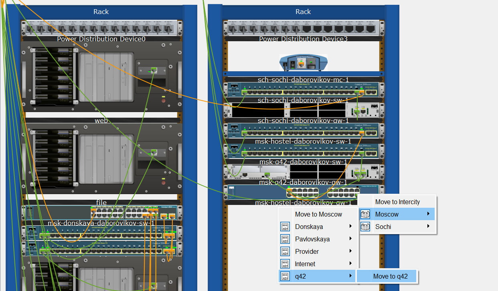{#fig:011 width=70%}

## Размещение объектов

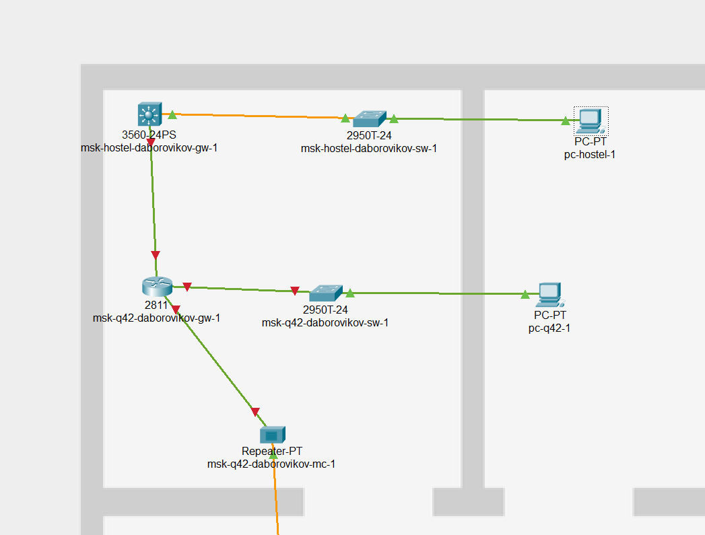{#fig:012 width=60%}

## Размещение объектов

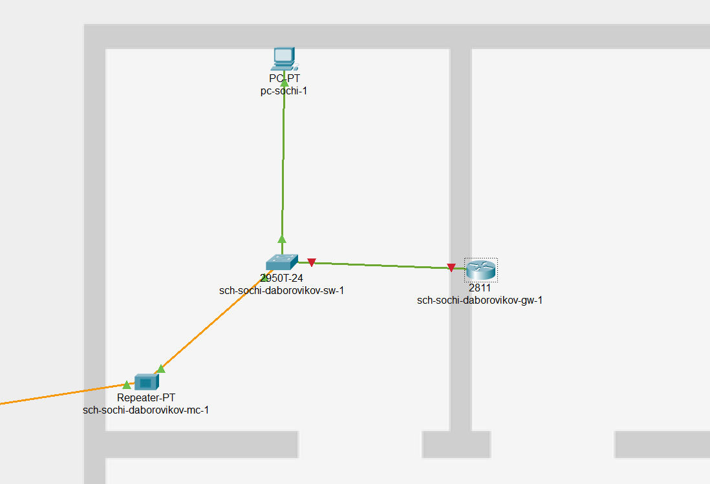{#fig:013 width=70%}

## Первоначальная настройка

{#fig:014 width=60%}

## Первоначальная настройка

{#fig:015 width=70%}

## Первоначальная настройка

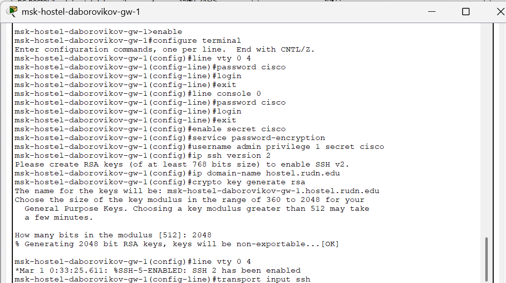{#fig:016 width=60%}

## Первоначальная настройка

{#fig:017 width=70%}

## Первоначальная настройка

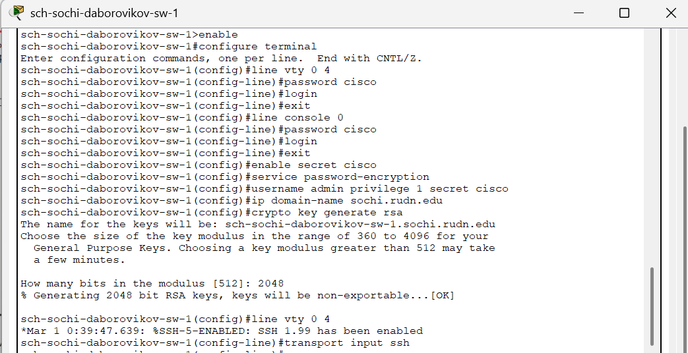{#fig:018 width=60%}

## Первоначальная настройка

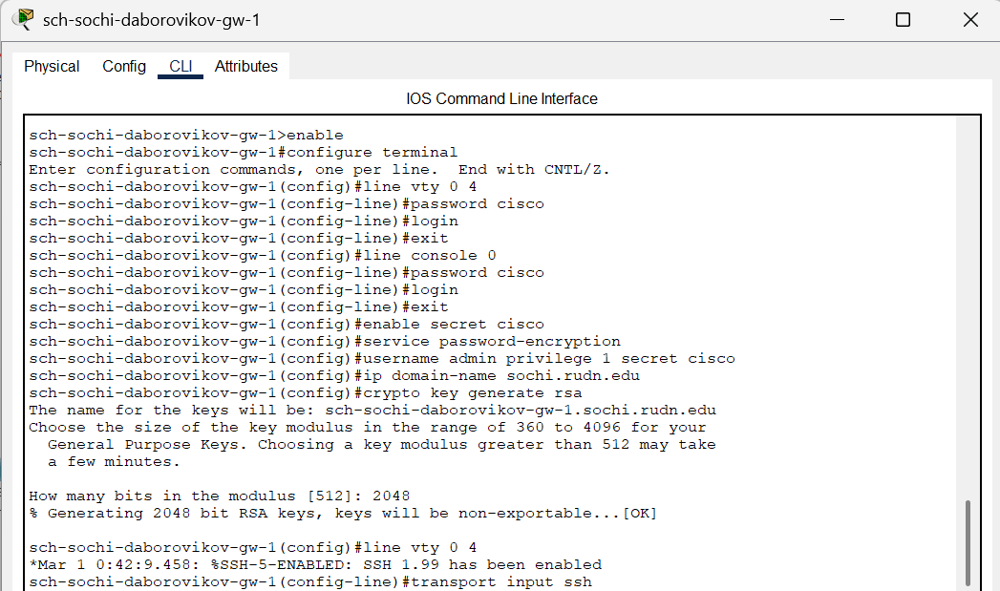{#fig:019 width=70%}

## Вывод

В ходе выполнения лабораторной работы мы провели подготовительные
мероприятия по организации взаимодействия через сеть провайдера
посредством статической маршрутизации локальной сети с сетью основного
здания, расположенного в 42-м квартале в Москве, и сетью филиала,
расположенного в г. Сочи.
