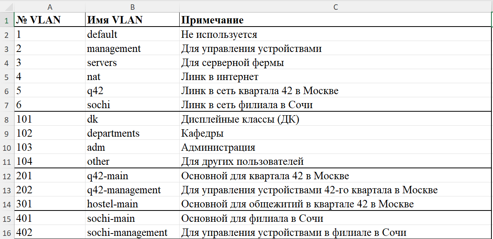
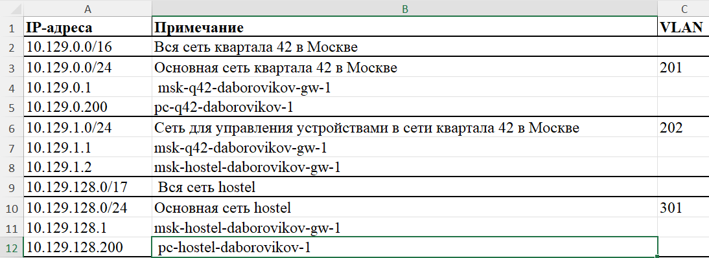
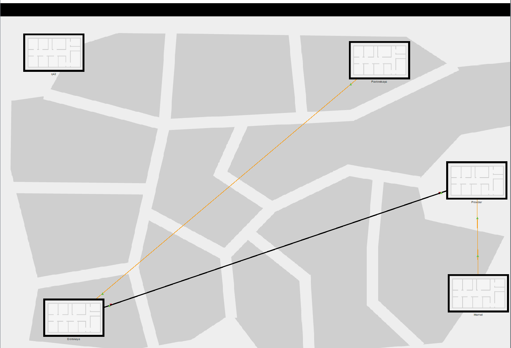
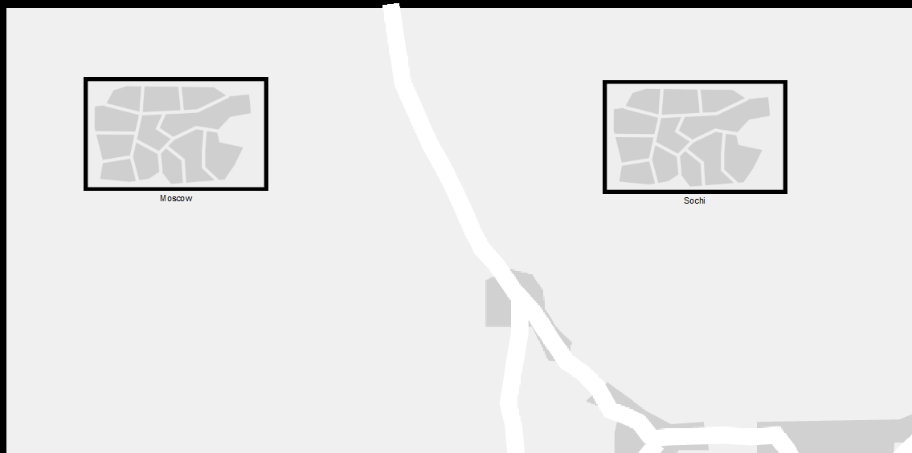
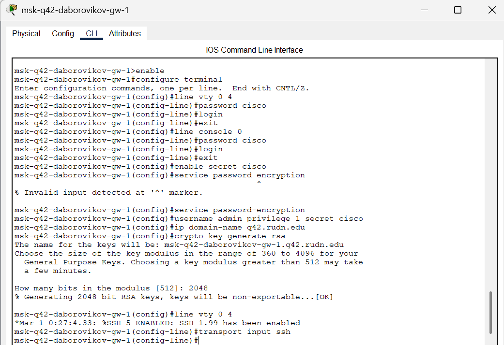
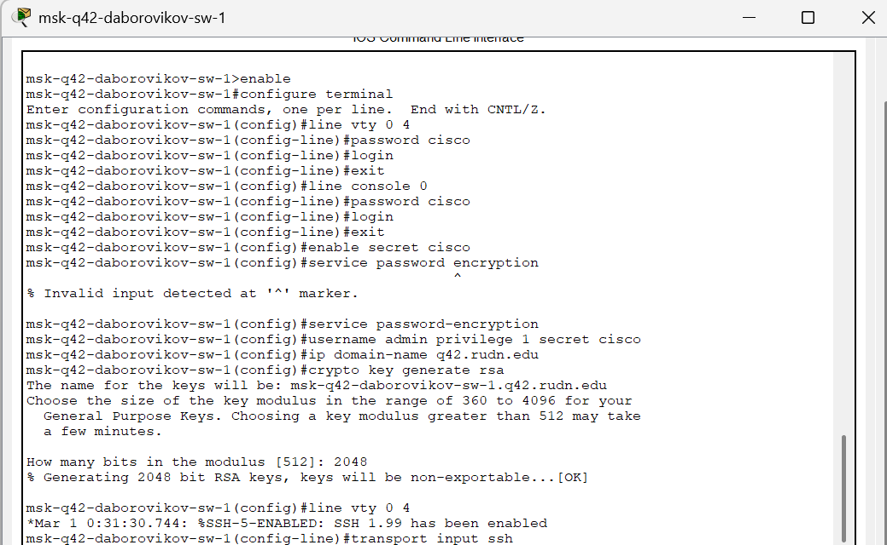
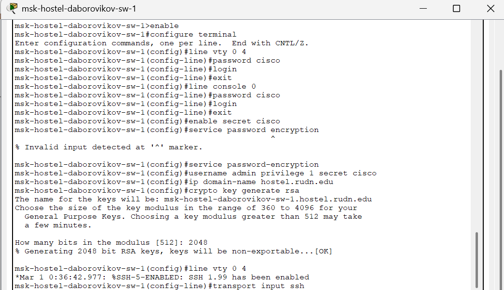

---
## Front matter
title: "Отчёт по лабораторной работе №13"
subtitle: "Дисциплина: Администрирование локальных сетей"
author: "Боровиков Даниил Александрович НПИбд-01-22"

## Generic otions
lang: ru-RU
toc-title: "Содержание"

## Bibliography
bibliography: bib/cite.bib
csl: pandoc/csl/gost-r-7-0-5-2008-numeric.csl

## Pdf output format
toc: true # Table of contents
toc-depth: 2
lof: true # List of figures
lot: true # List of tables
fontsize: 12pt
linestretch: 1.5
papersize: a4
documentclass: scrreprt
## I18n polyglossia
polyglossia-lang:
  name: russian
polyglossia-otherlangs:
  name: english
## I18n babel
babel-lang: russian
babel-otherlangs: english
## Fonts
mainfont: Arial
romanfont: Arial
sansfont: Arial
monofont: Arial
mainfontoptions: Ligatures=TeX
romanfontoptions: Ligatures=TeX
sansfontoptions: Ligatures=TeX,Scale=MatchLowercase
monofontoptions: Scale=MatchLowercase,Scale=0.9
## Biblatex
biblatex: true
biblio-style: "gost-numeric"
biblatexoptions:
  - parentracker=true
  - backend=biber
  - hyperref=auto
  - language=auto
  - autolang=other*
  - citestyle=gost-numeric
## Pandoc-crossref LaTeX customization
figureTitle: "Рис."
tableTitle: "Таблица"
listingTitle: "Листинг"
lofTitle: "Список иллюстраций"
lotTitle: "Список таблиц"
lolTitle: "Листинги"
## Misc options
indent: true
header-includes:
  - \usepackage{indentfirst}
  - \usepackage{float} # keep figures where there are in the text
  - \floatplacement{figure}{H} # keep figures where there are in the text
---

# Цель работы

Провести подготовительные мероприятия по организации взаимодействия
через сеть провайдера посредством статической маршрутизации локальной
сети с сетью основного здания, расположенного в 42-м квартале в Москве,
и сетью филиала, расположенного в г. Сочи.

#  Задание

1. Внести изменения в схемы L1, L2 и L3 сети, добавив в них информацию
о сети основной территории (42-й квартал в Москве) и сети филиала в г. Сочи.

2. Дополнить схему проекта, добавив подсеть основной территории организации 42-го квартала в Москве и подсеть филиала в г. Сочи 

3. Сделать первоначальную настройку добавленного в проект оборудования

4. При выполнении работы необходимо учитывать соглашение об именовании

# Выполнение лабораторной работы

Для начала внесём изменения в схему L1 сети, добавив информацию о сети
основной территории (42-й квартал в Москве) и сети филиала в г. Сочи. (рис. [-@fig:001]) После этого добавим информацию в таблицы (рис. [-@fig:002]). (рис. [-@fig:003]). (рис. [-@fig:004]). (рис. [-@fig:005]).

{ #fig:001 width=70% }

 

{ #fig:002 width=70% }

{ #fig:003 width=70% }

{ #fig:004 width=70% }

 

{ #fig:005 width=70% }

На схеме нашего проекта разместим необходимое оборудование: 4
медиаконвертера (Repeater-PT), 2 маршрутизатора типа Cisco 2811, 1
маршрутизирующий коммутатор типа Cisco 3560-24PS, 2 коммутатора типа
6
Cisco [@wiki:bash] 2950-24, коммутатор Cisco 2950-24T, 3 оконечных устройства типа PC-PT.
А также присвоим им названия и проведём соединение объектов согласно
скорректированной нами схеме 

(рис. [-@fig:006]). 

{ #fig:006 width=70% }

 

На медиаконвертерах заменим имеющиеся модули на PT-REPEATERNM1FFE и PT-REPEATER-NM-1CFE для подключения витой пары по технологии
Fast Ethernet и оптоволокна соответственно (рис. [-@fig:007]).

{ #fig:007 width=70% }
 
пары по технологии Fast Ethernet и оптоволокна соответственно).
Далее на маршрутизаторе msk-q42-daborovikov-gw-1 добавим дополнительный
интерфейс NM-2FE2W (рис. [-@fig:008])

{ #fig:008 width=70% }

В физической рабочей области Packet Tracer добавим в г.Москва здание 42-
го квартала и присвоим ему название (рис. [-@fig:009])

{ #fig:009 width=70% }

Затем в физической рабочей области добавим город Сочи и в нём здание
филиала, присвоим ему соответствующее название (рис. [-@fig:010])

{ #fig:010 width=70% }

После чего нужно перенести из сети «Донская» оборудование сети 42-го
квартала и сети филиала в соответствующие здания и выполнить расстановку
 (рис. [-@fig:011]) (рис. [-@fig:012]) (рис. [-@fig:013])

{ #fig:011 width=70% }

{ #fig:012 width=70% }

{ #fig:013 width=70% }

На последнем шаге выполним первоначальную настройку оборудования
(рис. [-@fig:014]) (рис. [-@fig:015]) (рис. [-@fig:016]) (рис. [-@fig:017]) (рис. [-@fig:018]) (рис. [-@fig:019])

{ #fig:014 width=70% }

{ #fig:015 width=70% }

{ #fig:016 width=70% }

{ #fig:017 width=70% }

{ #fig:018 width=70% }

{ #fig:019 width=70% }

 

##  Контрольные вопросы

1. В каких случаях следует использовать статическую маршрутизацию?
Приведите примеры. - В реальных условиях статическая
маршрутизация используется в условиях наличия шлюза по
умолчанию (узла, обладающего связностью с остальными узлами)
и 1-2 сетями. Помимо этого, статическая маршрутизация
используется для «выравнивания» работы маршрутизирующих
протоколов в условиях наличия туннеля (для того, чтобы
маршрутизация трафика, создаваемого туннелем, не
производилась через сам туннель).

2. Укажите основные принципы статической маршрутизации между
VLANs. - Процесс маршрутизации на 3-м уровне можно
осуществлять с помощью маршрутизатора или коммутатора 3-го
уровня. Использование устройства 3- го уровня обеспечивает
возможность управления передачей трафика между сегментами
сети, в том числе сегментами, которые были созданы с помощью
VLAN

# Выводы

В ходе выполнения лабораторной работы мы провели подготовительные
мероприятия по организации взаимодействия через сеть провайдера
посредством статической маршрутизации локальной сети с сетью основного
здания, расположенного в 42-м квартале в Москве, и сетью филиала,
расположенного в г. Сочи.

# Список литературы{.unnumbered}

::: {#refs}
:::
