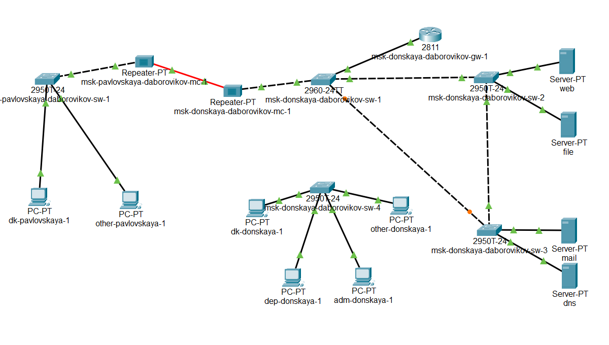
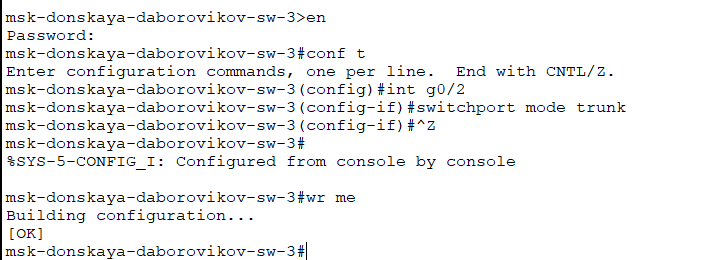
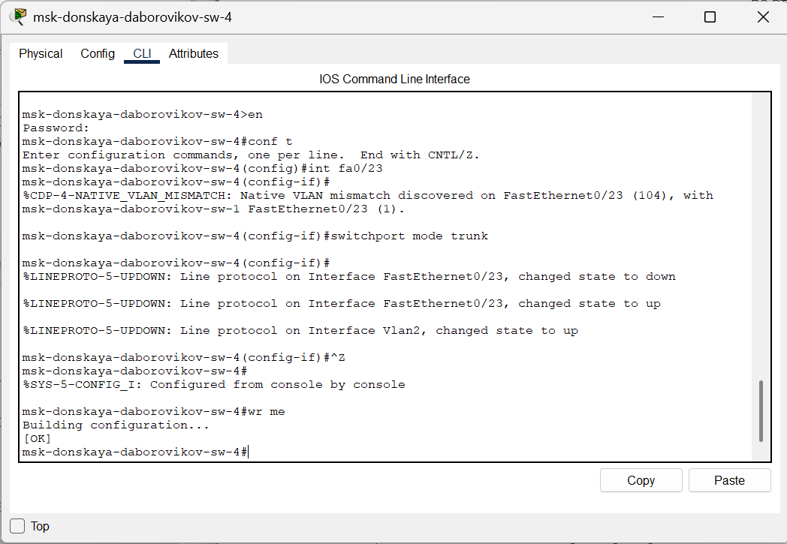
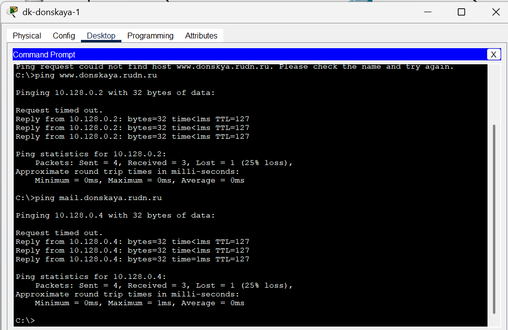
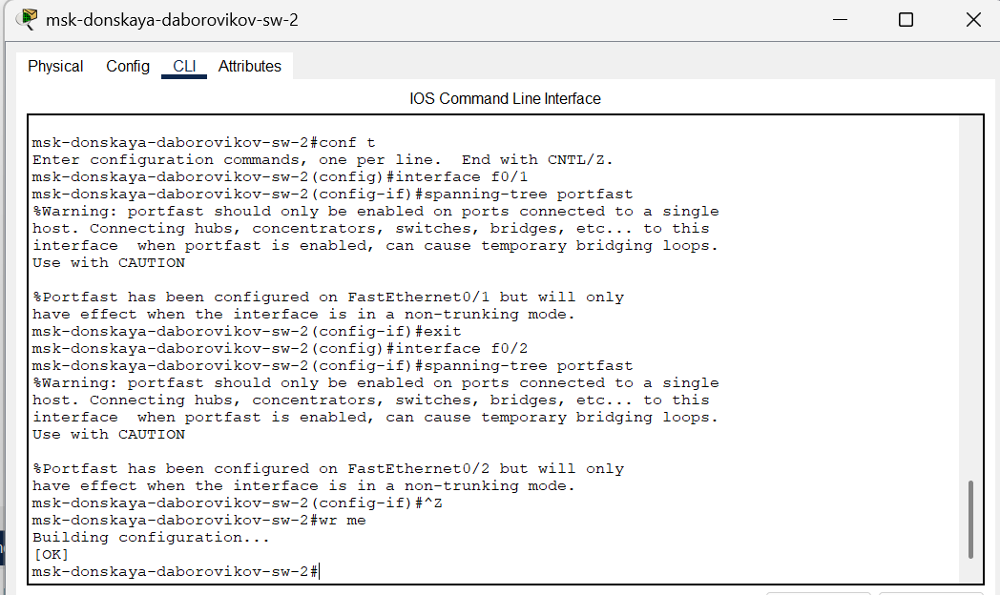
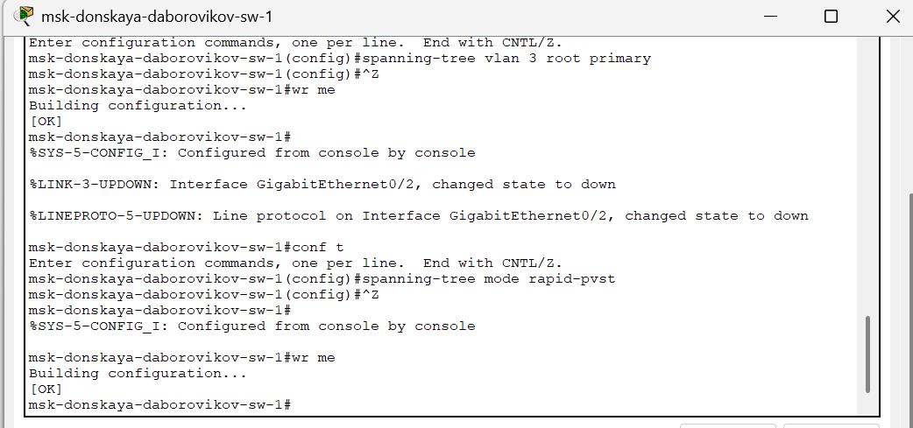
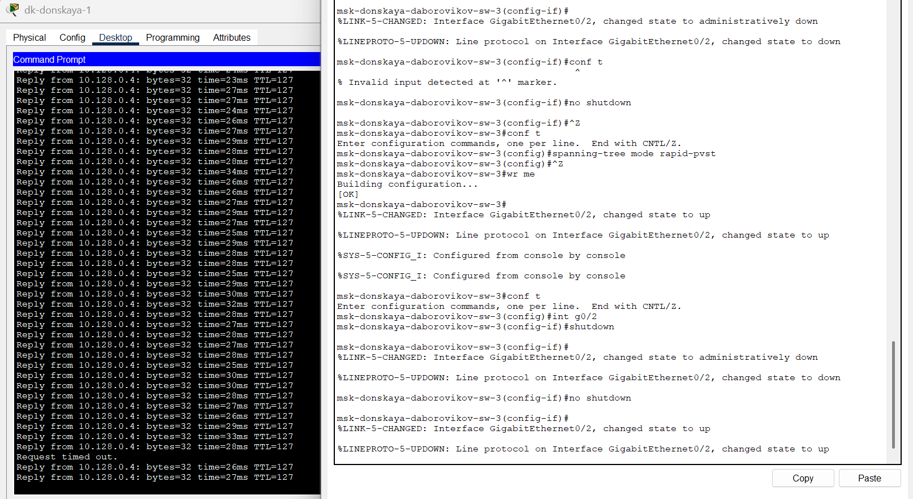
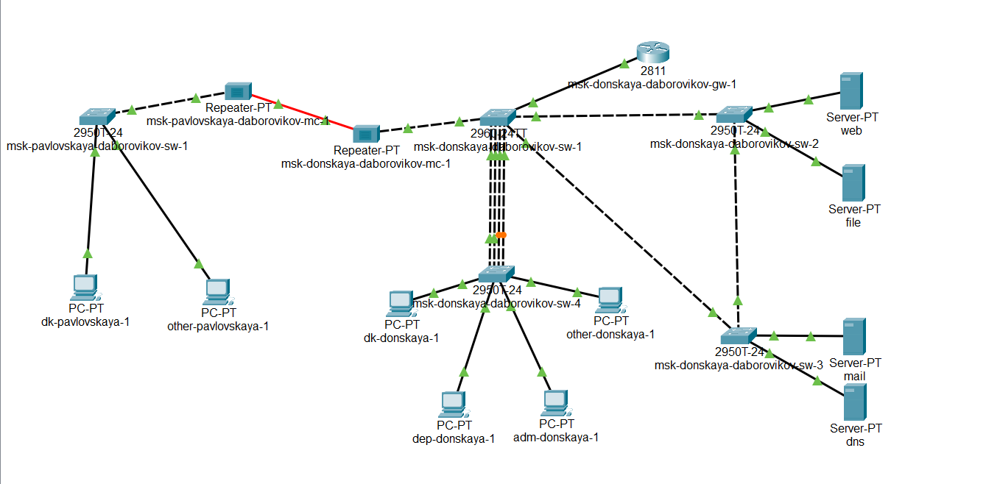
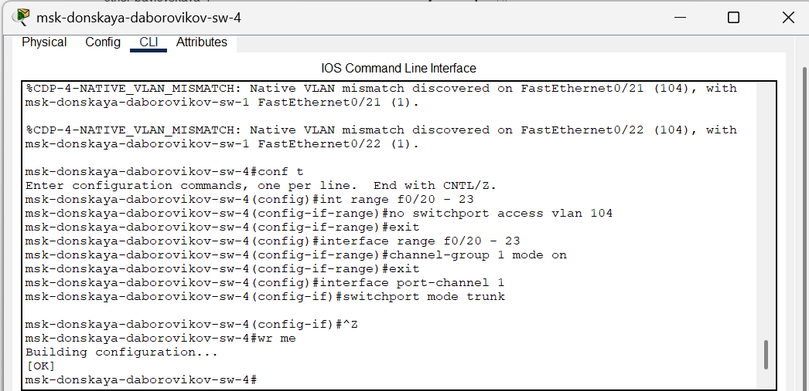

---
## Front matter
title: "Отчёт по лабораторной работе №9"
subtitle: "Дисциплина: Администрирование локальных сетей"
author: "Боровиков Даниил Александрович НПИбд-01-22"

## Generic otions
lang: ru-RU
toc-title: "Содержание"

## Bibliography
bibliography: bib/cite.bib
csl: pandoc/csl/gost-r-7-0-5-2008-numeric.csl

## Pdf output format
toc: true # Table of contents
toc-depth: 2
lof: true # List of figures
lot: true # List of tables
fontsize: 12pt
linestretch: 1.5
papersize: a4
documentclass: scrreprt
## I18n polyglossia
polyglossia-lang:
  name: russian
polyglossia-otherlangs:
  name: english
## I18n babel
babel-lang: russian
babel-otherlangs: english
## Fonts
mainfont: Arial
romanfont: Arial
sansfont: Arial
monofont: Arial
mainfontoptions: Ligatures=TeX
romanfontoptions: Ligatures=TeX
sansfontoptions: Ligatures=TeX,Scale=MatchLowercase
monofontoptions: Scale=MatchLowercase,Scale=0.9
## Biblatex
biblatex: true
biblio-style: "gost-numeric"
biblatexoptions:
  - parentracker=true
  - backend=biber
  - hyperref=auto
  - language=auto
  - autolang=other*
  - citestyle=gost-numeric
## Pandoc-crossref LaTeX customization
figureTitle: "Рис."
tableTitle: "Таблица"
listingTitle: "Листинг"
lofTitle: "Список иллюстраций"
lotTitle: "Список таблиц"
lolTitle: "Листинги"
## Misc options
indent: true
header-includes:
  - \usepackage{indentfirst}
  - \usepackage{float} # keep figures where there are in the text
  - \floatplacement{figure}{H} # keep figures where there are in the text
---

# Цель работы

Изучение возможностей протокола STP и его модификаций по обеспечению
отказоустойчивости сети, агрегированию интерфейсов и перераспределению
нагрузки между ними.

#  Задание

1. Сформируйте резервное соединение между коммутаторами msk-donskayasw-1 и msk-donskaya-sw-3.

2. Настройте балансировку нагрузки между резервными соединениями.

3. Настройте режим Portfast на тех интерфейсах коммутаторов, к которым
подключены серверы.

4. Изучите отказоустойчивость резервного соединения.

5. Сформируйте и настройте агрегированное соединение интерфейсов Fa0/20
– Fa0/23 между коммутаторами msk-donskaya-sw-1 и msk-donskaya-sw-4.

6. При выполнении работы необходимо учитывать соглашение об именовании

# Выполнение лабораторной работы

Сформируйте резервное соединение между коммутаторами msk-donskayasw-1 и msk-donskaya-sw-3 (рис. 9.1). Для этого:
– замените соединение между коммутаторами msk-donskaya-sw-1
(Gig0/2) и msk-donskaya-sw-4 (Gig0/1) на соединение между коммутаторами msk-donskaya-sw-1 (Gig0/2) и msk-donskaya-sw-3 (Gig0/2); (рис. [-@fig:001])
– сделайте порт на интерфейсе Gig0/2 коммутатора msk-donskaya-sw-3
транковым:
msk−donskaya −sw −3(config)#int g0/2
msk−donskaya −sw −3(config −if)#switchport mode trunk (рис. [-@fig:002]). 
– соединение между коммутаторами msk-donskaya-sw-1 и msk-donskayasw-4 сделайте через интерфейсы Fa0/23 (рис. [-@fig:003]). , не забыв активировать их (рис. [-@fig:004]). (рис. [-@fig:005]).
в транковом режиме.  

{ #fig:001 width=70% }

{ #fig:002 width=70% }

{ #fig:003 width=70% }

{ #fig:004 width=70% }

 

{ #fig:005 width=70% }

С оконечного устройства dk-donskaya-1 пропингуйте серверы mail и web.
В режиме симуляции проследите движение пакетов ICMP (рис. [-@fig:006]). . Убедитесь, что
движение пакетов происходит через коммутатор msk-donskaya-sw-2.   (рис. [-@fig:007]).

{ #fig:006 width=70% }

{ #fig:007 width=70% }

На коммутаторе msk-donskaya-sw-2 посмотрите состояние протокола STP
для vlan 3(рис. [-@fig:008])

{ #fig:008 width=70% }

В качестве корневого коммутатора STP настройте коммутатор mskdonskaya-sw-1:
(рис. [-@fig:009])

{ #fig:009 width=70% }

Используя режим симуляции, убедитесь, что пакеты ICMP пойдут от
хоста dk-donskaya-1 до mail (рис. [-@fig:010]) через коммутаторы msk-donskaya-sw-1 и mskdonskaya-sw-3, а от хоста dk-donskaya-1 до  web через коммутаторы
msk-donskaya-sw-1 и msk-donskaya-sw-2. (рис. [-@fig:011])

{ #fig:010 width=70% }
 

{ #fig:011 width=70% }

Настройте режим Portfast на тех интерфейсах коммутаторов, к которым
подключены серверы(рис. [-@fig:012]) (рис. [-@fig:013])

{ #fig:012 width=70% }

{ #fig:013 width=70% }

Изучите отказоустойчивость протокола STP и время восстановления соединения при переключении на резервное соединение. Для этого используйте
команду ping -n 1000 mail.donskaya.rudn.ru на хосте dk-donskaya-1,
а разрыв соединения обеспечьте переводом соответствующего интерфейса
коммутатора в состояние shutdown. (рис. [-@fig:014])

{ #fig:014 width=70% }

Переключите коммутаторы режим работы по протоколу Rapid PVST+ (рис. [-@fig:015])

{ #fig:015 width=70% }

Изучите отказоустойчивость протокола Rapid PVST+ и время восстановления соединения при переключении на резервное соединение (рис. [-@fig:016])

{ #fig:016 width=70% }

Сформируйте агрегированное соединение интерфейсов Fa0/20 – Fa0/23
между коммутаторами msk-donskaya-sw-1 и msk-donskaya-sw-4 (рис. [-@fig:017])

{ #fig:017 width=70% }

Настройте агрегирование каналов (режим EtherChannel [@wiki:bash] ):
(рис. [-@fig:018]) (рис. [-@fig:019])

{ #fig:018 width=70% }

{ #fig:019 width=70% }

##  Контрольные вопросы

1. **Какую информацию можно получить, воспользовавшись командой определения состояния протокола STP для VLAN (на корневом и не на корневом устройстве)?** 
 
Команда `show spanning-tree vlan <vlan-id>` показывает роль коммутатора (Root или не Root), идентификаторы корневого и текущего моста, состояние портов, таймеры и стоимость пути до корневого моста.

2. **При помощи какой команды можно узнать, в каком режиме, STP или Rapid PVST+, работает устройство?**  

Команда `show spanning-tree summary` указывает режим работы (ieee для STP или rstp для Rapid PVST+) в строке `Spanning tree enabled protocol`.

3. **Для чего и в каких случаях нужно настраивать режим Portfast?**  

Portfast ускоряет переход порта в состояние Forwarding для конечных устройств (ПК, серверы), минимизируя задержки. Применяется на портах, не подключенных к коммутаторам, чтобы избежать петель.

4. **В чем состоит принцип работы агрегированного интерфейса? Для чего он используется?**  

Агрегированный интерфейс (EtherChannel) объединяет физические порты в логический канал для увеличения пропускной способности и отказоустойчивости. Трафик распределяется по линкам, а при сбое одного линка используется другой. Применяется для связи между коммутаторами, маршрутизаторами или серверами.

5. **В чём принципиальные отличия при использовании протоколов LACP, PAgP и статического агрегирования без использования протоколов?**  

LACP (стандарт IEEE) и PAgP (проприетарный Cisco) динамически согласовывают EtherChannel и проверяют совместимость, LACP универсален, PAgP только для Cisco. Статическое агрегирование (mode on) вручную формирует канал без проверок, что проще, но менее надежно.

6. **При помощи каких команд можно узнать состояние агрегированного канала EtherChannel?**  

`show etherchannel summary` — общая информация о группах и статусе портов; `show etherchannel <group-number> detail` — детали портов и протокола; `show interfaces port-channel <number>` — состояние логического интерфейса; `show interfaces etherchannel` — данные о физических портах в канале.

# Выводы

В ходе выполнения лабораторной работы я изучил возможности протокола STP и его модификаций по обеспечению
отказоустойчивости сети, агрегированию интерфейсов и перераспределению
нагрузки между ними.

# Список литературы{.unnumbered}

::: {#refs}
:::

