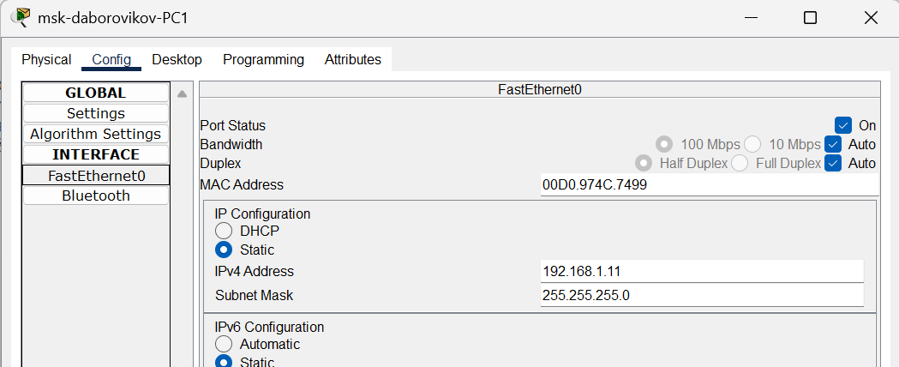
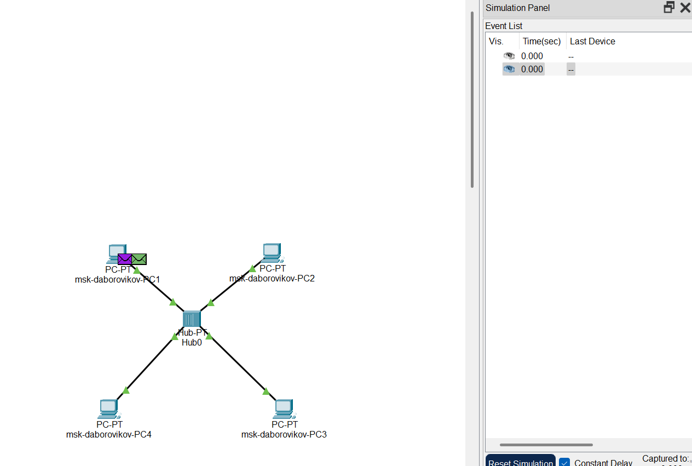
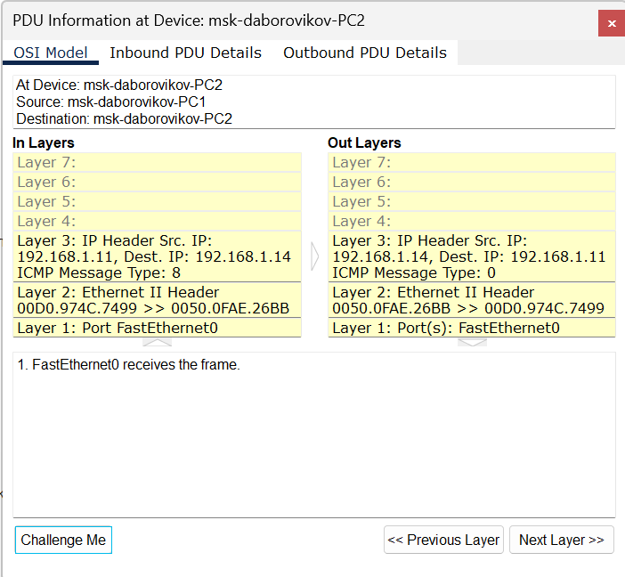
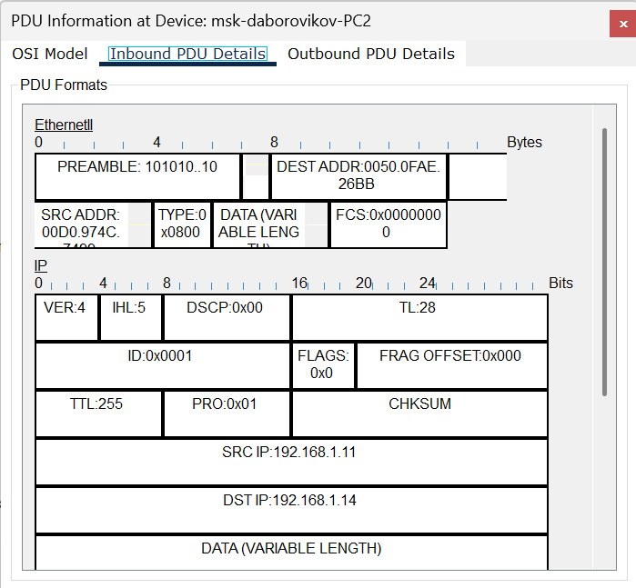
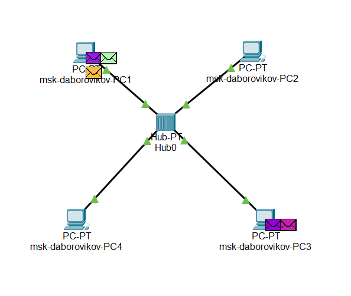
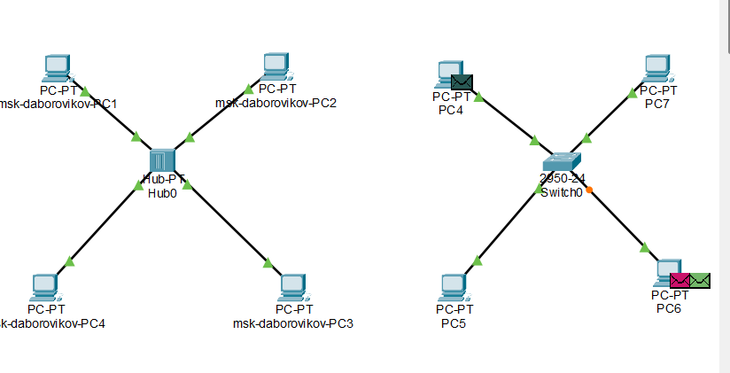
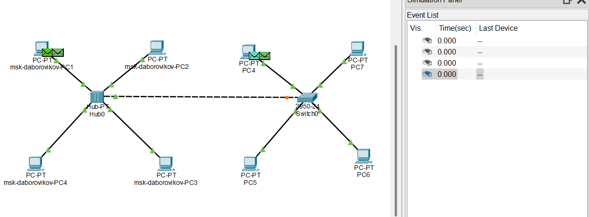
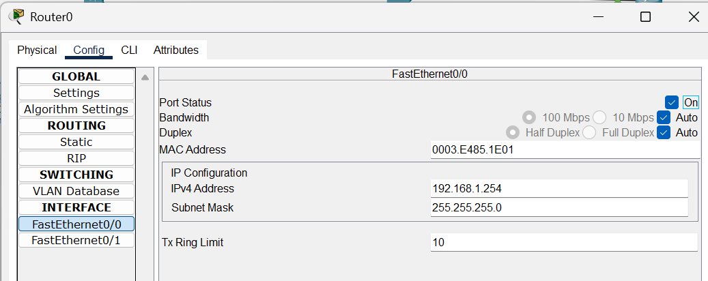
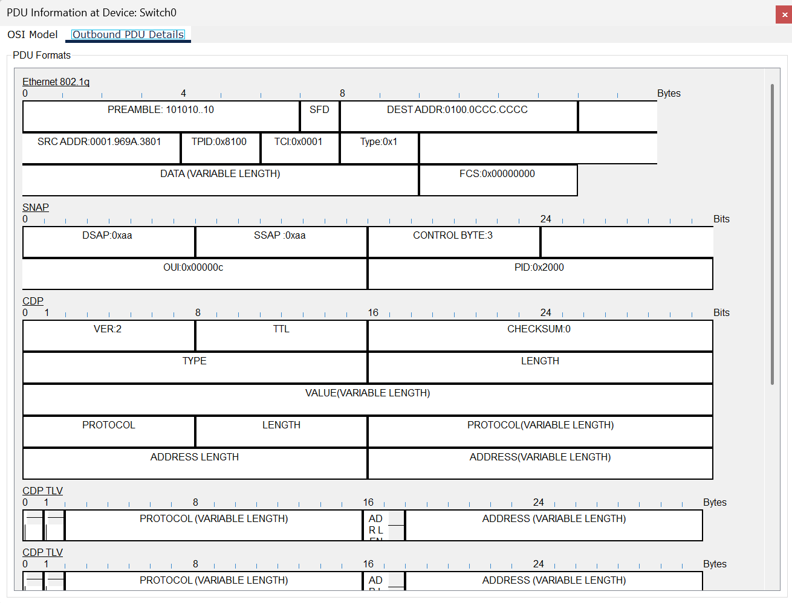

---
## Front matter
lang: ru-RU
title: Лабораторная Работа №1. Анализ трафика в Wireshark
subtitle: Сетевой администрирование
author:
  - Боровиков Д.А.
institute:
  - Российский университет дружбы народов им. Патриса Лумумбы, Москва, Россия

## i18n babel
babel-lang: russian
babel-otherlangs: english

## Formatting pdf
toc: false
toc-title: Содержание
slide_level: 2
aspectratio: 169
section-titles: true
theme: metropolis
header-includes:
 - \metroset{progressbar=frametitle,sectionpage=progressbar,numbering=fraction}
 - '\makeatletter'
 - '\beamer@ignorenonframefalse'
 - '\makeatother'

## Fonts
mainfont: Arial
romanfont: Arial
sansfont: Arial
monofont: Arial
---

## Докладчик

  * Боровиков Даниил Александрович
  * НПИбд-01-22
  * Российский университет дружбы народов
  * [1132222006@pfur.ru]

## Цели и задачи

Установка инструмента моделирования конфигурации сети Cisco Packet
Tracer [3], знакомство с его интерфейсом.

## Схема сети с концентратором

{#fig:001 width=70%}

## Настройка IP-адреса на компьютере

{#fig:002 width=60%}

## Добавление пакета Simple PDU

{#fig:003 width=70%}

## Данные о PDU: уровни OSI

{#fig:004 width=60%}

## Структура пакета в PDU

{#fig:005 width=70%}

## Сценарий для проверки коллизии

{#fig:006 width=60%}

## Демонстрация коллизии

{#fig:007 width=70%}

## Результат симуляции с коллизией

{#fig:008 width=60%}

## Схема сети с коммутатором

{#fig:009 width=70%}

## Передача пакета через коммутатор

{#fig:010 width=60%}

## Передача пакетов между PC4 и PC6

{#fig:011 width=70%}

## Сценарий с концентратором и коммутатором

{#fig:012 width=60%}

## Структура пакета STP

{#fig:013 width=70%}

## Настройка маршрутизатора

{#fig:014 width=60%}

## Сеть с маршрутизатором

{#fig:015 width=70%}

## Передача пакетов с маршрутизатором

{#fig:016 width=60%}

## Структура пакета CDP

{#fig:017 width=70%}

## Вывод

В ходе выполнения лабораторной работы я установил иснтрумент моделирования конфигурации сети Cisco Packet Tracer, ознакомился с его интерфейсом.
