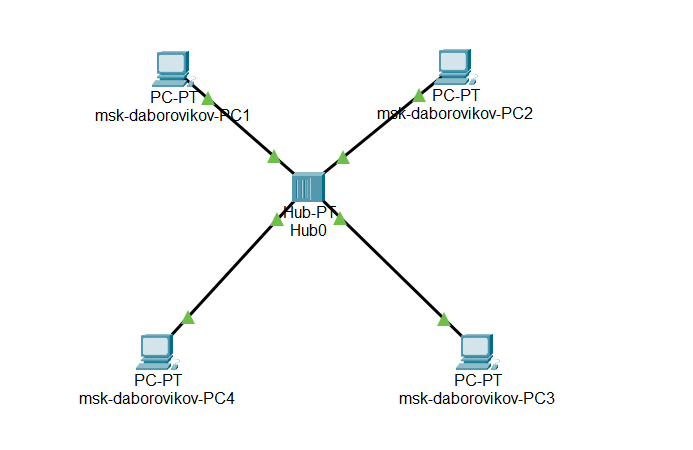
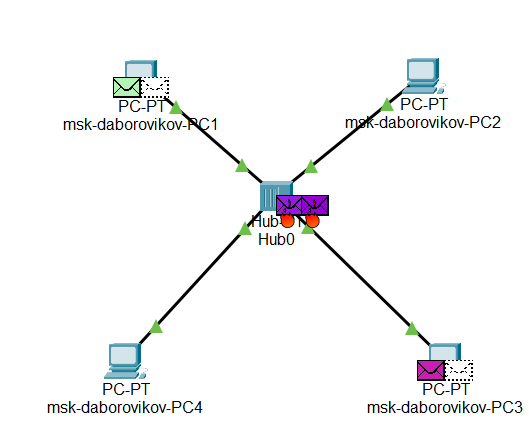
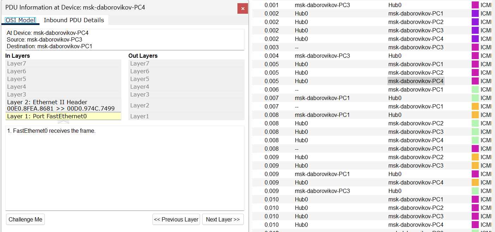
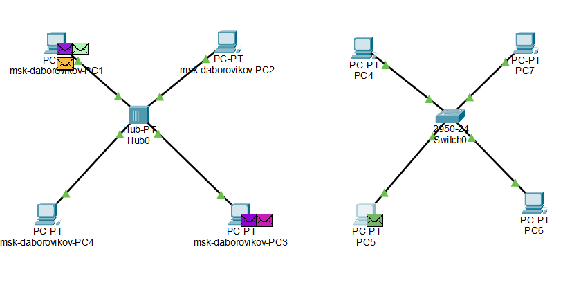
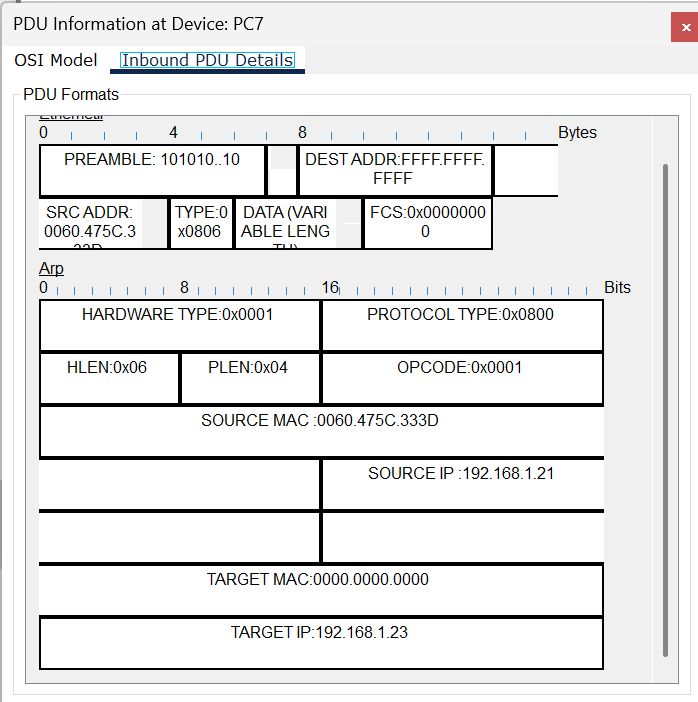
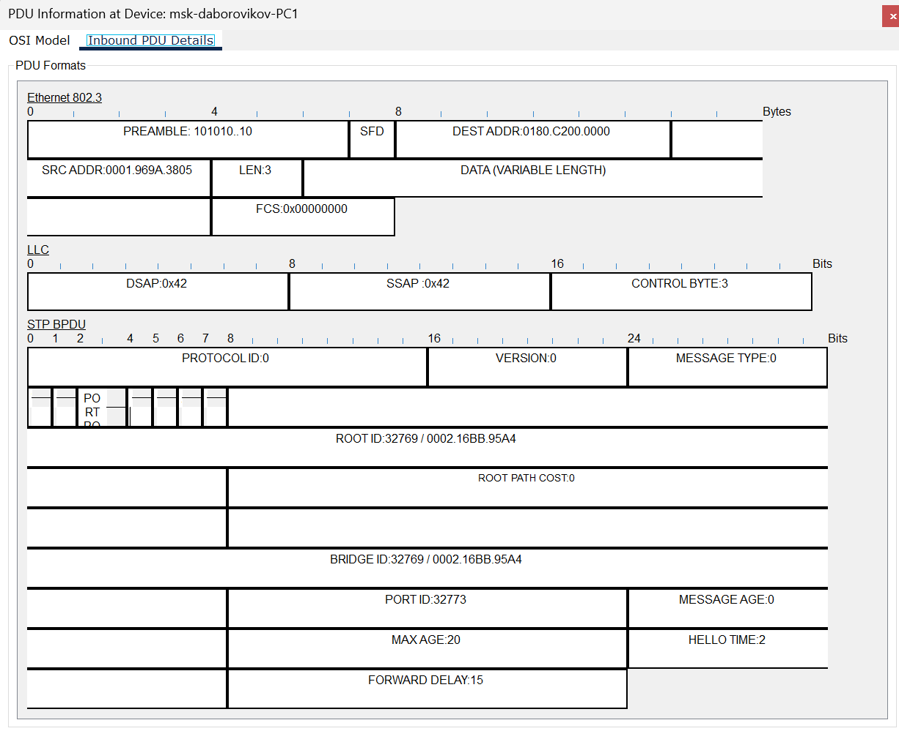
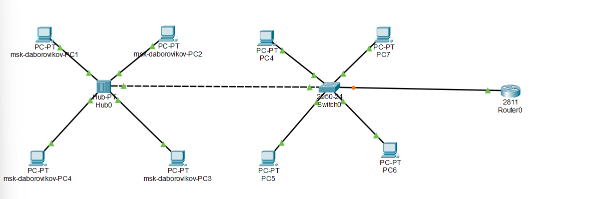
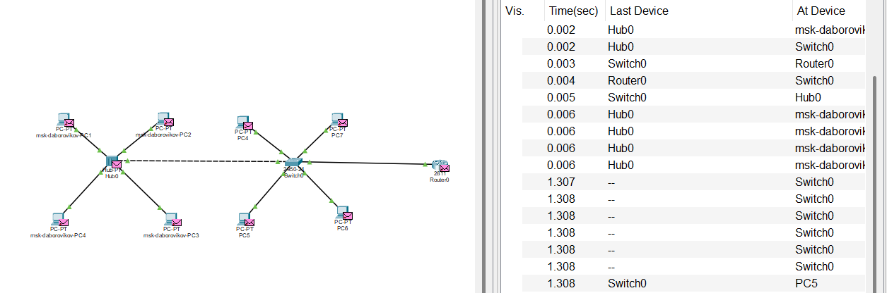

---
## Front matter
title: "Лабораторная работа №1"
subtitle: "Знакомство с Cisco Packet Tracer"
author: "Боровиков Даниил Александрович"

## Generic otions
lang: ru-RU
toc-title: "Содержание"

## Bibliography
bibliography: bib/cite.bib
csl: pandoc/csl/gost-r-7-0-5-2008-numeric.csl

## Pdf output format
toc: true # Table of contents
toc-depth: 2
lof: true # List of figures
lot: true # List of tables
fontsize: 12pt
linestretch: 1.5
papersize: a4
documentclass: scrreprt
## I18n polyglossia
polyglossia-lang:
  name: russian
  options:
	- spelling=modern
	- babelshorthands=true
polyglossia-otherlangs:
  name: english
## I18n babel
babel-lang: russian
babel-otherlangs: english
## Fonts
mainfont: IBM Plex Serif
romanfont: IBM Plex Serif
sansfont: IBM Plex Sans
monofont: IBM Plex Mono
mathfont: STIX Two Math
mainfontoptions: Ligatures=Common,Ligatures=TeX,Scale=0.94
romanfontoptions: Ligatures=Common,Ligatures=TeX,Scale=0.94
sansfontoptions: Ligatures=Common,Ligatures=TeX,Scale=MatchLowercase,Scale=0.94
monofontoptions: Scale=MatchLowercase,Scale=0.94,FakeStretch=0.9
mathfontoptions:
## Biblatex
biblatex: true
biblio-style: "gost-numeric"
biblatexoptions:
  - parentracker=true
  - backend=biber
  - hyperref=auto
  - language=auto
  - autolang=other*
  - citestyle=gost-numeric
## Pandoc-crossref LaTeX customization
figureTitle: "Рис."
tableTitle: "Таблица"
listingTitle: "Листинг"
lofTitle: "Список иллюстраций"
lotTitle: "Список таблиц"
lolTitle: "Листинги"
## Misc options
indent: true
header-includes:
  - \usepackage{indentfirst}
  - \usepackage{float} # keep figures where there are in the text
  - \floatplacement{figure}{H} # keep figures where there are in the text
---

# Цель работы

Ознакомиться с программой Cisco Packet Tracer, установить её на персональное устройство и изучить основные возможности интерфейса для моделирования сетей.

# Задание

1. Загрузить и установить Cisco Packet Tracer на домашний компьютер.
2. Создать простую сеть в Cisco Packet Tracer и выполнить базовую настройку оборудования.  
[@wiki:bash]

# Ход выполнения лабораторной работы

Создаём новый проект с именем `lab_PT-01.pkt`.

На рабочей области размещаем один концентратор (`Hub-PT`) и четыре компьютера (`PC`). Соединяем их с концентратором с помощью прямых кабелей. Открываем настройки каждого компьютера и задаём статические IP-адреса: `192.168.1.11`, `192.168.1.12`, `192.168.1.13`, `192.168.1.14` с маской подсети `255.255.255.0` (см. рис. [-@fig:002]). Для идентификации устройств добавляем в их имена мой логин `vnkhrustalev` и город `msk`.

{#fig:001 width=70%}

{#fig:002 width=70%}

Переключаемся в главном окне из режима реального времени (`Realtime`) в режим симуляции (`Simulation`). Используем инструмент `Add Simple PDU (P)`: кликаем сначала на `PC0`, затем на `PC2`. В рабочей зоне появляются два значка-конверта (см. рис. [-@fig:003]), а на панели событий отображаются записи о пакетах ARP и ICMP. Запускаем симуляцию кнопкой `Play` и наблюдаем, как пакеты ARP и ICMP движутся от `PC0` к `PC2` и обратно.  

Пакет сначала поступает на концентратор, который рассылает его всем подключённым устройствам. Однако принимает его только тот компьютер, которому он адресован.

{#fig:003 width=70%}

Кликаем на строку события в панели симуляции, открываем окно с данными о PDU и изучаем процессы на уровнях модели OSI. На вкладке `OSI Model` используем функцию `Challenge Me` (см. рис. [-@fig:004]) и отвечаем на контрольные вопросы.

{#fig:004 width=70%}

Переходим к анализу структуры пакета ICMP во вкладке PDU. В нём содержится заголовок IP с информацией об IP-адресах отправителя и получателя, а также заголовок ICMP с типом пакета, кодом, контрольной суммой, идентификатором и номером последовательности. Эти данные неизменны при передаче.  

Далее формируется кадр Ethernet:  
- Поле преамбулы (7 байт) для синхронизации.  
- Поле SFD.  
- Адрес назначения (`Destination Address`, 6 байт).  
- Адрес источника (`Source Address`, 6 байт).  
- Тип протокола (`Type`).  
- Контрольная последовательность (`FCS`, 4 байта).  

Рассмотрим пример MAC-адресов (см. рис. [-@fig:005]):  
- `0001.63AA.BC3E` — адрес получателя (`PC2`).  
- `0060.5CB0.446E` — адрес отправителя (`PC1`).  
Первые три байта указывают на производителя (в данном случае Cisco), а последние три — уникальный идентификатор устройства.

{#fig:005 width=70%}

Очищаем список событий и удаляем текущий сценарий. Снова используем `Add Simple PDU (P)`: сначала от `PC0` к `PC2`, затем от `PC2` к `PC0` (см. рис. [-@fig:006]). Запускаем симуляцию кнопкой `Play` и наблюдаем возникновение коллизии (см. рис. [-@fig:007]).  

Концентратор не может одновременно обработать два пакета, что приводит к ошибке (см. рис. [-@fig:008]).

{#fig:006 width=70%}

{#fig:007 width=70%}

{#fig:008 width=70%}

Возвращаемся в режим `Realtime`. Заменяем концентратор на коммутатор (например, `Cisco 2950-24`), подключаем к нему четыре компьютера прямыми кабелями и задаём IP-адреса: `192.168.1.21`, `192.168.1.22`, `192.168.1.23`, `192.168.1.24` с маской `255.255.255.0` (см. рис. [-@fig:009]).

{#fig:009 width=70%}

Переключаемся в режим `Simulation`. Используем `Add Simple PDU (P)` от `PC4` к `PC6`. В рабочей зоне появляются значки пакетов, а в списке событий — записи об ARP и ICMP (см. рис. [-@fig:010]). Запускаем симуляцию и видим, что ARP-пакеты сначала рассылаются всем устройствам (как с концентратором), но ответ идёт только к нужному получателю.

Структура пакета ICMP аналогична описанной ранее: заголовки IP и ICMP остаются неизменными, а кадр Ethernet включает те же поля. Пакет передаётся через коммутатор, который направляет его по MAC-адресам от `PC4` к `PC6`.

{#fig:010 width=70%}

Очищаем события, добавляем два пакета: от `PC4` к `PC6` и от `PC6` к `PC4` (см. рис. [-@fig:011]). Запускаем симуляцию. Коллизий нет, так как коммутатор отправляет пакеты только целевым устройствам.

{#fig:011 width=70%}

Возвращаемся в `Realtime`. Соединяем концентратор и коммутатор кроссовым кабелем. Переходим в `Simulation`, очищаем события и добавляем пакеты: от `PC0` к `PC4` и от `PC4` к `PC0` (см. рис. [-@fig:012]). Запускаем симуляцию.  

Пакет из сети с концентратором теряется из-за коллизии, а пакет из сети с коммутатором доходит до адресата благодаря полнодуплексному режиму, позволяющему передавать данные в обоих направлениях одновременно.

{#fig:012 width=70%}

Очищаем события и запускаем симуляцию заново. В списке появляются пакеты STP. Рассмотрим их структуру (см. рис. [-@fig:013]):  

- **Protocol Identifier** (2 байта) — всегда `0`.  

- **Protocol Version** (1 байт) — `0`.  

- **BPDU Type** (1 байт) — `0` для CBPDU, `1` для TCN BPDU.  

- **Flags** (1 байт) — биты для изменений топологии.  

- **Root Identifier** — приоритет и MAC корневого моста.  

-**Root Path Cost** — стоимость пути до корня.  
- **Bridge Identifier** — данные отправителя.  
- **Port Identifier** — порт отправки.  
- **Message Age**, **Max Age**, **Hello Time**, **Forward Delay** — временные параметры.  

Кадр Ethernet в STP-пакетах использует тип `802.3` с преамбулой, MAC-адресами и полем длины.

{#fig:013 width=70%}

В режиме `Realtime` добавляем маршрутизатор (`Cisco 2811`), соединяем его с коммутатором прямым кабелем (см. рис. [-@fig:014]). Настраиваем маршрутизатор: задаём IP `192.168.1.254`, маска `255.255.255.0`, активируем порт (см. рис. [-@fig:015]).

{#fig:014 width=70%}

{#fig:015 width=70%}

В режиме `Simulation` очищаем события, добавляем пакет от `PC3` к маршрутизатору и запускаем симуляцию. Наблюдаем пакеты ARP, ICMP, STP и CDP (см. рис. [-@fig:016]).  

CDP (Cisco Discovery Protocol) — проприетарный протокол Cisco. Его структура (см. рис. [-@fig:017]):  
- **Version** — `0x01`.  
- **Time-to-Live** — время хранения данных.  
- **Checksum** — контрольная сумма.  
- **Type/Length/Value** — тип, длина и значение данных.  

Кадр Ethernet остаётся аналогичным STP.

{#fig:016 width=70%}

{#fig:017 width=70%}

# Контрольные вопросы

##  Что такое концентратор, коммутатор, маршрутизатор и шлюз? Когда их применяют?  

- **Концентратор** — устройство, соединяющее устройства в сеть и передающее данные всем портам. Применяется в простых сетях, но вызывает коллизии.  

- **Коммутатор** — передаёт данные только нужному порту по MAC-адресу, снижая коллизии. Используется в локальных сетях.  

- **Маршрутизатор** — связывает разные сети, маршрутизируя трафик по IP. Применяется для межсетевого взаимодействия.  

- **Шлюз** — точка перехода между сетями с разными протоколами.  

##. Что такое IP-адрес, сетевая маска и broadcast-адрес?  

- **IP-адрес** — уникальный идентификатор устройства в сети (например, `192.168.1.11`).  

- **Сетевая маска** — разделяет IP на адрес сети и узла (например, `255.255.255.0`).  

- **Broadcast-адрес** — адрес для рассылки всем узлам сети (например, `192.168.1.255`).  

##  Как проверить доступность узла в сети?  

Используем команду `ping`, отправляющую ICMP-запросы. В Packet Tracer это моделируется через PDU, где видны ответы узла.

# Выводы

В ходе выполнения лабораторной работы я установил иснтрумент моделирования конфигурации сети Cisco Packet Tracer, ознакомился с его интерфейсом.

# Список литературы{.unnumbered}

::: {#refs}
:::
