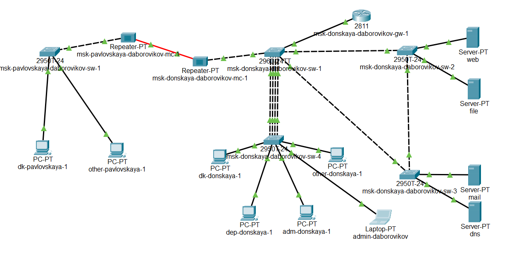
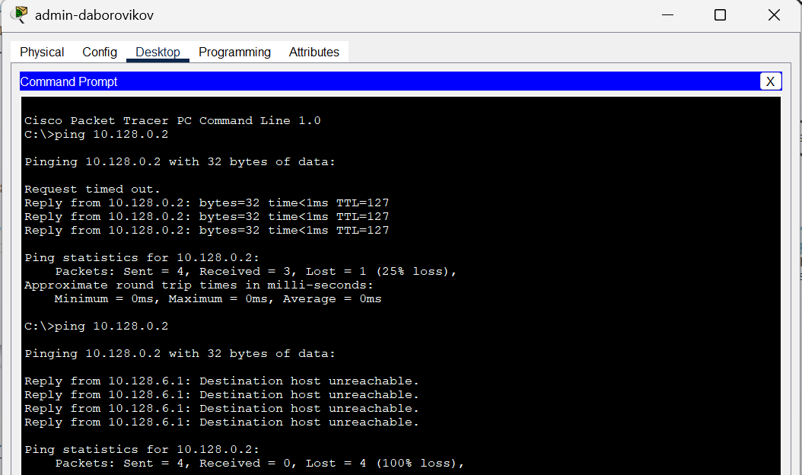
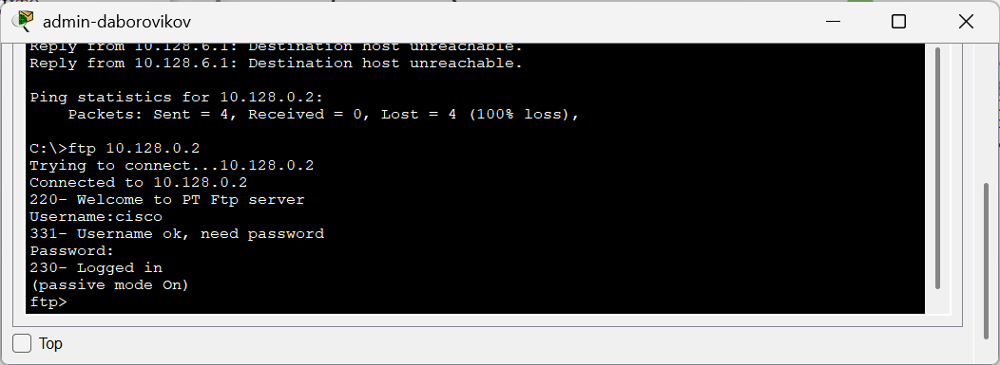
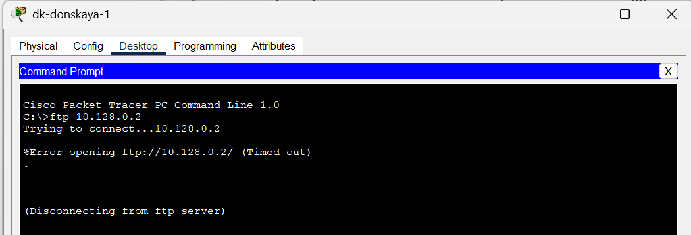
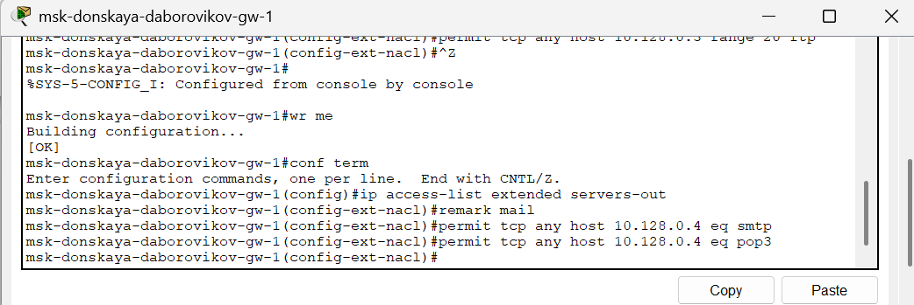
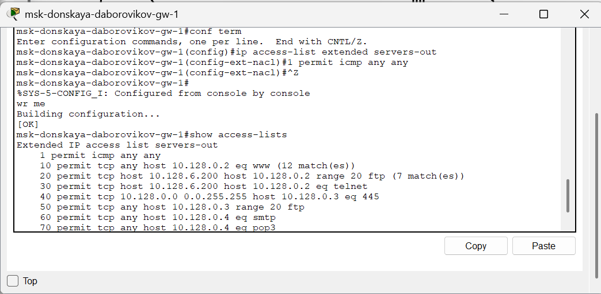
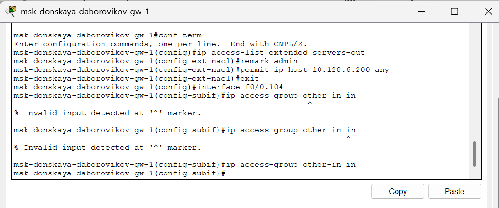
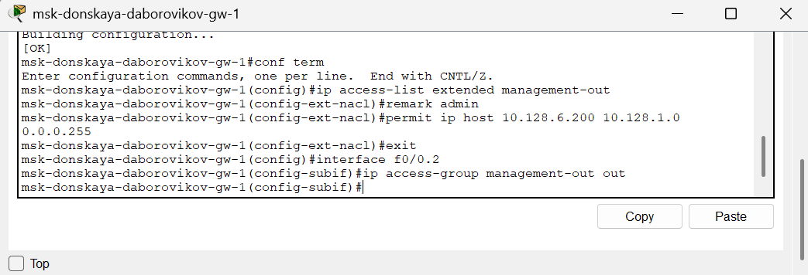
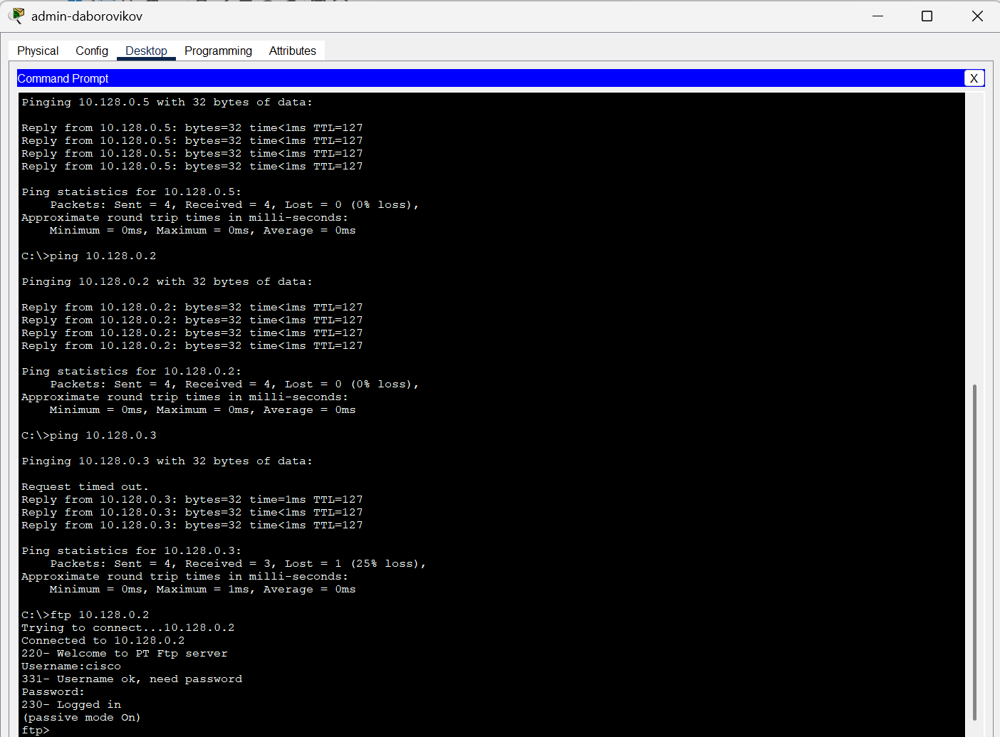
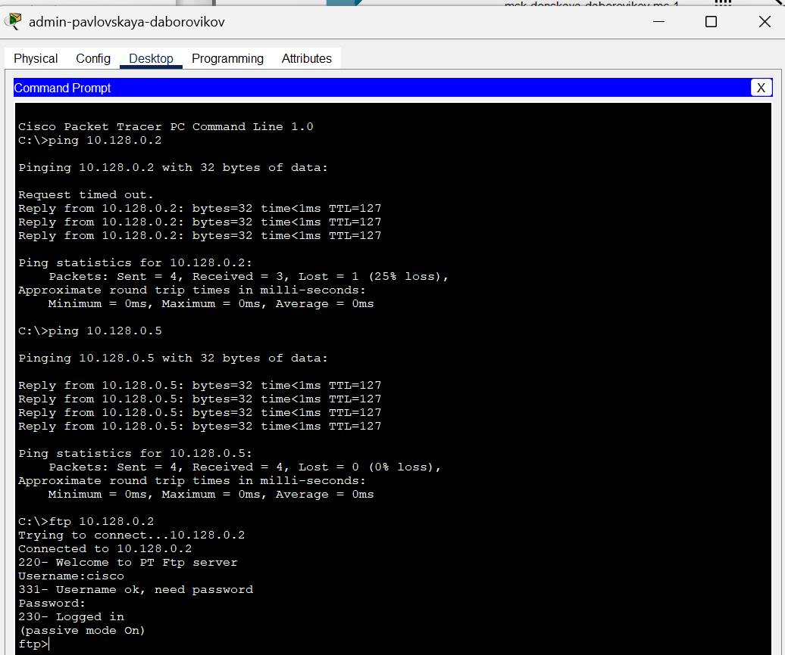

---
## Front matter
lang: ru-RU
title: Лабораторная Работа №10. Настройка списков управления доступом (ACL)
subtitle: Администрирование локальных сетей
author:
  - Боровиков Д.А.
institute:
  - Российский университет дружбы народов им. Патриса Лумумбы, Москва, Россия

## i18n babel
babel-lang: russian
babel-otherlangs: english

## Formatting pdf
toc: false
toc-title: Содержание
slide_level: 2
aspectratio: 169
section-titles: true
theme: metropolis
header-includes:
 - \metroset{progressbar=frametitle,sectionpage=progressbar,numbering=fraction}
 - '\makeatletter'
 - '\beamer@ignorenonframefalse'
 - '\makeatother'

## Fonts
mainfont: Arial
romanfont: Arial
sansfont: Arial
monofont: Arial
---

## Докладчик

  * Боровиков Даниил Александрович
  * НПИбд-01-22
  * Российский университет дружбы народов
  * [1132222006@pfur.ru]

## Цели и задачи

Освоить настройку прав доступа пользователей к ресурсам сети.

## Подсоединение ноутбука

{#fig:001 width=70%}

## gateway-адрес

{#fig:002 width=60%}

## Настройка доступа к web-серверу

{#fig:003 width=70%}

## Список управления доступом к интерфейсу

{#fig:004 width=60%}

## ping

{#fig:005 width=70%}

## Проверка доступа к web-серверу через протокол HTTP

{#fig:006 width=60%}

## Telnet и FTP

{#fig:007 width=70%}

## Проверка доступа по протоколу FTP

{#fig:008 width=60%}

## Проверка доступа по протоколу FTP

{#fig:009 width=70%}

## Настройка доступа к файловому серверу 

{#fig:010 width=60%}

## POP3 и SMTP

{#fig:011 width=70%}

## UDP-порт 53

{#fig:012 width=60%}

## Проверка доступности web-сервера (через браузер) по имени

{#fig:013 width=70%}

## Разрешение icmp-запросов

{#fig:014 width=60%}

## Настройка доступа для сети Other

{#fig:015 width=70%}

## Настройка доступа администратора

{#fig:016 width=60%}

## ping ftp

{#fig:017 width=70%}

## Other на Павловской 

{#fig:018 width=60%}

## Other на Павловской

{#fig:019 width=70%}

## Проверка Other на Павловской

{#fig:020 width=60%}

## Вывод

В ходе выполнения лабораторной работы я освоил настройку прав доступа пользователей к ресурсам сети.
