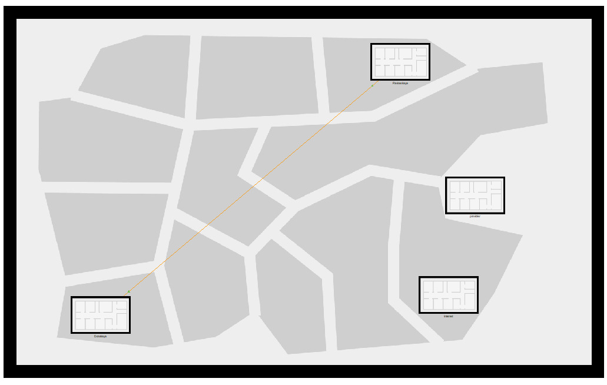
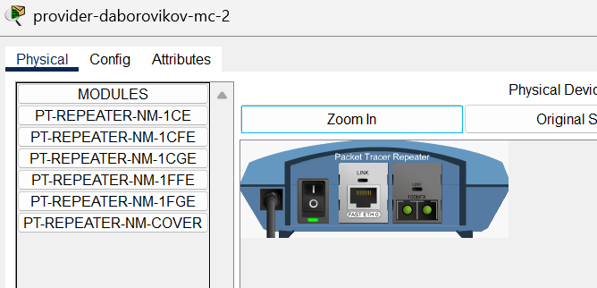

---
## Front matter
lang: ru-RU
title: Лабораторная Работа №11. Настройка NAT. Планирование
subtitle: Администрирование Локальных Сетей
author:
  - Боровиков Д.А.
institute:
  - Российский университет дружбы народов им. Патриса Лумумбы, Москва, Россия

## i18n babel
babel-lang: russian
babel-otherlangs: english

## Formatting pdf
toc: false
toc-title: Содержание
slide_level: 2
aspectratio: 169
section-titles: true
theme: metropolis
header-includes:
 - \metroset{progressbar=frametitle,sectionpage=progressbar,numbering=fraction}
 - '\makeatletter'
 - '\beamer@ignorenonframefalse'
 - '\makeatother'

## Fonts
mainfont: Arial
romanfont: Arial
sansfont: Arial
monofont: Arial
---

## Докладчик

  * Боровиков Даниил Александрович
  * НПИбд-01-22
  * Российский университет дружбы народов
  * [1132222006@pfur.ru]

## Цели и задачи

Провести подготовительные мероприятия по подключению локальной сети
организации к Интернету.

## Схема сети с выходом в Интернет

{#fig:001 width=70%}

## Здания провайдера и интернета

{#fig:002 width=60%}

## Перенос оборудования провайдера и Интернет

{#fig:003 width=70%}

## Оборудование в здании сети провайдера

{#fig:004 width=40%}

## Оборудование в здании сети модельного Интернета

{#fig:005 width=50%}

## Замена модулей на медиаконвертерах

{#fig:006 width=60%}

## Прописываем IP-адреса серверам

{#fig:007 width=70%}

## DNS-записи на сервере DNS в сети «Донская»

{#fig:008 width=60%}

## Вывод

В ходе выполнения лабораторной работы я провел подготовительные мероприятия по подключению локальной сети организации к Интернету.
