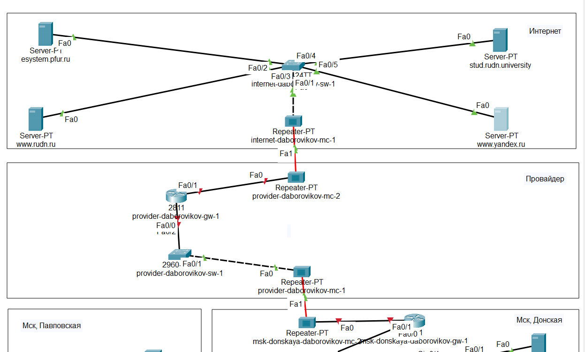
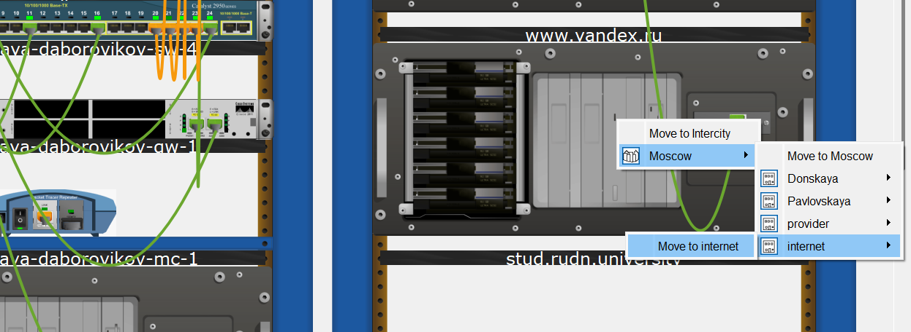
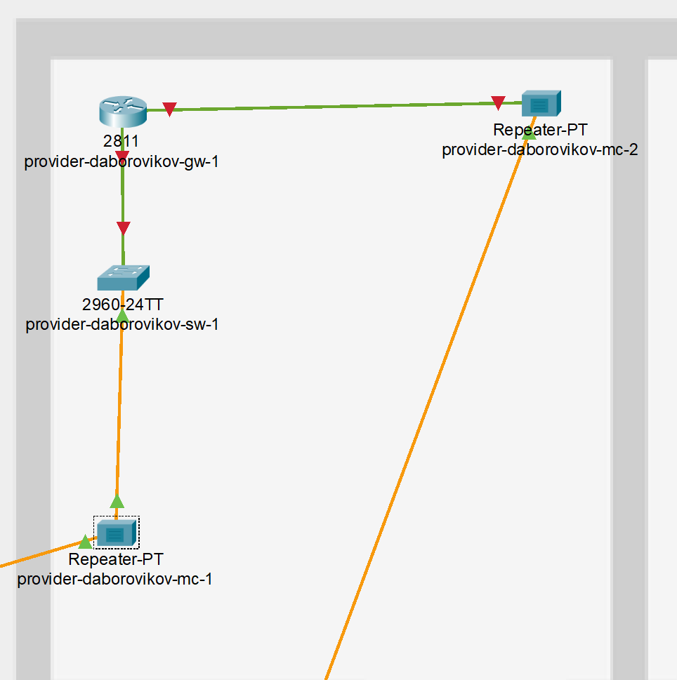
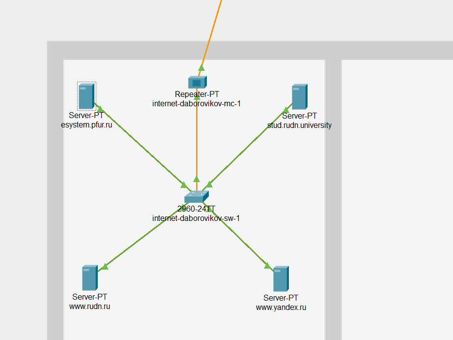
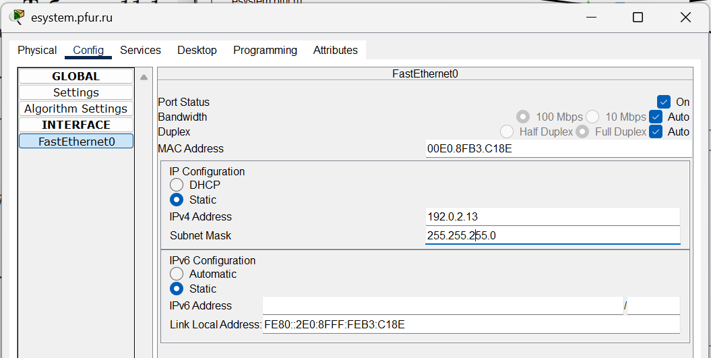
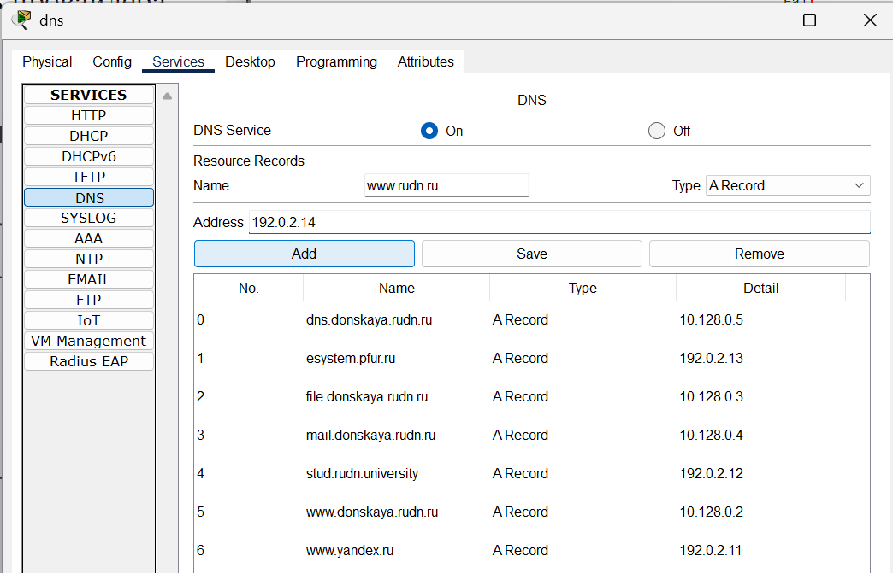

---
## Front matter
title: "Отчёт по лабораторной работе №11"
subtitle: "Дисциплина: Администрирование локальных сетей"
author: "Боровиков Даниил Александрович НПИбд-01-22"

## Generic otions
lang: ru-RU
toc-title: "Содержание"

## Bibliography
bibliography: bib/cite.bib
csl: pandoc/csl/gost-r-7-0-5-2008-numeric.csl

## Pdf output format
toc: true # Table of contents
toc-depth: 2
lof: true # List of figures
lot: true # List of tables
fontsize: 12pt
linestretch: 1.5
papersize: a4
documentclass: scrreprt
## I18n polyglossia
polyglossia-lang:
  name: russian
polyglossia-otherlangs:
  name: english
## I18n babel
babel-lang: russian
babel-otherlangs: english
## Fonts
mainfont: Arial
romanfont: Arial
sansfont: Arial
monofont: Arial
mainfontoptions: Ligatures=TeX
romanfontoptions: Ligatures=TeX
sansfontoptions: Ligatures=TeX,Scale=MatchLowercase
monofontoptions: Scale=MatchLowercase,Scale=0.9
## Biblatex
biblatex: true
biblio-style: "gost-numeric"
biblatexoptions:
  - parentracker=true
  - backend=biber
  - hyperref=auto
  - language=auto
  - autolang=other*
  - citestyle=gost-numeric
## Pandoc-crossref LaTeX customization
figureTitle: "Рис."
tableTitle: "Таблица"
listingTitle: "Листинг"
lofTitle: "Список иллюстраций"
lotTitle: "Список таблиц"
lolTitle: "Листинги"
## Misc options
indent: true
header-includes:
  - \usepackage{indentfirst}
  - \usepackage{float} # keep figures where there are in the text
  - \floatplacement{figure}{H} # keep figures where there are in the text
---

# Цель работы

Провести подготовительные мероприятия по подключению локальной сети
организации к Интернету.

#  Задание

1. Построить схему подсоединения локальной сети к Интернету.

2. Построить модельные сети провайдера и сети Интернет.

3. Построить схемы сетей L1, L2, L3.

4. При выполнении работы необходимо учитывать соглашение об именовании.

# Выполнение лабораторной работы

1. Внесите изменения в схему L1 сети, добавив в неё сеть провайдера и сеть
модельного Интернета с указанием названий оборудования и портов подключения.

2. Внесите изменения в схемы L2 и L3 сети, указав адреса и VLAN сети провайдера и модельной сети Интернета. Скорректируйте таблицы распределения
IP-адресов и портов.

3. На схеме предыдущего вашего проекта разместите согласно  необходимое оборудование для сети провайдера и сети модельного Интернета:
4 медиаконвертера (Repeater-PT)  , 2 коммутатора типа Cisco 2960-24TT,
маршрутизатор типа Cisco 2811, 4 сервера.

4. Присвойте названия размещённым в сети провайдера и в сети модельного
Интернета объектам согласно модельным предположениям и схеме L1.

 (рис. [-@fig:001])

{ #fig:001 width=70% }

5. В физической рабочей области добавьте здание провайдера и здание,
имитирующее расположение серверов модельного Интернета 
Присвойте им соответствующие названия.

(рис. [-@fig:002]). 

{ #fig:002 width=70% }

6. Перенесите из сети «Донская» оборудование провайдера  и модельной сети Интернета (рис. 11.5) в соответствующие здания.

(рис. [-@fig:003]). 

{ #fig:003 width=70% }

(рис. [-@fig:004]). 

{ #fig:004 width=70% }

(рис. [-@fig:005]). 

{ #fig:005 width=70% }

7. На медиаконвертерах замените имеющиеся модули на PT-REPEATERNM-1FFE и PT-REPEATER-NM-1CFE для подключения витой пары по
технологии Fast Ethernet и оптоволокна соответственно

(рис. [-@fig:006]). 

{ #fig:006 width=70% }

8. Проведите соединение объектов согласно скорректированной Вами схеме L1.

9. Пропишите IP-адреса серверам 

 (рис. [-@fig:007]).

{ #fig:007 width=70% }

10. Пропишите сведения о серверах на DNS-сервере сети «Донская» 

(рис. [-@fig:008])

{ #fig:008 width=70% }

# Выводы

В ходе выполнения лабораторной работы я провел подготовительные мероприятия по подключению локальной сети организации к Интернету.

#  Контрольные вопросы

## 1. Что такое Network Address Translation (NAT)? [@wiki:bash]

**Network Address Translation (NAT)** — это механизм преобразования IP-адресов транзитных пакетов. Его основная задача — замена одного IP-адреса другим при пересечении границы сети, чаще всего для подключения локальной сети с частными адресами к Интернету через один или несколько публичных IP-адресов.

---

## 2. Как определить, находится ли узел сети за NAT?

**Узнать, находится ли узел за NAT, можно несколькими способами:**
- Проверить локальный IP-адрес и внешний IP-адрес через внешние сервисы типа `ifconfig.me`. Если они отличаются, узел за NAT.
- Использовать утилиты и протоколы типа STUN, которые могут определить наличие и тип NAT.
- Наблюдать за сетевыми пакетами: при NAT меняются IP-адреса и часто номера портов.

---

## 3. Какое оборудование отвечает за преобразование адреса методом NAT?

**За преобразование адресов с помощью NAT** отвечают:
- **Маршрутизаторы** — в домашних и корпоративных сетях.
- **Межсетевые экраны (firewall)** — при наличии функций NAT.
- **Специализированные устройства NAT-шлюзы** — в более сложных сетевых инфраструктурах.

---

## 4. В чём отличие статического, динамического и перегруженного NAT?

**Статический NAT** — каждому внутреннему IP-адресу сопоставляется конкретный внешний IP-адрес. Преобразование фиксировано.

**Динамический NAT** — внутренние IP-адреса получают любой свободный внешний IP-адрес из заранее заданного пула. Связь не фиксирована и может меняться.

**Перегруженный NAT (PAT, Port Address Translation)** — множество внутренних IP-адресов используют один внешний IP-адрес, различаясь только портами. Это наиболее часто используемый вид NAT для массового подключения устройств к Интернету.

---

## 5. Охарактеризуйте типы NAT

**Full Cone NAT** — внутренний IP:порт сопоставляется с одним внешним IP:портом. Любой внешний узел может отправить ответные пакеты.

**Restricted Cone NAT** — внешний узел может отправить пакеты только в случае, если внутренний узел первым отправил ему данные. Сохраняется ограничение по IP-адресу.

**Port Restricted Cone NAT** — более строгая версия Restricted Cone NAT: кроме IP-адреса, фильтрация производится и по номеру порта.

**Symmetric NAT** — для каждого нового соединения с разным внешним адресом или портом NAT назначает новый внешний порт. Пакеты от других адресов или портов блокируются. Самый сложный тип NAT для организации входящих соединений.

# Список литературы{.unnumbered}

::: {#refs}
:::

