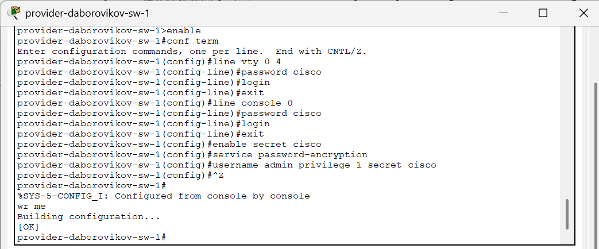
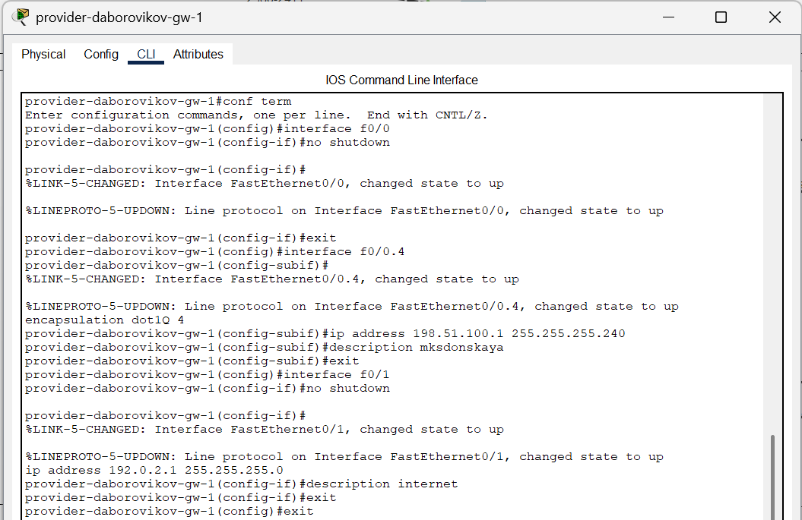
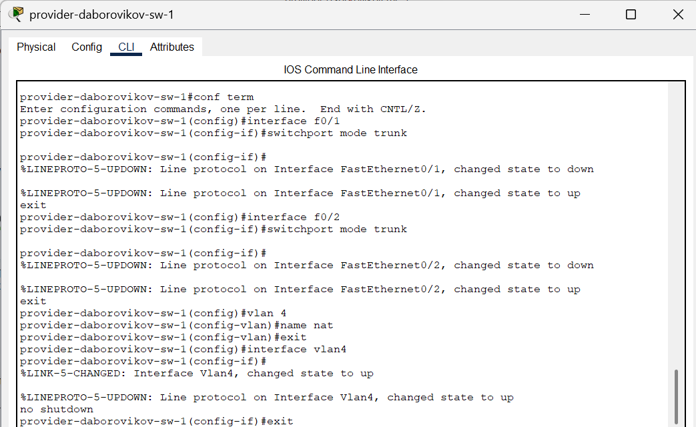
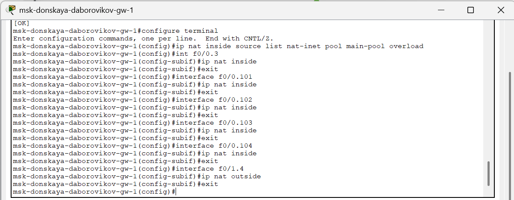
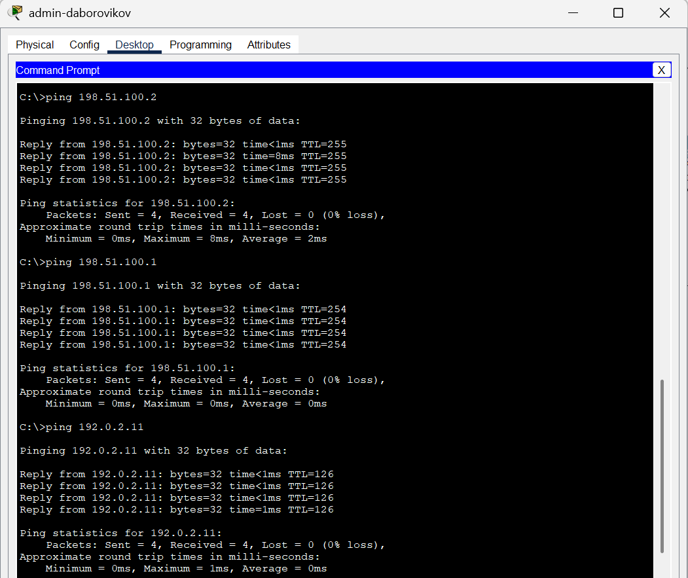
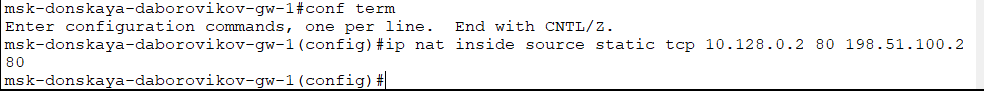
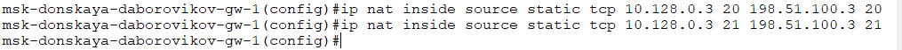
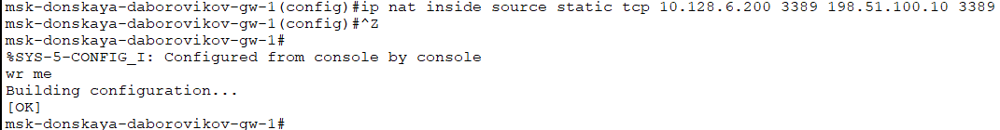

---
## Front matter
title: "Отчёт по лабораторной работе №12"
subtitle: "Дисциплина: Администрирование локальных сетей"
author: "Боровиков Даниил Александрович НПИбд-01-22"

## Generic otions
lang: ru-RU
toc-title: "Содержание"

## Bibliography
bibliography: bib/cite.bib
csl: pandoc/csl/gost-r-7-0-5-2008-numeric.csl

## Pdf output format
toc: true # Table of contents
toc-depth: 2
lof: true # List of figures
lot: true # List of tables
fontsize: 12pt
linestretch: 1.5
papersize: a4
documentclass: scrreprt
## I18n polyglossia
polyglossia-lang:
  name: russian
polyglossia-otherlangs:
  name: english
## I18n babel
babel-lang: russian
babel-otherlangs: english
## Fonts
mainfont: Arial
romanfont: Arial
sansfont: Arial
monofont: Arial
mainfontoptions: Ligatures=TeX
romanfontoptions: Ligatures=TeX
sansfontoptions: Ligatures=TeX,Scale=MatchLowercase
monofontoptions: Scale=MatchLowercase,Scale=0.9
## Biblatex
biblatex: true
biblio-style: "gost-numeric"
biblatexoptions:
  - parentracker=true
  - backend=biber
  - hyperref=auto
  - language=auto
  - autolang=other*
  - citestyle=gost-numeric
## Pandoc-crossref LaTeX customization
figureTitle: "Рис."
tableTitle: "Таблица"
listingTitle: "Листинг"
lofTitle: "Список иллюстраций"
lotTitle: "Список таблиц"
lolTitle: "Листинги"
## Misc options
indent: true
header-includes:
  - \usepackage{indentfirst}
  - \usepackage{float} # keep figures where there are in the text
  - \floatplacement{figure}{H} # keep figures where there are in the text
---

# Цель работы

Приобретение практических навыков по настройке доступа локальной сети
к внешней сети посредством NAT.

#  Задание

1. Сделать первоначальную настройку маршрутизатора provider-gw-1 и коммутатора provider-sw-1 провайдера: задать имя, настроить доступ по
паролю и т.п. (см. разделы 12.4.1, 12.4.2).
2. Настроить интерфейсы маршрутизатора provider-gw-1 и коммутатора
provider-sw-1 провайдера: (см. разделы 12.4.3, 12.4.4).
3. Настроить интерфейсы маршрутизатора сети «Донская» для доступа к сети
провайдера (cм. раздел 12.4.5).
4. Настроить на маршрутизаторе сети «Донская» NAT с правилами, указанными в разделе 12.2 (см. разделы 12.4.6–12.4.8).
5. Настроить доступ из внешней сети в локальную сеть организации, как
указано в разделе 12.2 (см. раздел 12.4.9).
6. Проверить работоспособность заданных настроек.
7. При выполнении работы необходимо учитывать соглашение об именовании
(см. раздел 2.5).

# Выполнение лабораторной работы

Для начала сделаем первоначальную настройку маршрутизатора provider-gw-1 и коммутатора provider-sw-1 провайдера (зададим имя,
настроим доступ по паролю и т.п.) 

 (рис. [-@fig:001]) (рис. [-@fig:002]).  

{ #fig:001 width=70% }

{ #fig:002 width=70% }

Теперь настроим интерфейсы маршрутизатора provider-gw-1 и
коммутатора provider-sw-1 провайдера (рис. [-@fig:003]). (рис. [-@fig:004]). 

{ #fig:003 width=70% }

{ #fig:004 width=70% }

Выполним проверку командой ping с сервера www.rudn.ru на роутер
провайдера (рис. [-@fig:005]). 

{ #fig:005 width=70% }

Следующим шагом настроим интерфейсы маршрутизатора сети «Донская»
для доступа к сети провайдера(рис. [-@fig:006]). 

{ #fig:006 width=70% }

Выполним проверку. Настроим на маршрутизаторе сети «Донская» NAT [@wiki:bash]. с правилами, указанными
в лабораторной работе (рис. [-@fig:007]). (рис. [-@fig:008]) (рис. [-@fig:009]) (рис. [-@fig:010])  (рис. [-@fig:011]) (рис. [-@fig:012]) (рис. [-@fig:013])

{ #fig:007 width=70% }

 

{ #fig:008 width=70% }

{ #fig:009 width=70% }

{ #fig:010 width=70% }

{ #fig:011 width=70% }

{ #fig:012 width=70% }

(рис. [-@fig:013])

{ #fig:013 width=70% }

(рис. [-@fig:014])

{ #fig:014 width=70% }

 
На последнем шаге настроим доступ из внешней сети в локальную сеть
организации  (рис. [-@fig:015]) (рис. [-@fig:016]) (рис. [-@fig:017]) (рис. [-@fig:018]) (рис. [-@fig:019])

{ #fig:015 width=70% }

{ #fig:016 width=70% }

{ #fig:017 width=70% }

{ #fig:018 width=70% }

{ #fig:019 width=70% }

##  Контрольные вопросы

1. В чём состоит основной принцип работы NAT (что даёт наличие NAT
в сети организации)? - NAT на устройстве позволяет ему соединять
публичные и частные сети между собой с помощью только одного
IP-адреса для группы.

2. В чём состоит принцип настройки NAT (на каком оборудовании и что
нужно настроить для из локальной сети во внешнюю сеть через NAT)?
- Настроить интерфейсы на внутренних и внешних
маршрутизаторах, наборы правил для преобразования IP.

3. Можно ли применить Cisco IOS NAT к субинтерфейсам? - Да,
поскольку они существуют в энергонезависимой памяти.

4. Что такое пулы IP NAT? - Выделяемые для трансляции NAT IP.

5. Что такое статические преобразования NAT? - Взаимно однозначное
преобразование внутренних IP во внешние.

# Выводы

В ходе выполнения лабораторной работы я приобрел практические навыки по настройке доступа локальной сети
к внешней сети посредством NAT.

# Список литературы{.unnumbered}

::: {#refs}
:::

