---
## Front matter
title: "Отчёт по лабораторной работе №14"
subtitle: "Дисциплина: Администрирование сетевых подсистем"
author: "Боровиков Даниил Александрович НПИбд-01-22"

## Generic otions
lang: ru-RU
toc-title: "Содержание"

## Bibliography
bibliography: bib/cite.bib
csl: pandoc/csl/gost-r-7-0-5-2008-numeric.csl

## Pdf output format
toc: true # Table of contents
toc-depth: 2
lof: true # List of figures
lot: true # List of tables
fontsize: 12pt
linestretch: 1.5
papersize: a4
documentclass: scrreprt
## I18n polyglossia
polyglossia-lang:
  name: russian
polyglossia-otherlangs:
  name: english
## I18n babel
babel-lang: russian
babel-otherlangs: english
## Fonts
mainfont: Arial
romanfont: Arial
sansfont: Arial
monofont: Arial
mainfontoptions: Ligatures=TeX
romanfontoptions: Ligatures=TeX
sansfontoptions: Ligatures=TeX,Scale=MatchLowercase
monofontoptions: Scale=MatchLowercase,Scale=0.9
## Biblatex
biblatex: true
biblio-style: "gost-numeric"
biblatexoptions:
  - parentracker=true
  - backend=biber
  - hyperref=auto
  - language=auto
  - autolang=other*
  - citestyle=gost-numeric
## Pandoc-crossref LaTeX customization
figureTitle: "Рис."
tableTitle: "Таблица"
listingTitle: "Листинг"
lofTitle: "Список иллюстраций"
lotTitle: "Список таблиц"
lolTitle: "Листинги"
## Misc options
indent: true
header-includes:
  - \usepackage{indentfirst}
  - \usepackage{float} # keep figures where there are in the text
  - \floatplacement{figure}{H} # keep figures where there are in the text
---

# Цель работы

Настроить взаимодействие через сеть провайдера посредством статической
маршрутизации локальной сети организации с сетью основного здания, расположенного в 42-м квартале в Москве, и сетью филиала, расположенного
в г. Сочи.

#  Задание

1. Настроить связь между территориями .

2. Настроить оборудование, расположенное в квартале 42 в Москве .

3. Настроить оборудование, расположенное в филиале в г. Сочи .

4. Настроить статическую маршрутизацию между территориями.

5. Настроить статическую маршрутизацию на территории квартала 42 в г.
Москве .

6. Настроить NAT на маршрутизаторе msk-donskaya-gw-1 .

7. При выполнении работы необходимо учитывать соглашение об именовании.

# Выполнение лабораторной работы

Первым делом нам нужно настроить линку между площадками. Для этого
настроим интерфейсы у коммутатора provider-daborovikov-sw-1, маршрутизатора
msk-donskaya-daborovikov-gw-1, маршрутизатора msk-q42-daborovikov-gw-1,
коммутатора sch-sochi-daborovikov-sw-1 и маршрутизатора sch-sochi-daborovikov-gw-1 
 (рис. [-@fig:001])

{ #fig:001 width=70% }

(рис. [-@fig:002]). 

{ #fig:002 width=70% }

(рис. [-@fig:003]). 

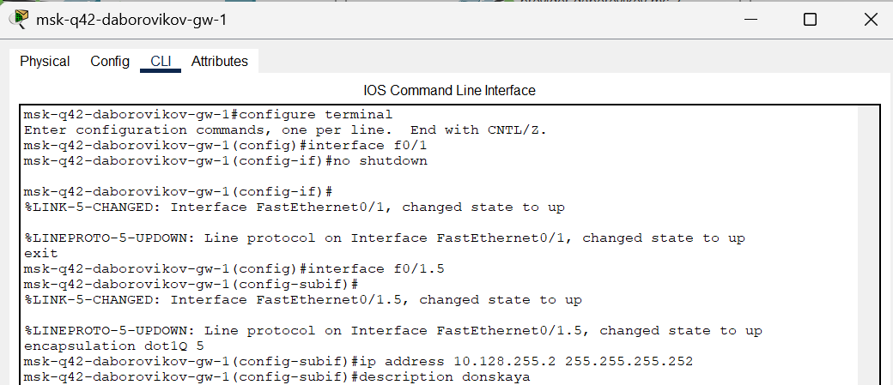{ #fig:003 width=70% }

(рис. [-@fig:004]). 

{ #fig:004 width=70% }

(рис. [-@fig:005]). 

{ #fig:005 width=70% }

(рис. [-@fig:006]). 

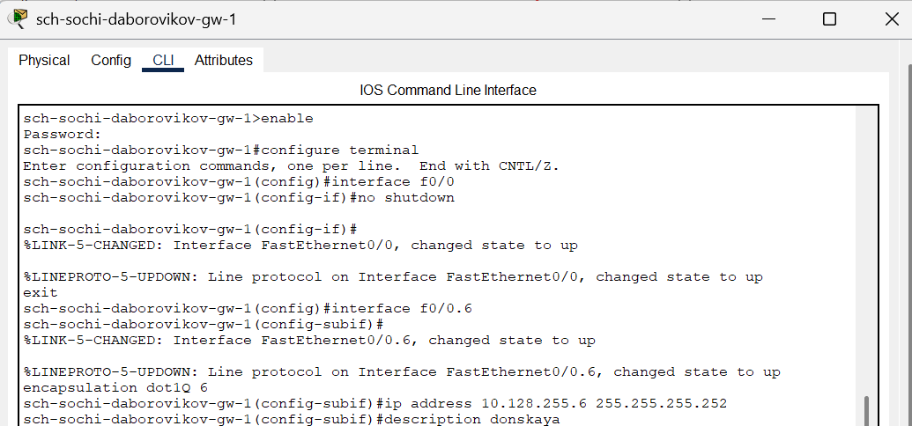{ #fig:006 width=70% }

 (рис. [-@fig:007]).

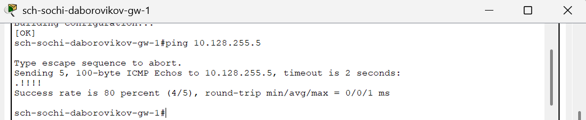{ #fig:007 width=70% }

Следующим шагом настроим площадку 42-го квартала. Для этого настроим
интерфейсы у маршрутизатора msk-q42-daborovikov-gw-1, коммутатора msk-q42-
daborovikov-sw-1, маршрутизирующего коммутатора msk-hostel-daborovikov-gw-1 и
коммутатора msk-hostel-sw-1 
(рис. [-@fig:008])

{ #fig:008 width=70% }

(рис. [-@fig:009])

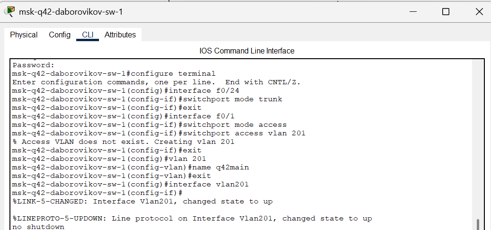{ #fig:009 width=70% }

(рис. [-@fig:010])

{ #fig:010 width=70% }

 (рис. [-@fig:011])

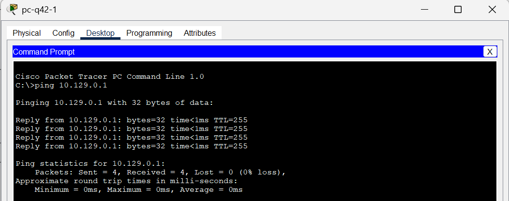{ #fig:011 width=70% }

(рис. [-@fig:012])

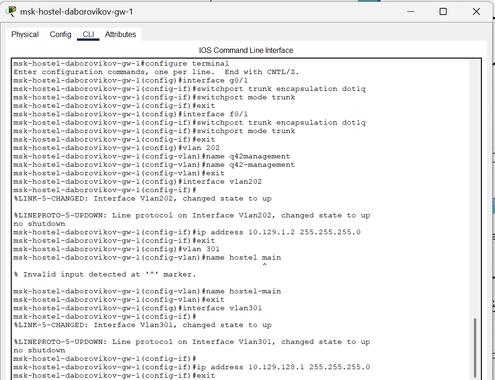{ #fig:012 width=70% }

(рис. [-@fig:013])

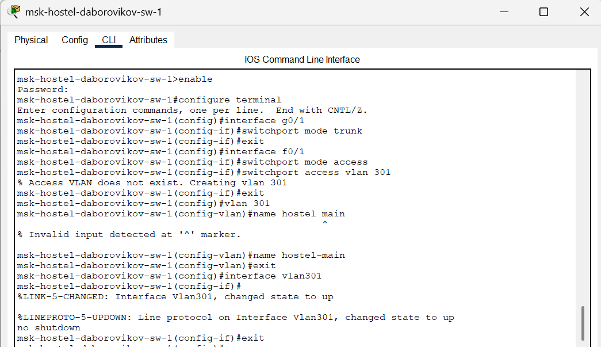{ #fig:013 width=70% }

(рис. [-@fig:014])

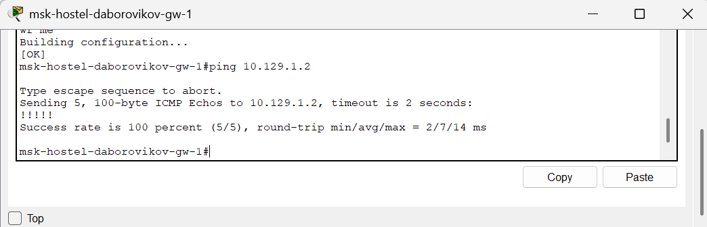{ #fig:014 width=70% }

(рис. [-@fig:015])

{ #fig:015 width=70% }

(рис. [-@fig:016])

{ #fig:016 width=70% }

 
Далее настроим площадку в Сочи. Настроим интерфейсы у маршрутизатора
sch-sochi-daborovikov-gw-1 и у коммутатора sch-sochi-daborovikov-sw-1 

(рис. [-@fig:017])

{ #fig:017 width=70% }

(рис. [-@fig:018])

{ #fig:018 width=70% }

(рис. [-@fig:019])

{ #fig:019 width=70% }

Затем настроим маршрутизацию между площадками. Настроим
маршрутизатор msk-donskaya-daborovikov-gw-1, маршрутизатор msk-q42-daborovikovgw-1 и маршрутизатор sch-sochi-daborovikov-gw-1 

(рис. [-@fig:020])

{ #fig:020 width=70% }

(рис. [-@fig:021])

{ #fig:021 width=70% }

(рис. [-@fig:022])

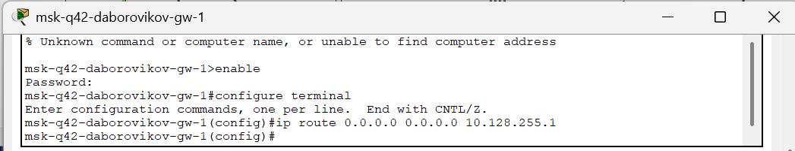{ #fig:022 width=70% }

(рис. [-@fig:023])

{ #fig:023 width=70% }

(рис. [-@fig:024])

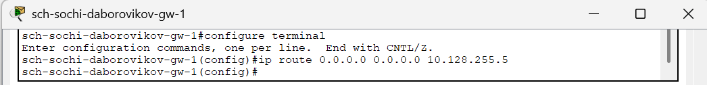{ #fig:024 width=70% }

Предпоследним шагом настроим маршрутизацию на 42 квартале. Для этого
настроим маршрутизатор msk-q42-daborovikov-gw-1 (Рис. 1.26) и маршрутизирующий
коммутатор msk-hostel-daborovikov-gw-1 (Рис. 1.27):

(рис. [-@fig:025])

{ #fig:025 width=70% }

(рис. [-@fig:026])

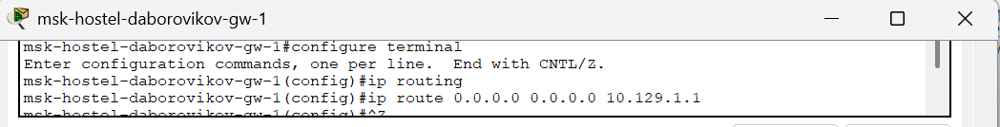{ #fig:026 width=70% }

И наконец последним шагом настроим NAT [@wiki:bash] на маршрутизаторе mskdonskaya-daborovikov-gw-1  и выполним контрольную проверку 
(рис. [-@fig:027])

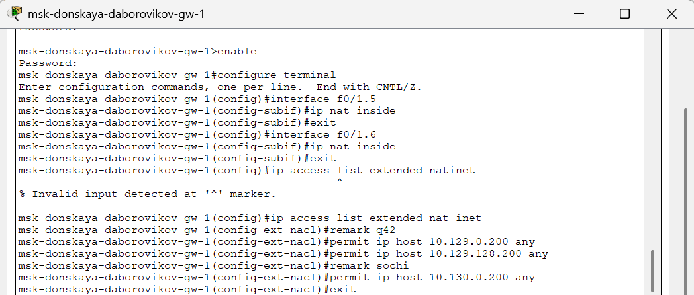{ #fig:027 width=70% }

(рис. [-@fig:028])

{ #fig:028 width=70% }

##  Контрольные вопросы

1. Приведите пример настройки статической маршрутизации между
двумя подсетями организации. - Необходимо задать IP шлюзов на
интерфейсах, настроить sub-интерфейсы с тегированием кадром
VLAN'нами и своими IP, затем настроить статические маршруты
между сетями.

2. Опишите процесс обращения устройства из одного VLAN к устройству
из другого VLAN. - 1 устройство посылает фрейм на
маршрутизатор, тот меняет MAC исходника на свой и
перенаправляет фрейм 2 устройству.

3. Как проверить работоспособность маршрута? - ping на диаметрально
противоположных устройствах друг к другу.

4. Как посмотреть таблицу маршрутизации? - show ip route

# Выводы

В ходе выполнения лабораторной работы я настроил взаимодействие через сеть провайдера посредством статической
маршрутизации локальной сети организации с сетью основного здания, расположенного в 42-м квартале в Москве, и сетью филиала, расположенного
в г. Сочи.

# Список литературы{.unnumbered}

::: {#refs}
:::

