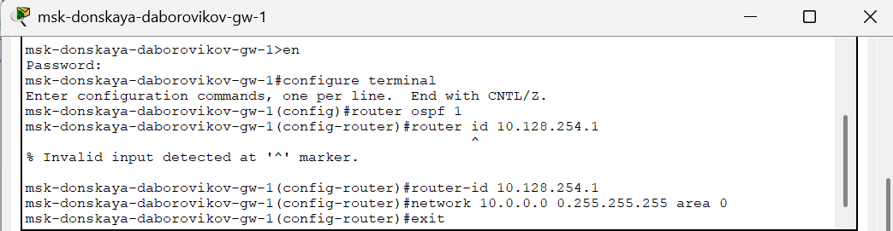
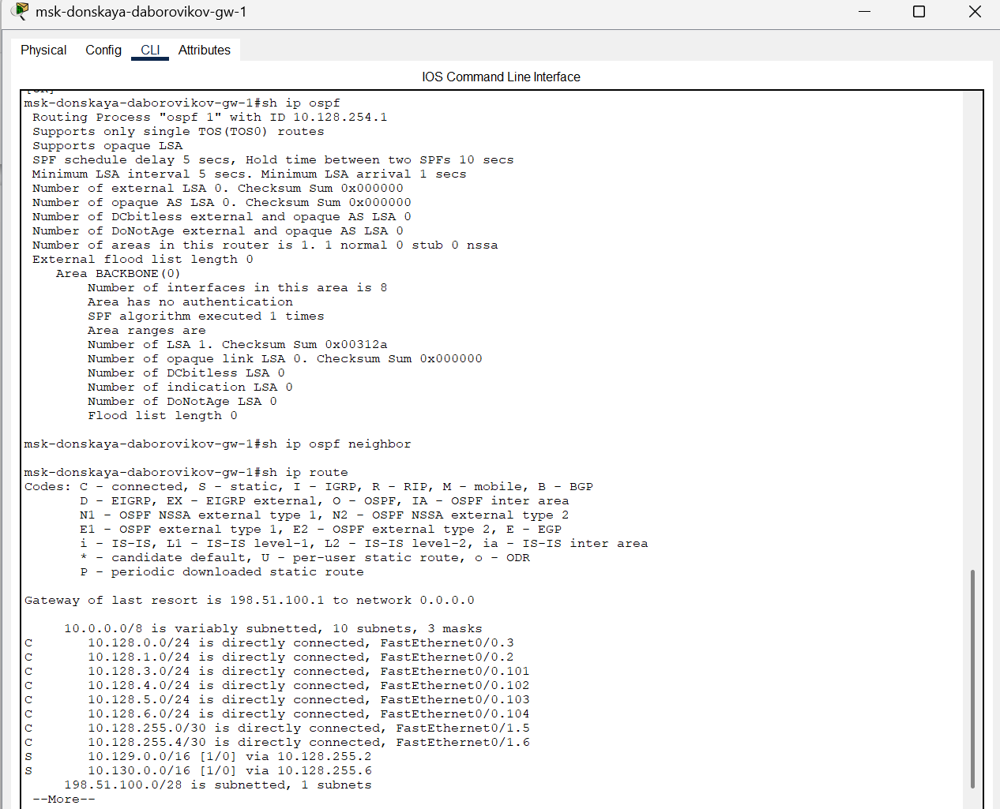
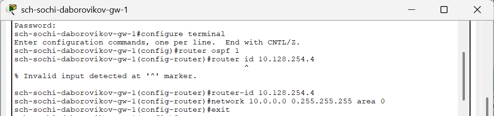
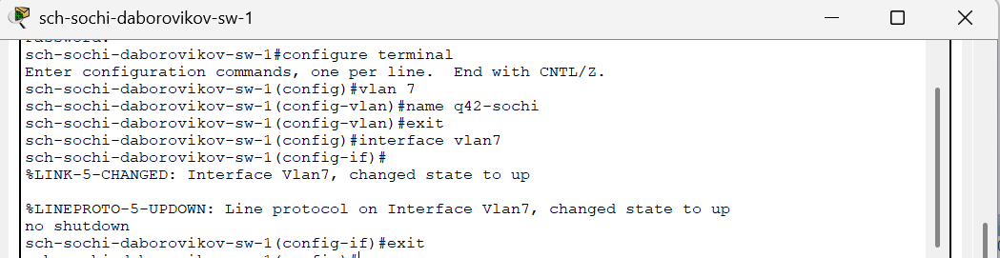
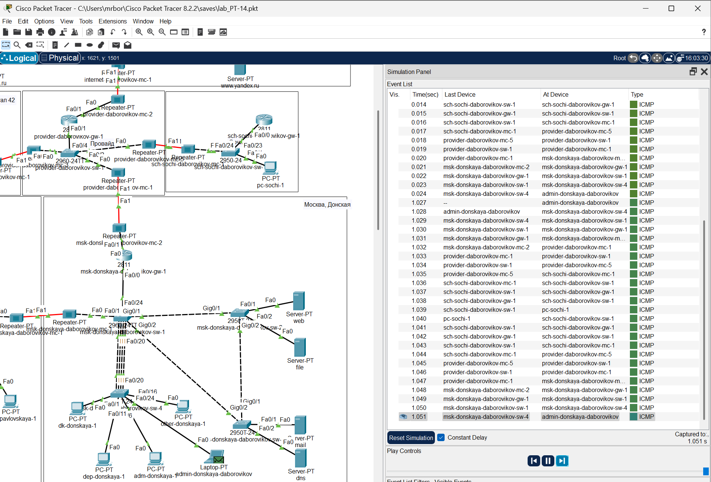
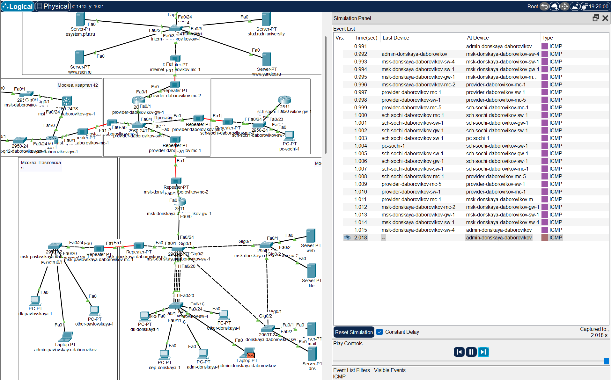

---
## Front matter
title: "Отчёт по лабораторной работе №15"
subtitle: "Дисциплина: Администрирование локальных сетей"
author: "Боровиков Даниил Александрович НПИбд-01-22"

## Generic otions
lang: ru-RU
toc-title: "Содержание"

## Bibliography
bibliography: bib/cite.bib
csl: pandoc/csl/gost-r-7-0-5-2008-numeric.csl

## Pdf output format
toc: true # Table of contents
toc-depth: 2
lof: true # List of figures
lot: true # List of tables
fontsize: 12pt
linestretch: 1.5
papersize: a4
documentclass: scrreprt
## I18n polyglossia
polyglossia-lang:
  name: russian
polyglossia-otherlangs:
  name: english
## I18n babel
babel-lang: russian
babel-otherlangs: english
## Fonts
mainfont: Arial
romanfont: Arial
sansfont: Arial
monofont: Arial
mainfontoptions: Ligatures=TeX
romanfontoptions: Ligatures=TeX
sansfontoptions: Ligatures=TeX,Scale=MatchLowercase
monofontoptions: Scale=MatchLowercase,Scale=0.9
## Biblatex
biblatex: true
biblio-style: "gost-numeric"
biblatexoptions:
  - parentracker=true
  - backend=biber
  - hyperref=auto
  - language=auto
  - autolang=other*
  - citestyle=gost-numeric
## Pandoc-crossref LaTeX customization
figureTitle: "Рис."
tableTitle: "Таблица"
listingTitle: "Листинг"
lofTitle: "Список иллюстраций"
lotTitle: "Список таблиц"
lolTitle: "Листинги"
## Misc options
indent: true
header-includes:
  - \usepackage{indentfirst}
  - \usepackage{float} # keep figures where there are in the text
  - \floatplacement{figure}{H} # keep figures where there are in the text
---

# Цель работы

Настроить динамическую маршрутизацию между территориями
организации.

# Выполнение лабораторной работы

Для начала настроим OSPF на маршрутизаторе msk-donskaya-daborovikov-gw1. Включение OSPF [@wiki:bash] на маршрутизаторе предполагает, во-первых, включение
процесса OSPF командой router ospf , во-вторых — назначение областей (зон)
интерфейсам с помощью команды network area 
Идентификатор процесса OSPF (process-id) по сути идентифицирует
маршрутизатор в автономной системе, и, вообще говоря, он не должен совпадать
с идентификаторами процессов на других маршрутизаторах.
Значение идентификатора области (area-id) может быть целым числом от 0
до 4294967295 или может быть представлено в виде IP-адреса: A.B.C.D. Область
0 называется магистралью, области с другими идентификаторами должны
подключаться к магистрали.

 (рис. [-@fig:001])

{ #fig:001 width=70% }

 
(включение процесса OSPF, назначение областей интерфейсам).
Проверим состояние протокола OSPF на маршрутизаторе msk-donskayadaborovikov-gw-1. Маршрутизаторы с общим сегментом являются соседями в
этом сегменте. Соседи выбираются с помощью протокола Hello. Команда show
ip ospf neighbor показывает статус всех соседей в заданном сегменте. Команда
show ip ospf route (или show ip route) выводит информацию из таблицы
маршрутизации 

(рис. [-@fig:002]). 

{ #fig:002 width=70% }

Далее приступим к настройке: маршрутизатора msk-q42-daborovikov-gw-1,
маршрутизирующего коммутатора msk-hostel-daborovikov-gw-1, маршрутизатора schsochi-daborovikov-gw-1 

(рис. [-@fig:003]).  (рис. [-@fig:004]). (рис. [-@fig:005]). 

{ #fig:003 width=70% }

{ #fig:004 width=70% }

{ #fig:005 width=70% }

Теперь проверим состояние протокола OSPF на всех маршрутизаторах 

(рис. [-@fig:006]).  (рис. [-@fig:007]). (рис. [-@fig:008])

{ #fig:006 width=70% }

{ #fig:007 width=70% }

{ #fig:008 width=70% }

 
Следующим шагом настроим линк 42-й квартал–Сочи (рис. [-@fig:009]) (рис. [-@fig:010]) (рис. [-@fig:011]) (рис. [-@fig:012])

{ #fig:009 width=70% }

{ #fig:010 width=70% }

 
{ #fig:011 width=70% }

{ #fig:012 width=70% }

В режиме симуляции отследим движение пакета ICMP с ноутбука
администратора сети на Донской в Москве (admin-donskaya-daborovikov) до
компьютера пользователя в филиале в г. Сочи pc-sochi-1 (рис. [-@fig:013]) (рис. [-@fig:014])

{ #fig:013 width=70% }

{ #fig:014 width=70% }

 
Следующим шагом на коммутаторе провайдера отключим временно vlan 6 и
в режиме симуляции убедимся в изменении маршрута прохождения пакета ICMP
с ноутбука администратора сети на Донской в Москве до компьютера
пользователя в филиале в г. Сочи 
(рис. [-@fig:015]) (рис. [-@fig:016])

{ #fig:015 width=70% }

{ #fig:016 width=70% }

На коммутаторе провайдера восстановим vlan 6 и в режиме симуляции вновь
убедимся в изменении маршрута прохождения пакета ICMP

(рис. [-@fig:017])  (рис. [-@fig:018]) (рис. [-@fig:019]) 

{ #fig:017 width=70% }

{ #fig:018 width=70% }

{ #fig:019 width=70% }

##  Контрольные вопросы

1. Какие протоколы относятся к протоколам динамической
маршрутизации? - OSPF, RIP, EIGRP.

2. Охарактеризуйте принципы работы протоколов динамической
маршрутизации. - Маршрутизаторы по протоколу делятся между
собой информацией из своих таблиц маршрутизации и
корректируют их в соответствии с остальными.

3. Опишите процесс обращения устройства из одной подсети к
устройству из другой подсети по протоколу динамической
маршрутизации. – Вектор-Расстояние — маршрутизатор рассылает
список адресов со сборным параметром расстояния (кол-во
маршрутизаторов, производительность и т. д.) из доступных сетей.
Состояние канала — маршрутизаторы обмениваются
топологической (связи маршрутизаторов) информацией.

4. Опишите выводимую информацию при просмотре таблицы
маршрутизации. - Протокол Тип маршрута Адрес удаленной сети
[Административная дистанция источника/Метрика маршрута]
Следующий маршрутизатор Время последнего обновления
маршрута Интерфейс.

# Выводы

В ходе выполнения лабораторной работы мы настроили динамическую
маршрутизацию между территориями организации.

# Список литературы{.unnumbered}

::: {#refs}
:::

