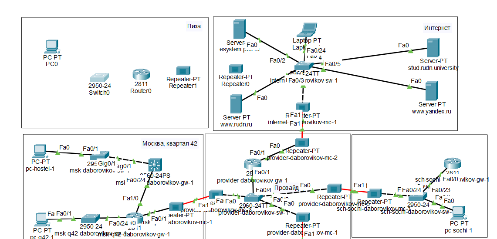
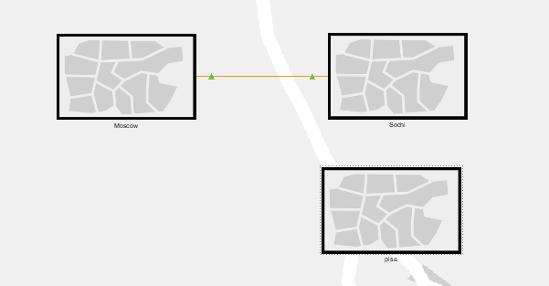
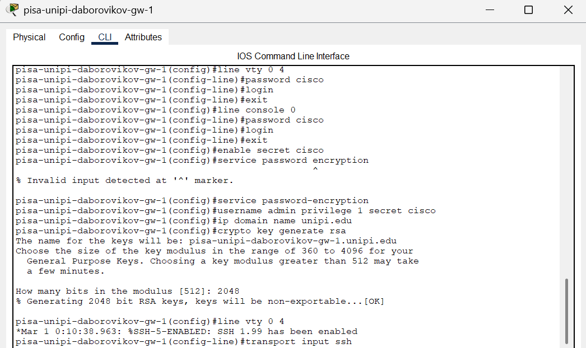
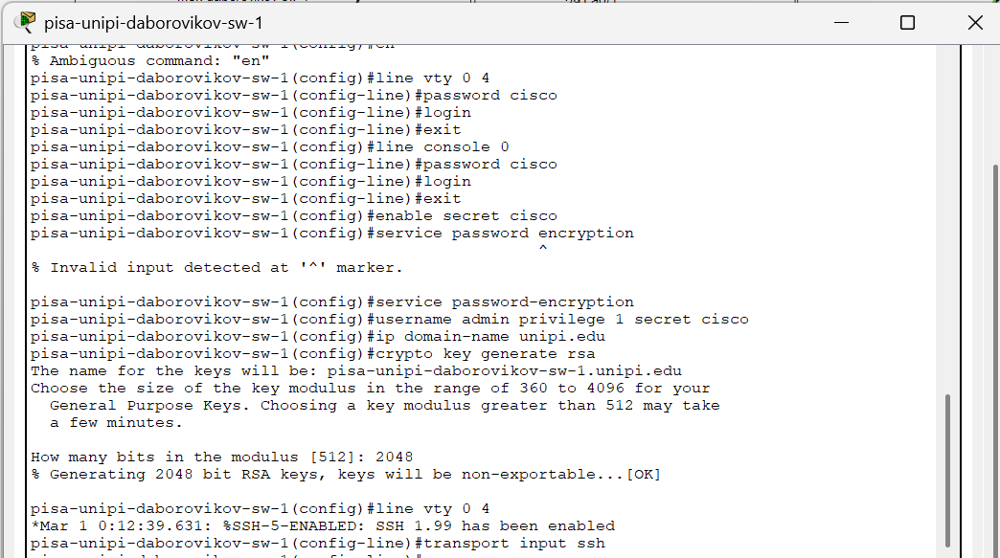
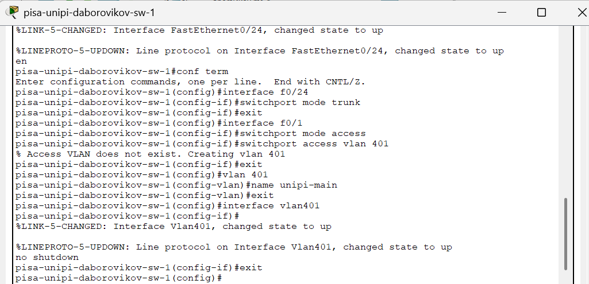
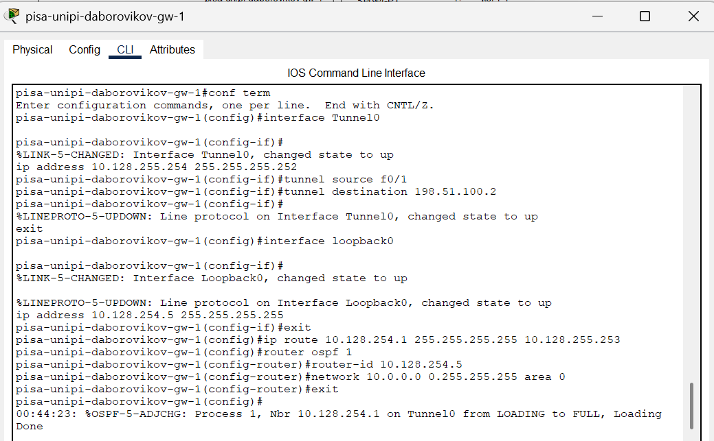

---
## Front matter
lang: ru-RU
title: Лабораторная Работа №16.  Настройка VPN
subtitle: Администрирование локальных сетей 
author:
  - Боровиков Д.А.
institute:
  - Российский университет дружбы народов им. Патриса Лумумбы, Москва, Россия

## i18n babel
babel-lang: russian
babel-otherlangs: english

## Formatting pdf
toc: false
toc-title: Содержание
slide_level: 2
aspectratio: 169
section-titles: true
theme: metropolis
header-includes:
 - \metroset{progressbar=frametitle,sectionpage=progressbar,numbering=fraction}
 - '\makeatletter'
 - '\beamer@ignorenonframefalse'
 - '\makeatother'

## Fonts
mainfont: Arial
romanfont: Arial
sansfont: Arial
monofont: Arial
---

## Докладчик

  * Боровиков Даниил Александрович
  * НПИбд-01-22
  * Российский университет дружбы народов
  * [1132222006@pfur.ru]

## Цели и задачи

Получение навыков настройки VPN-туннеля через незащищённое Интернет-соединение.

## Размещение оборудования

{#fig:001 width=70%}

## Repeater-PT

{#fig:002 width=60%}

## Подключение оборудования

{#fig:003 width=70%}

## Создание города Пиза

{#fig:004 width=60%}

## Перемещение оборудования

{#fig:005 width=70%}

## pisa-unipi-daborovikov-gw-1

{#fig:006 width=60%}

## pisa-unipi-daborovikov-sw-1

{#fig:007 width=70%}

## pisa-unipi-daborovikov-gw-1

{#fig:008 width=60%}

## pisa-unipi-daborovikov-sw-1

{#fig:009 width=70%}

## Присвоение адресов

{#fig:010 width=60%}

## Пинг

{#fig:011 width=70%}

## VPN

{#fig:012 width=60%}

## VPN

{#fig:013 width=70%}

## VPN

{#fig:014 width=60%}

## Вывод

В ходе выполнения лабораторной работы мы получили навыки настройки
VPN-туннеля через незащищённое Интернет-соединение.
