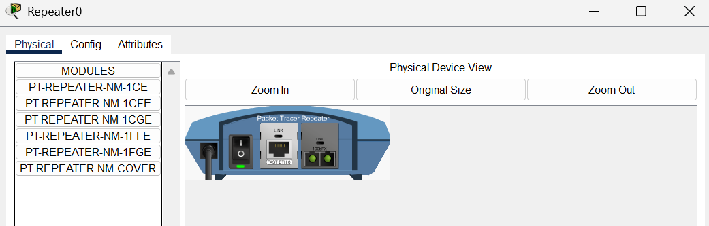
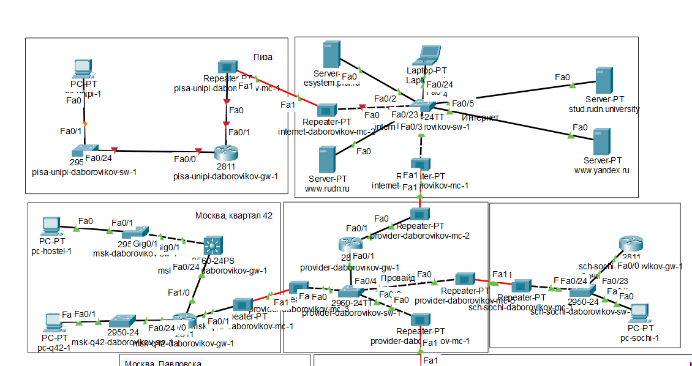
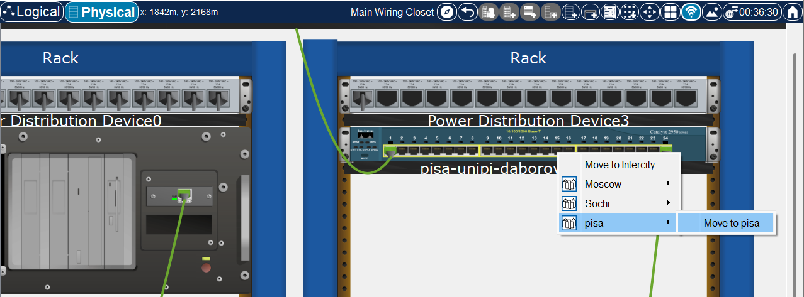
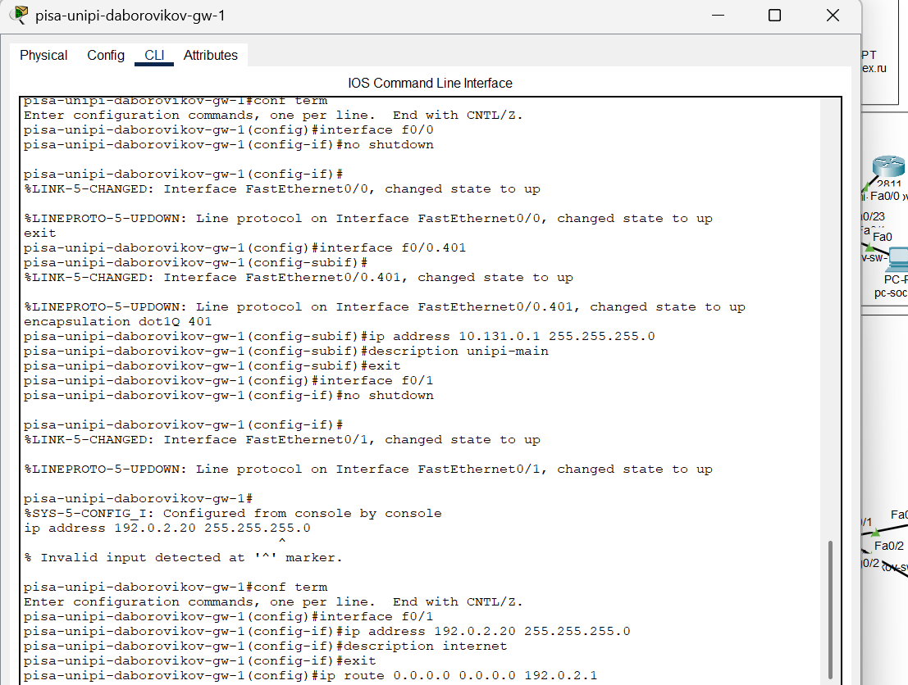
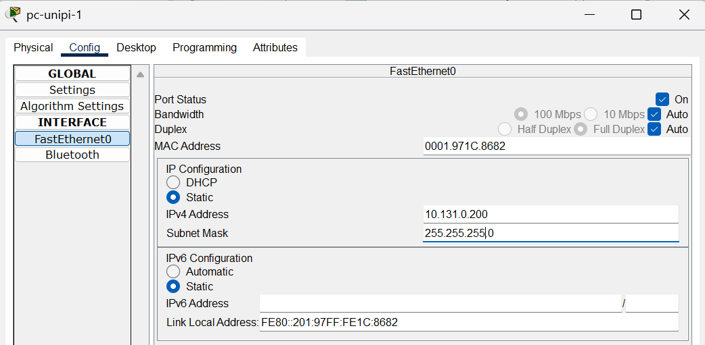
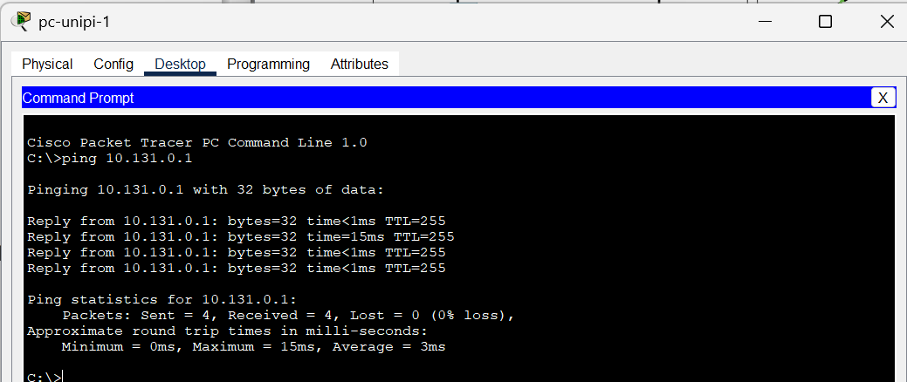
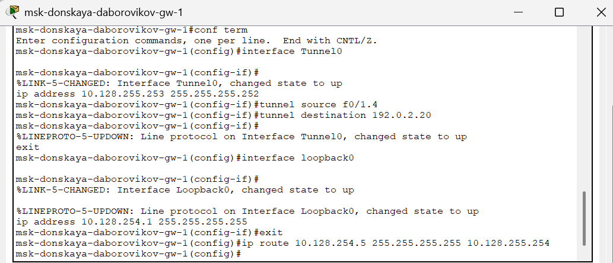
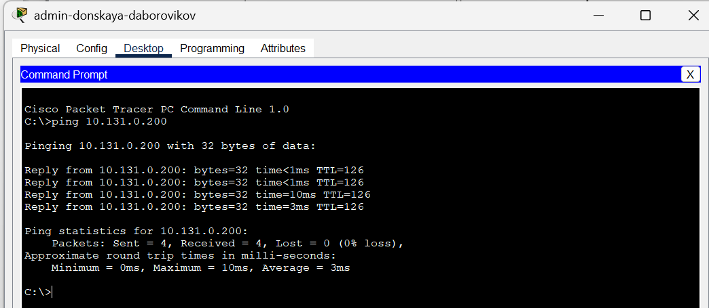

---
## Front matter
title: "Отчёт по лабораторной работе №16"
subtitle: "Дисциплина: Администрирование локальных сетей"
author: "Боровиков Даниил Александрович НПИбд-01-22"

## Generic otions
lang: ru-RU
toc-title: "Содержание"

## Bibliography
bibliography: bib/cite.bib
csl: pandoc/csl/gost-r-7-0-5-2008-numeric.csl

## Pdf output format
toc: true # Table of contents
toc-depth: 2
lof: true # List of figures
lot: true # List of tables
fontsize: 12pt
linestretch: 1.5
papersize: a4
documentclass: scrreprt
## I18n polyglossia
polyglossia-lang:
  name: russian
polyglossia-otherlangs:
  name: english
## I18n babel
babel-lang: russian
babel-otherlangs: english
## Fonts
mainfont: Arial
romanfont: Arial
sansfont: Arial
monofont: Arial
mainfontoptions: Ligatures=TeX
romanfontoptions: Ligatures=TeX
sansfontoptions: Ligatures=TeX,Scale=MatchLowercase
monofontoptions: Scale=MatchLowercase,Scale=0.9
## Biblatex
biblatex: true
biblio-style: "gost-numeric"
biblatexoptions:
  - parentracker=true
  - backend=biber
  - hyperref=auto
  - language=auto
  - autolang=other*
  - citestyle=gost-numeric
## Pandoc-crossref LaTeX customization
figureTitle: "Рис."
tableTitle: "Таблица"
listingTitle: "Листинг"
lofTitle: "Список иллюстраций"
lotTitle: "Список таблиц"
lolTitle: "Листинги"
## Misc options
indent: true
header-includes:
  - \usepackage{indentfirst}
  - \usepackage{float} # keep figures where there are in the text
  - \floatplacement{figure}{H} # keep figures where there are in the text
---

# Цель работы

Получение навыков настройки VPN-туннеля через незащищённое Интернет-соединение.

# Выполнение лабораторной работы

Разместим в рабочей области проекта в соответствии с модельными
предположениями оборудование для сети Университета г. Пиза 

 (рис. [-@fig:001]) (рис. [-@fig:002]).  (рис. [-@fig:003]). 

{ #fig:001 width=70% }

{ #fig:002 width=70% }

{ #fig:003 width=70% }

В физической рабочей области проекта создадим город Пиза, здание
Университета г. Пиза. Переместим туда соответствующее оборудование (рис. [-@fig:004]). (рис. [-@fig:005]). 

{ #fig:004 width=70% }

{ #fig:005 width=70% }

Теперь сделаем первоначальную настройку и настройку интерфейсов
оборудования сети Университета г. Пиза (рис. [-@fig:006]).  (рис. [-@fig:007]). (рис. [-@fig:008]) (рис. [-@fig:009])

{ #fig:006 width=70% }

{ #fig:007 width=70% }

{ #fig:008 width=70% }

{ #fig:009 width=70% }

(рис. [-@fig:010])

{ #fig:010 width=70% }

 (рис. [-@fig:011])

{ #fig:011 width=70% }

 
Далее настроим VPN [@wiki:bash] на основе протокола GRE (рис. [-@fig:012])

{ #fig:012 width=70% }

(рис. [-@fig:013])

{ #fig:013 width=70% }

 
Последним шагом проверим доступность узлов сети Университета г. Пиза с
ноутбука администратора сети «Донская» (рис. [-@fig:014])

{ #fig:014 width=70% }

##  Контрольные вопросы

1. Что такое VPN? - Зашифрованное соединение, устанавливаемое
через Интернет между устройством и сетью.

2. В каких случаях следует использовать VPN? - Для дополнительного
шифрования в сетях, безопасному подключению к локальным
сетям извне.

3. Как с помощью VPN обойти NAT? - Поднять VPNтуннель/подключить OpenVPN.

# Выводы

В ходе выполнения лабораторной работы мы получили навыки настройки
VPN-туннеля через незащищённое Интернет-соединение.

# Список литературы{.unnumbered}

::: {#refs}
:::
