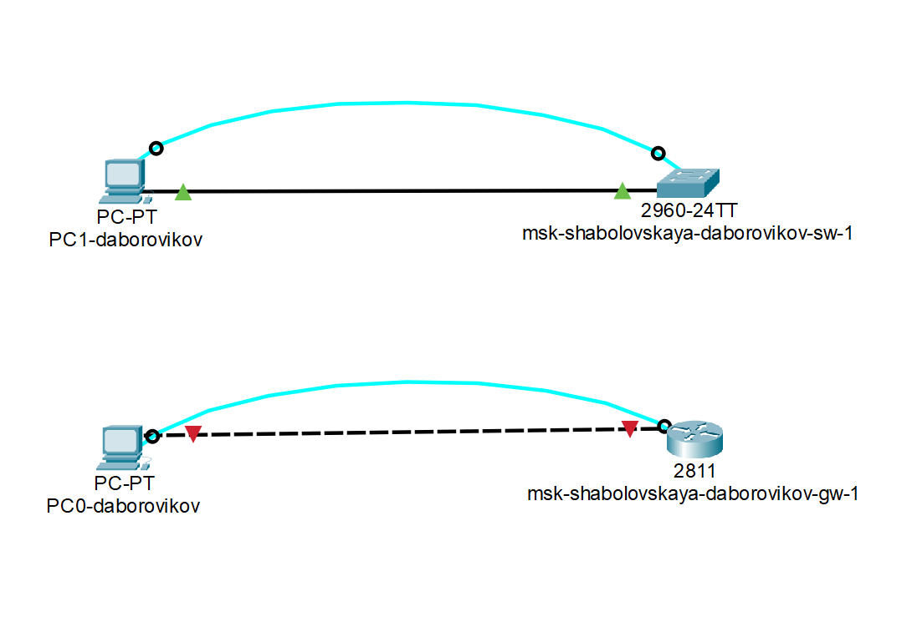
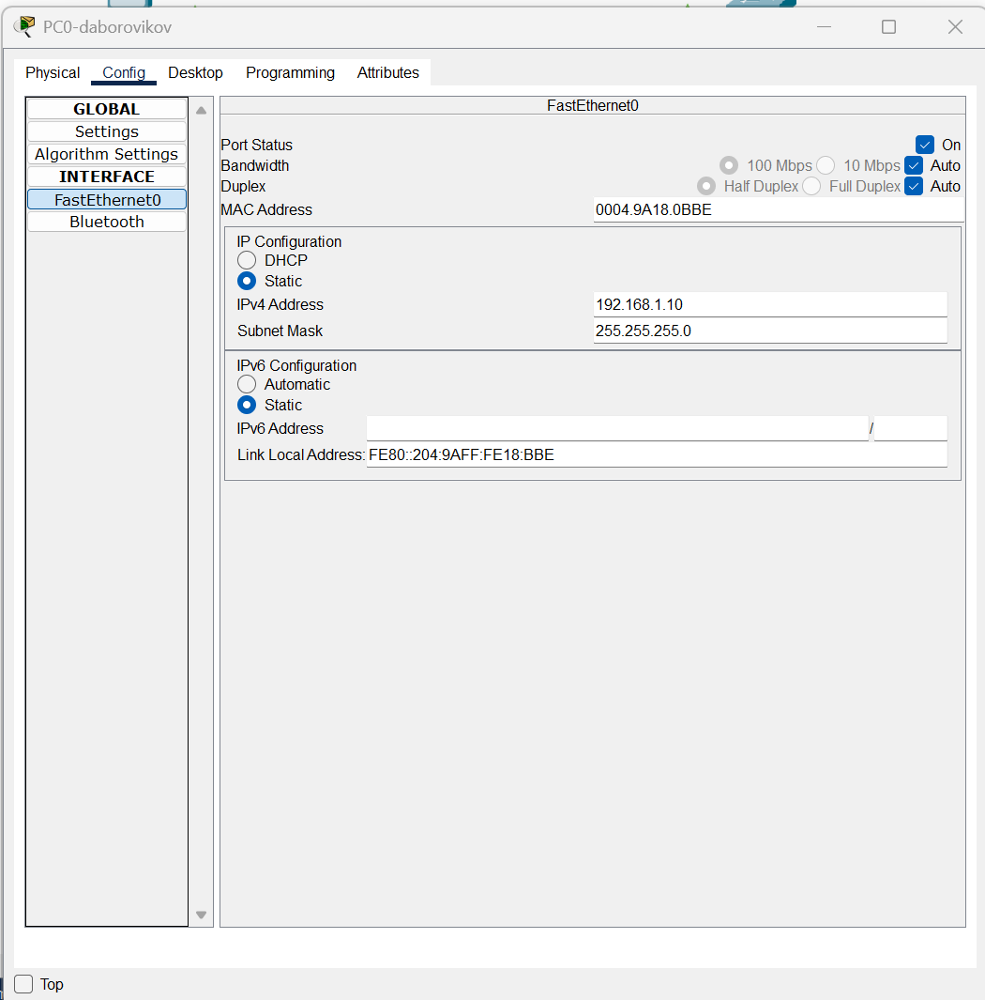
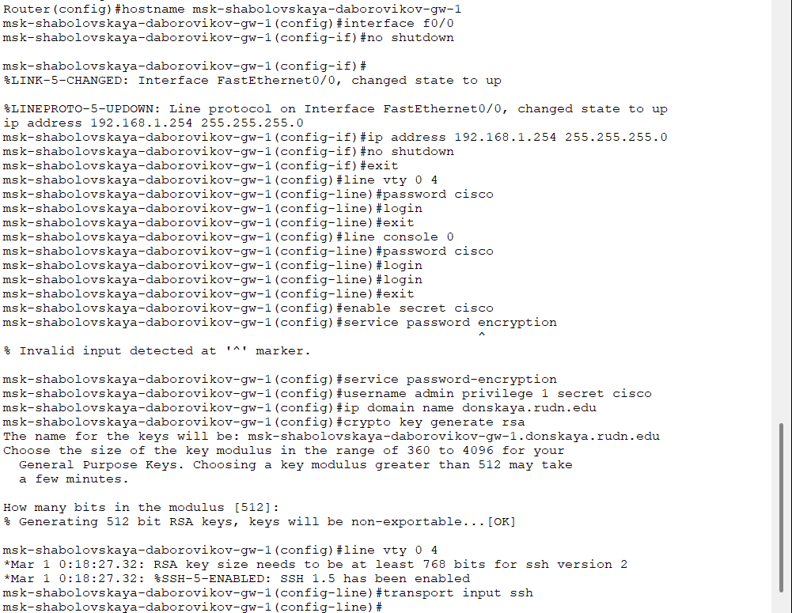
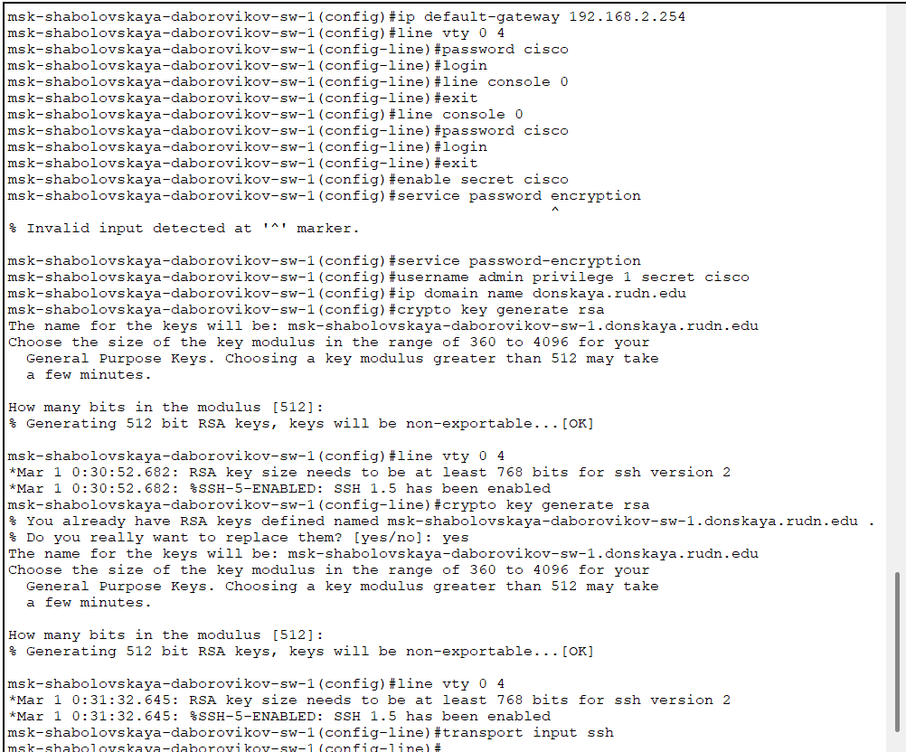
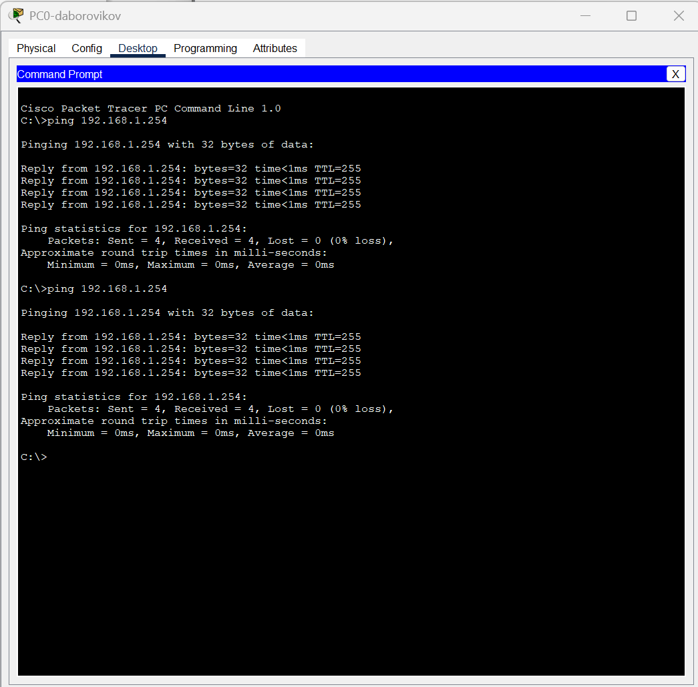
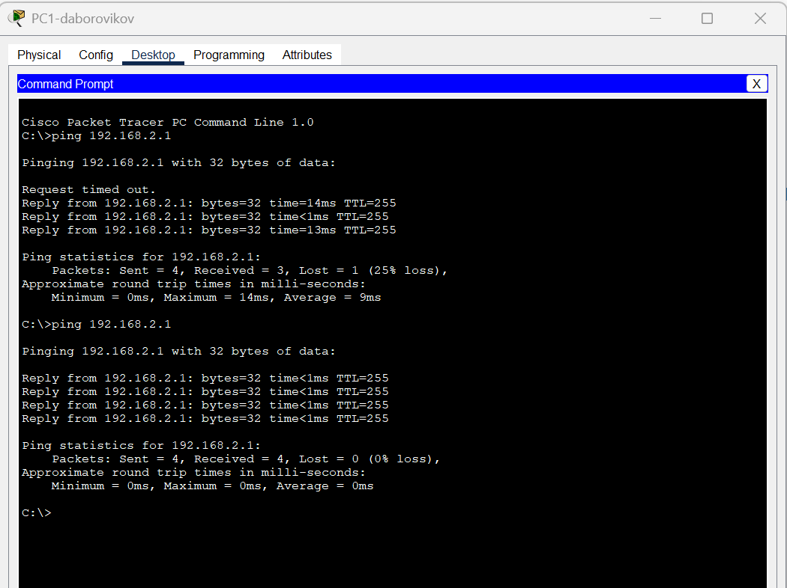
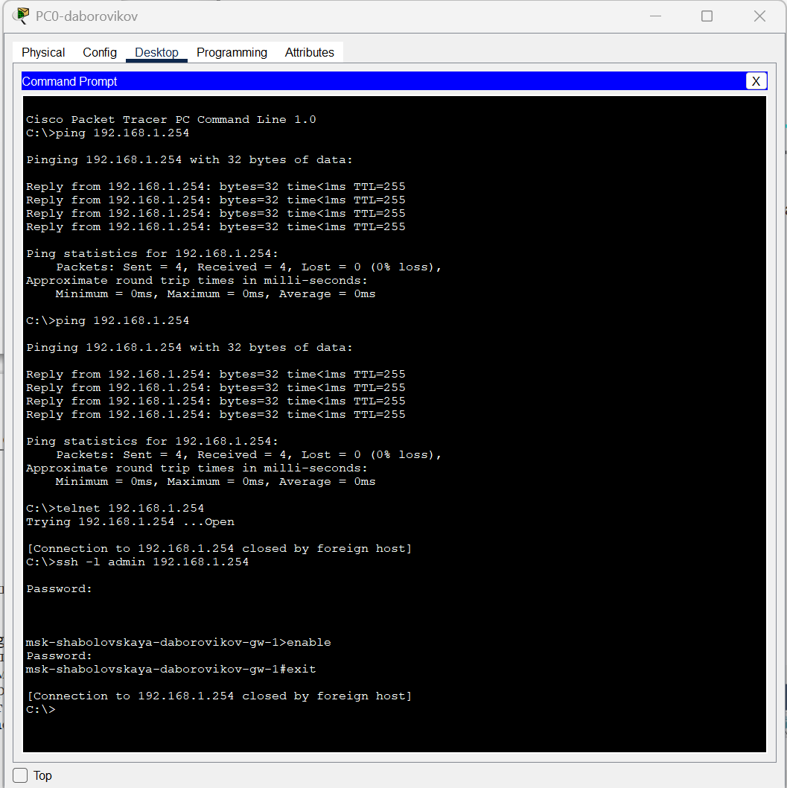
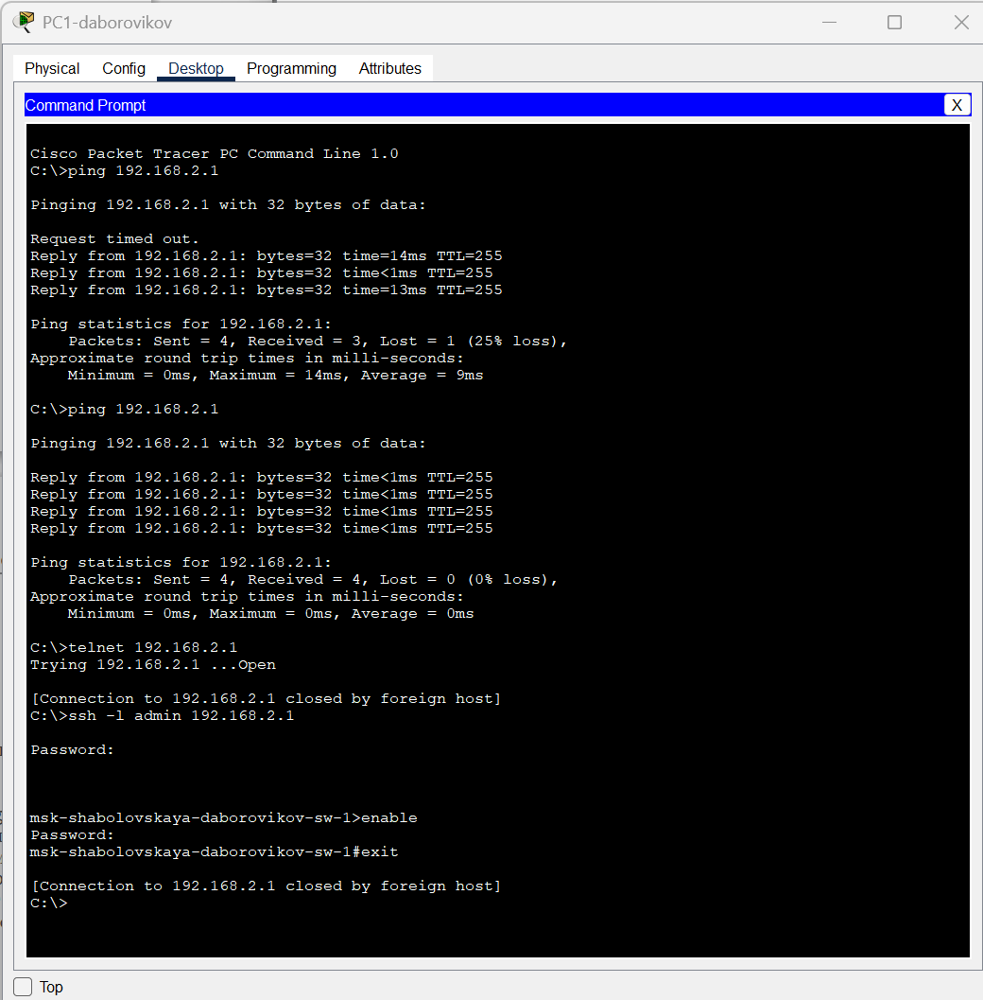

---
## Front matter
lang: ru-RU
title: Лабораторная Работа №2. Предварительная настройкаоборудования Cisco
subtitle: Администрирование локальных сетей
author:
  - Боровиков Д.А.
institute:
  - Российский университет дружбы народов им. Патриса Лумумбы, Москва, Россия

## i18n babel
babel-lang: russian
babel-otherlangs: english

## Formatting pdf
toc: false
toc-title: Содержание
slide_level: 2
aspectratio: 169
section-titles: true
theme: metropolis
header-includes:
 - \metroset{progressbar=frametitle,sectionpage=progressbar,numbering=fraction}
 - '\makeatletter'
 - '\beamer@ignorenonframefalse'
 - '\makeatother'

## Fonts
mainfont: Arial
romanfont: Arial
sansfont: Arial
monofont: Arial
---

## Докладчик

  * Боровиков Даниил Александрович
  * НПИбд-01-22
  * Российский университет дружбы народов
  * [1132222006@pfur.ru]

## Цели и задачи

Получить основные навыки по начальному конфигурированию оборудования
Cisco.

## Создание нового проекта

{#fig:001 width=70%}

## Схема подключения

{#fig:002 width=60%}

## Статические ip-адреса и маски подсети.

{#fig:003 width=50%}

## Настройка маршрутизатора

{#fig:004 width=60%}

## Настройку коммутатора в соответствии с заданием

{#fig:005 width=40%}

## Проверка работоспособности соединения

{#fig:006 width=40%}

## Проверка работоспособности соединения

{#fig:007 width=40%}

## Попытка подключения к маршрутизатору

{#fig:008 width=40%}

## Попытка подключения к коммутатору

{#fig:009 width=40%}

## Вывод

Я приобрел навыки по начальному конфигурированию оборудования
Cisco.
