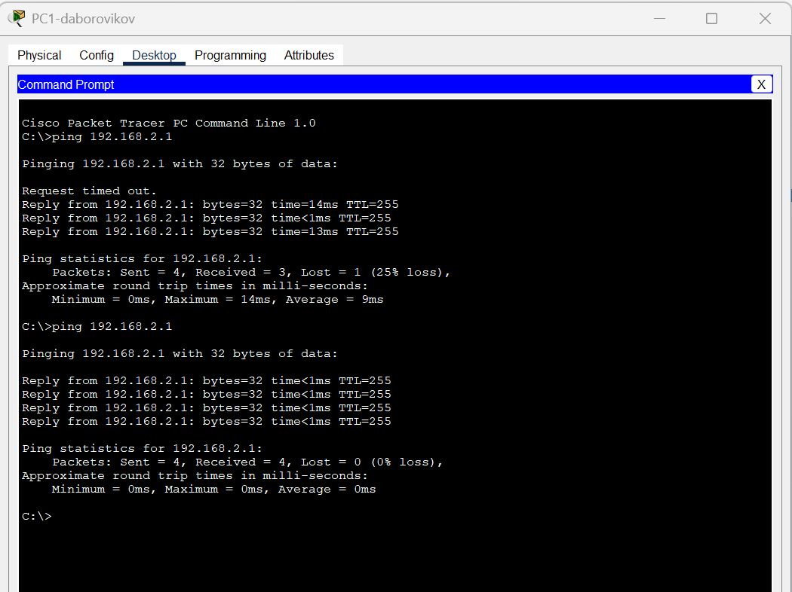
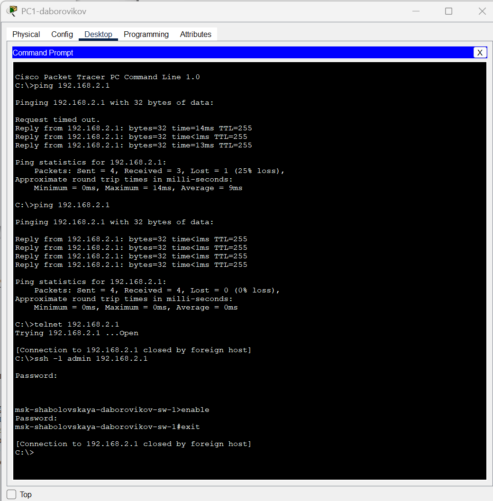

---
## Front matter
title: "Отчёт по лабораторной работе №2"
subtitle: "Дисциплина: Администрирование локальных сетей"
author: "Боровиков Даниил Александрович НПИбд-01-22"

## Generic otions
lang: ru-RU
toc-title: "Содержание"

## Bibliography
bibliography: bib/cite.bib
csl: pandoc/csl/gost-r-7-0-5-2008-numeric.csl

## Pdf output format
toc: true # Table of contents
toc-depth: 2
lof: true # List of figures
lot: true # List of tables
fontsize: 12pt
linestretch: 1.5
papersize: a4
documentclass: scrreprt
## I18n polyglossia
polyglossia-lang:
  name: russian
polyglossia-otherlangs:
  name: english
## I18n babel
babel-lang: russian
babel-otherlangs: english
## Fonts
mainfont: Arial
romanfont: Arial
sansfont: Arial
monofont: Arial
mainfontoptions: Ligatures=TeX
romanfontoptions: Ligatures=TeX
sansfontoptions: Ligatures=TeX,Scale=MatchLowercase
monofontoptions: Scale=MatchLowercase,Scale=0.9
## Biblatex
biblatex: true
biblio-style: "gost-numeric"
biblatexoptions:
  - parentracker=true
  - backend=biber
  - hyperref=auto
  - language=auto
  - autolang=other*
  - citestyle=gost-numeric
## Pandoc-crossref LaTeX customization
figureTitle: "Рис."
tableTitle: "Таблица"
listingTitle: "Листинг"
lofTitle: "Список иллюстраций"
lotTitle: "Список таблиц"
lolTitle: "Листинги"
## Misc options
indent: true
header-includes:
  - \usepackage{indentfirst}
  - \usepackage{float} # keep figures where there are in the text
  - \floatplacement{figure}{H} # keep figures where there are in the text
---

# Цель работы

Получить основные навыки по начальному конфигурированию оборудования
Cisco.

#  Задание

1. Сделать предварительную настройку маршрутизатора:

– задать имя в виде «город-территория-учётная_записьтип_оборудования-номер» (см. пункт 2.5), например
msk-donskaya-osbender-gw-1;

– задать интерфейсу Fast Ethernet с номером 0 ip-адрес 192.168.1.254
и маску 255.255.255.0, затем поднять интерфейс;

– задать пароль для доступа к привилегированному режиму (сначала
в открытом виде, затем — в зашифрованном);

– настроить доступ к оборудованию сначала через telnet, затем — через
ssh (используя в качестве имени домена donskaya.rudn.edu);

– сохранить и экспортировать конфигурацию в отдельный файл.

2. Сделать предварительную настройку коммутатора:

– задать имя в виде «город-территория-учётная_записьтип_оборудования-номер» (см. пункт 2.5), например
msk-donskaya-osbender-sw-1;

– задать интерфейсу vlan 2 ip-адрес 192.168.2.1 и маску 255.255.255.0,
затем поднять интерфейс;

– привязать интерфейс Fast Ethernet с номером 1 к vlan 2;

– задать в качестве адреса шлюза по умолчанию адрес 192.168.2.254;

– задать пароль для доступа к привилегированному режиму (сначала
в открытом виде, затем — в зашифрованном);

– настроить доступ к оборудованию сначала через telnet, затем — через
ssh (используя в качестве имени домена donskaya.rudn.edu);

– для пользователя admin задать доступ 1-го уровня по паролю;

– сохранить и экспортировать конфигурацию в отдельный файл.

# Выполнение лабораторной работы

Создадим проект (рис. [-@fig:001])

{ #fig:001 width=70% }

В логической рабочей области Packet Tracer разместим коммутатор,
маршрутизатор и 2 оконечных устройства типа PC, соединим один PC
с маршрутизатором, другой PC — с коммутатором(рис. [-@fig:002]). 

{ #fig:002 width=70% }

Присвоим статические ip-адреса и маски подсети. (рис. [-@fig:003]). 

{ #fig:003 width=70% }

Проведем настройку маршрутизатора в соответствии с заданием(рис. [-@fig:004]). 

{ #fig:004 width=70% }

Проведем настройку коммутатора в соответствии с заданием(рис. [-@fig:005]). 

{ #fig:005 width=70% }

Проверьте работоспособность соединений с помощью команды ping на PC0(рис. [-@fig:006]) на PC1  (рис. [-@fig:007]).

{ #fig:006 width=70% }

{ #fig:007 width=70% }

Попробем подключиться к коммутатору (рис. [-@fig:009])  и маршрутизатору (рис. [-@fig:008]) разными способами: с помощью консольного кабеля, по протоколу удалённого доступа
(telnet, ssh).

{ #fig:008 width=70% }

{ #fig:009 width=70% }

##  Контрольные вопросы

**1. Укажите возможные способы подключения к сетевому оборудованию.**  

- Проводное подключение (Ethernet): наиболее распространенный метод подключения, который использует сетевой кабель (обычно категории Ethernet) для соединения компьютера, маршрутизатора, коммутатора или другого сетевого устройства.
  
- Беспроводное подключение (Wi-Fi): используют радиоволновые соединения для передачи данных между устройствами. Wi-Fi обычно используется для подключения мобильных устройств, но также может использоваться для подключения компьютеров и другого сетевого оборудования.

**2. Каким типом сетевого кабеля следует подключать оконечное оборудование пользователя к маршрутизатору и почему?**  

- Для подключения оконечного оборудования пользователя к маршрутизатору обычно используется кабель Ethernet. Существует несколько видов Ethernet-кабелей, но наиболее распространенным и рекомендуемым для этой цели является кабель категории 5e (Cat5e) или категории 6 (Cat6).  
Кабели Cat5e и Cat6 имеют несколько преимуществ, делающих их предпочтительными для подключения оконечного оборудования к маршрутизатору: 
 
  • Скорость и пропускная способность. 
 
  • Поддержка Gigabit Ethernet.  

  • Устойчивость к помехам.
  
  • Будущая совместимость.

**3. Каким типом сетевого кабеля следует подключать оконечное оборудование пользователя к коммутатору и почему?** 
 
- Для подключения оконечного оборудования пользователя к коммутатору также рекомендуется использовать кабель Ethernet. В зависимости от требований сети и возможностей коммутатора, можно использовать кабели различных категорий, но обычно предпочтительными являются кабели категории 5e (Cat5e) или категории 6 (Cat6) по тем же причинам, что и при подключении к маршрутизатору:  

  • Скорость и пропускная способность.  

  • Поддержка Gigabit Ethernet.  

  • Устойчивость к помехам.  

  • Будущая совместимость.

**4. Каким типом сетевого кабеля следует подключать коммутатор к коммутатору и почему?**  

- Для подключения коммутатора к коммутатору также используются сетевые кабели Ethernet. Однако здесь обычно используются кабели определенной категории в зависимости от требований к сети и пропускной способности, а также от расстояния между коммутаторами. Наиболее распространенными кабелями для соединения коммутаторов являются кабели категории 5e (Cat5e), категории 6 (Cat6) и категории 6a (Cat6a).  

Выбор кабеля зависит от нескольких факторов:  

  • Пропускная способность и расстояние.
  
  • Будущие потребности.  

  • Бюджет.  

  • Совместимость с имеющейся инфраструктурой. 
 
Таким образом, для подключения коммутатора к коммутатору наиболее подходящими кабелями являются Cat5e, Cat6 или Cat6a, в зависимости от требований к пропускной способности, расстоянию и бюджету.

**5. Укажите возможные способы настройки доступа к сетевому оборудованию по паролю.**  

- Пароли на уровне устройства.  

- AAA (Authentication, Authorization, Accounting).  

- SSH (Secure Shell) или Telnet: SSH и Telnet - это протоколы удаленного управления, которые позволяют администраторам подключаться к сетевому оборудованию через сеть и вводить команды для настройки и управления устройством. Часто они могут быть защищены паролем для обеспечения безопасного доступа.  

- Web-based интерфейс управления.  

- Локальные аккаунты.  

- Протокол SNMP (Simple Network Management Protocol). 
 
- Все эти методы позволяют администраторам обеспечить безопасный доступ к сетевому оборудованию по паролю, минимизируя риски несанкционированного доступа и обеспечивая конфиденциальность и целостность сетевых данных.

**6. Укажите возможные способы настройки удалённого доступа к сетевому оборудованию. Какой из способов предпочтительнее и почему?**  

- SSH (Secure Shell): SSH предоставляет защищенное соединение с удаленным сетевым оборудованием через шифрование данных. Этот метод обеспечивает безопасность и конфиденциальность при передаче команд и данных по сети.  

- Telnet: Telnet также предоставляет удаленный доступ к сетевому оборудованию, но не обеспечивает защиту данных, так как информация передается в открытом виде. Использование Telnet не рекомендуется из-за небезопасности этого протокола.  

- VPN (Virtual Private Network): VPN создает защищенное соединение через общую сеть, такую как интернет, что позволяет удаленным пользователям безопасно подключаться к сетевому оборудованию, как если бы они были внутри локальной сети.  

- SSL VPN (Secure Socket Layer Virtual Private Network): SSL VPN предоставляет удаленным пользователям защищенный доступ к сетевому оборудованию через веб-браузер, используя SSL-шифрование для защиты данных.  

- Модемный доступ: Многие сетевые устройства могут быть настроены для доступа через модемы, обеспечивая резервное подключение в случае проблем с основной сетью.  

- Удаленное управление через веб-интерфейс: Некоторые сетевые устройства предоставляют веб-интерфейс для удаленного управления, который позволяет администраторам настроить и управлять устройством через веб-браузер.  

Предпочтительным методом для настройки удаленного доступа к сетевому оборудованию является использование SSH или VPN. Оба эти метода обеспечивают защищенное соединение и шифрование данных, что обеспечивает конфиденциальность и безопасность при удаленном доступе. SSH особенно удобен для доступа к командной строке устройства, в то время как VPN обеспечивает более универсальный и общий доступ к сети. Таким образом, использование SSH или VPN является предпочтительным для обеспечения безопасного удаленного доступа к сетевому оборудованию.

# Выводы

Я приобрел навыки по начальному конфигурированию оборудования
Cisco.
