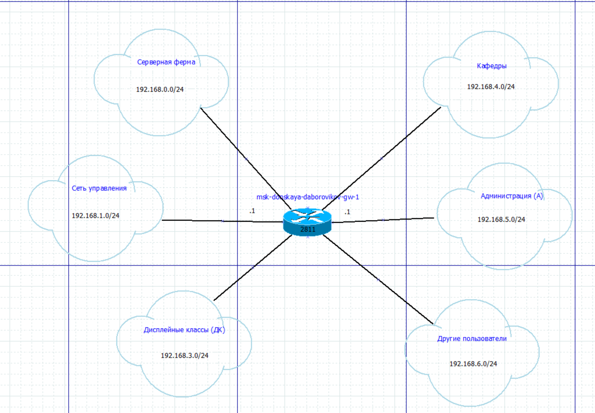
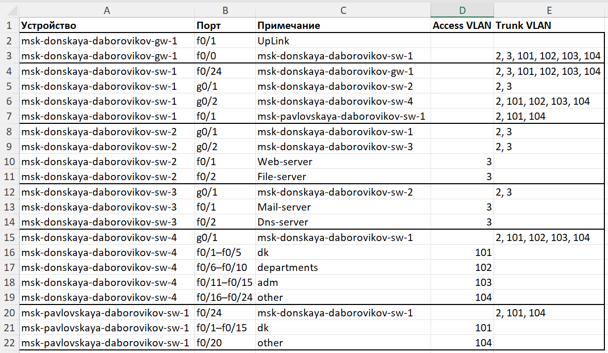

---
## Front matter
title: "Отчёт по лабораторной работе №3"
subtitle: "Дисциплина: Администрирование локальных сетей"
author: "Боровиков Даниил Александрович НПИбд-01-22"

## Generic otions
lang: ru-RU
toc-title: "Содержание"

## Bibliography
bibliography: bib/cite.bib
csl: pandoc/csl/gost-r-7-0-5-2008-numeric.csl

## Pdf output format
toc: true # Table of contents
toc-depth: 2
lof: true # List of figures
lot: true # List of tables
fontsize: 12pt
linestretch: 1.5
papersize: a4
documentclass: scrreprt
## I18n polyglossia
polyglossia-lang:
  name: russian
polyglossia-otherlangs:
  name: english
## I18n babel
babel-lang: russian
babel-otherlangs: english
## Fonts
mainfont: Arial
romanfont: Arial
sansfont: Arial
monofont: Arial
mainfontoptions: Ligatures=TeX
romanfontoptions: Ligatures=TeX
sansfontoptions: Ligatures=TeX,Scale=MatchLowercase
monofontoptions: Scale=MatchLowercase,Scale=0.9
## Biblatex
biblatex: true
biblio-style: "gost-numeric"
biblatexoptions:
  - parentracker=true
  - backend=biber
  - hyperref=auto
  - language=auto
  - autolang=other*
  - citestyle=gost-numeric
## Pandoc-crossref LaTeX customization
figureTitle: "Рис."
tableTitle: "Таблица"
listingTitle: "Листинг"
lofTitle: "Список иллюстраций"
lotTitle: "Список таблиц"
lolTitle: "Листинги"
## Misc options
indent: true
header-includes:
  - \usepackage{indentfirst}
  - \usepackage{float} # keep figures where there are in the text
  - \floatplacement{figure}{H} # keep figures where there are in the text
---

# Цель работы

Познакомиться с принципами планирования локальной сети организации.

# Выполнение лабораторной работы

 
Используя графический редактор (например, Dia), требуется повторить
схемы L1 (рис. [-@fig:001]), L2 (рис. [-@fig:002]), L3 (рис. [-@fig:003]), а также сопутствующие им таблицы VLAN (рис. [-@fig:004]), IP-адресов (рис. [-@fig:005])
и портов подключения оборудования планируемой сети (рис. [-@fig:006]).

{ #fig:001 width=70% }

{ #fig:002 width=70% }

{ #fig:003 width=70% }
 

{ #fig:004 width=70% }

{ #fig:005 width=40% }

{ #fig:006 width=70% }

Требуется сделаем аналогичный план адресного пространства для сетей
172.16.0.0/12 (рис. [-@fig:007]) (рис. [-@fig:008]) (рис. [-@fig:009]) (рис. [-@fig:010])  (рис. [-@fig:011]) (рис. [-@fig:012]) и 192.168.0.0/16 (рис. [-@fig:013]) (рис. [-@fig:014]) (рис. [-@fig:015]) (рис. [-@fig:016]) (рис. [-@fig:017])  (рис. [-@fig:018]) с соответствующими схемами сети и сопутствующими таблицами VLAN, IP-адресов и портов подключения оборудования. .

{ #fig:007 width=70% }

{ #fig:008 width=70% }

{ #fig:009 width=70% }

{ #fig:010 width=70% }

{ #fig:011 width=40% }

{ #fig:012 width=70% }

{ #fig:013 width=70% }

{ #fig:014 width=70% }

{ #fig:015 width=70% }

{ #fig:016 width=70% }

{ #fig:017 width=40% }

{ #fig:018 width=70% }

##  Контрольные вопросы

### 1. Что такое модель взаимодействия открытых систем (OSI)? Какие уровни в ней есть? Какие функции закреплены за каждым уровнем модели OSI?

**Модель OSI (Open Systems Interconnection)** — это концептуальная модель, разработанная Международной организацией по стандартизации (ISO) для описания взаимодействия сетевых протоколов и устройств. Она делит процесс передачи данных на **7 уровней**, каждый из которых выполняет определённые функции.

 Уровни модели OSI и их функции:

1. **Физический уровень (Physical Layer)**
  
   - Передача необработанных битов через физическую среду (кабели, радиоволны).  

   - Определяет электрические, механические и физические характеристики (разъёмы, напряжение, частоты).

2. **Канальный уровень (Data Link Layer)**  

   - Обеспечение надёжной передачи данных между соседними узлами.  

   - Обнаружение и исправление ошибок, управление доступом к среде (MAC-адреса).

3. **Сетевой уровень (Network Layer)**  

   - Маршрутизация данных между сетями. 
 
   - Определение логических адресов (IP-адреса), выбор пути для пакетов.

4. **Транспортный уровень (Transport Layer)**  

   - Обеспечение надёжной передачи данных между хостами.  

   - Управление потоками, контроль ошибок, сегментация данных (TCP, UDP).

5. **Сеансовый уровень (Session Layer)**  

   - Управление сеансами связи между приложениями.  

   - Установка, поддержание и завершение соединений.

6. **Уровень представления (Presentation Layer)**  

   - Преобразование данных в понятный для приложения формат. 
 
   - Шифрование, сжатие, преобразование кодировок.

7. **Прикладной уровень (Application Layer)**  

   - Предоставление интерфейса для пользователя и приложений. 
 
   - Поддержка протоколов прикладного уровня (HTTP, FTP, SMTP).

---

### 2. Какие функции выполняет коммутатор?

**Коммутатор (Switch)** — устройство канального уровня (Layer 2), которое:

- **Пересылает кадры** данных на основе MAC-адресов.  

- **Создаёт таблицу коммутации** (MAC-адресов), чтобы направлять данные только на нужный порт.  

- **Сегментирует сеть**, уменьшая коллизии в отличие от хабов.  

- **Поддерживает дуплексную связь** (одновременная передача и приём данных). 
 
- Может поддерживать VLAN для логического разделения сети.

---

### 3. Какие функции выполняет маршрутизатор?

**Маршрутизатор (Router)** — устройство сетевого уровня (Layer 3), которое:

- **Маршрутизирует пакеты** между различными сетями на основе IP-адресов. 
 
- **Определяет оптимальный путь** передачи данных, используя таблицы маршрутизации. 
 
- **Обеспечивает межсетевое взаимодействие** (например, между LAN и WAN). 
 
- Выполняет **трансляцию сетевых адресов (NAT)** для экономии IP-адресов. 
 
- Поддерживает функции фильтрации трафика и безопасности (ACL).

---

### 4. В чём отличие коммутаторов третьего уровня от коммутаторов второго уровня?

- **Коммутаторы второго уровня (Layer 2)**:  

  - Работают на канальном уровне, используют MAC-адреса для пересылки данных. 
 
  - Основная функция — коммутация в пределах одной сети.  

  - Поддерживают VLAN, но не маршрутизацию.  

- **Коммутаторы третьего уровня (Layer 3)**:  

  - Работают на сетевом уровне, используют IP-адреса для маршрутизации.  

  - Могут выполнять функции маршрутизатора (межсетевую маршрутизацию).  

  - Поддерживают более сложные функции: маршрутизацию между VLAN, динамические протоколы (OSPF, RIP).  

**Отличие**: L3-коммутаторы совмещают функции коммутации и маршрутизации, тогда как L2-коммутаторы ограничены коммутацией в пределах одной сети.

---

### 5. Что такое сетевой интерфейс?

**Сетевой интерфейс** — это аппаратно-программный компонент, обеспечивающий подключение устройства к сети.  

- Примеры: сетевая карта (NIC), Wi-Fi-адаптер.  

- Имеет уникальный **MAC-адрес** для идентификации на канальном уровне.
  
- Выполняет функции передачи и приёма данных через физическую среду.

---

### 6. Что такое сетевой порт?

**Сетевой порт** — это:  

1. **Физический порт**: разъём на устройстве (например, Ethernet-порт RJ45 на коммутаторе).  

2. **Логический порт**: числовой идентификатор (0–65535) в транспортном уровне (TCP/UDP), используемый для различения приложений на одном устройстве (например, порт 80 для HTTP).  

---

### 7. Кратко охарактеризуйте технологии Ethernet, Fast Ethernet, Gigabit Ethernet.

- **Ethernet**:  

  - Скорость: **10 Мбит/с**.  

  - Использует кабели UTP или коаксиальные, стандарт IEEE 802.3.  

  - Базовая технология локальных сетей.  

- **Fast Ethernet**:  

  - Скорость: **100 Мбит/с**.  

  - Улучшенная версия Ethernet, стандарт IEEE 802.3u. 
 
  - Использует кабели UTP категории 5.  

- **Gigabit Ethernet**:  

  - Скорость: **1 Гбит/с**.  

  - Стандарт IEEE 802.3ab (медь) или 802.3z (оптика).  

  - Подходит для высокоскоростных сетей, использует кабели Cat5e/Cat6 или оптику.

---

### 8. Что такое IP-адрес (IPv4-адрес)? Определите понятия сеть, подсеть, маска подсети. Охарактеризуйте служебные IP-адреса. Приведите пример с пояснениями разбиения сети на две или более подсетей с указанием числа узлов в каждой подсети.

- **IP-адрес (IPv4)**: 32-битный адрес (например, 192.168.1.1), используемый для идентификации устройства в сети. Состоит из 4 октетов.  

- **Сеть**: группа устройств с общим диапазоном IP-адресов, определённым маской подсети.  

- **Подсеть**: часть сети, разделённая для повышения эффективности или безопасности.  

- **Маска подсети**: битовая маска (например, 255.255.255.0 или /24), определяющая, какая часть IP-адреса относится к сети, а какая — к хостам.  

- **Служебные IP-адреса**:  

  - **0.0.0.0**: любой адрес (например, для маршрута по умолчанию). 
 
  - **255.255.255.255**: широковещательный адрес (broadcast).  

  - Первый адрес подсети: идентификатор сети (например, 192.168.1.0).  

  - Последний адрес подсети: широковещательный (например, 192.168.1.255). 
 
  - **127.0.0.1**: локальный адрес (loopback).  

#### Пример разбиения сети:

Исходная сеть: **192.168.1.0/24** (256 адресов, 254 хоста).
  
Разделим на 4 подсети:  

- Маска: /26 (255.255.255.192), 64 адреса в каждой подсети (62 хоста). 
 
1. **192.168.1.0–192.168.1.63**: сеть 192.168.1.0, broadcast 192.168.1.63.  

2. **192.168.1.64–192.168.1.127**: сеть 192.168.1.64, broadcast 192.168.1.127.
  
3. **192.168.1.128–192.168.1.191**: сеть 192.168.1.128, broadcast 192.168.1.191. 
 
4. **192.168.1.192–192.168.1.255**: сеть 192.168.1.192, broadcast 192.168.1.255.  

Каждая подсеть имеет **62 хоста**.

---

### 9. Дайте определение понятию VLAN. Для чего применяется VLAN в сети организации? Какие преимущества даёт применение VLAN в сети организации? Приведите примеры разных ситуаций.

- **VLAN (Virtual Local Area Network)**: логическая сеть, созданная на основе физической сети для разделения трафика без дополнительных коммутаторов.  

- **Применение в организации**:  

  - Разделение отделов (например, бухгалтерия и IT).  

  - Повышение безопасности.  

  - Упрощение управления трафиком.  

- **Преимущества**: 
 
  - **Сегментация**: изоляция трафика между группами.  

  - **Гибкость**: изменение сети без переподключения кабелей.  

  - **Безопасность**: ограничение доступа к данным.  

- **Примеры**:  

  1. VLAN 10 для сотрудников, VLAN 20 для гостей — гости не видят корпоративные ресурсы.  

  2. VLAN 101 для серверов, VLAN 102 для рабочих станций — контроль доступа к серверам.

---

### 10. В чём отличие Trunk Port от Access Port?

- **Access Port**:  

  - Подключён к одному устройству (например, ПК).  

  - Принадлежит одному VLAN.  

  - Передаёт данные без тегов VLAN.  

- **Trunk Port**:  

  - Соединяет сетевые устройства (например, коммутаторы).  

  - Передаёт трафик нескольких VLAN с тегами (IEEE 802.1Q).  

  - Используется для передачи данных между сетями или устройствами.  

**Отличие**: Access Port привязан к одному VLAN без тегов, Trunk Port передаёт множество VLAN с тегами.

# Выводы

В ходе выполнения лабораторной работы мы познакомились с принципами планирования локальной сети организации.

