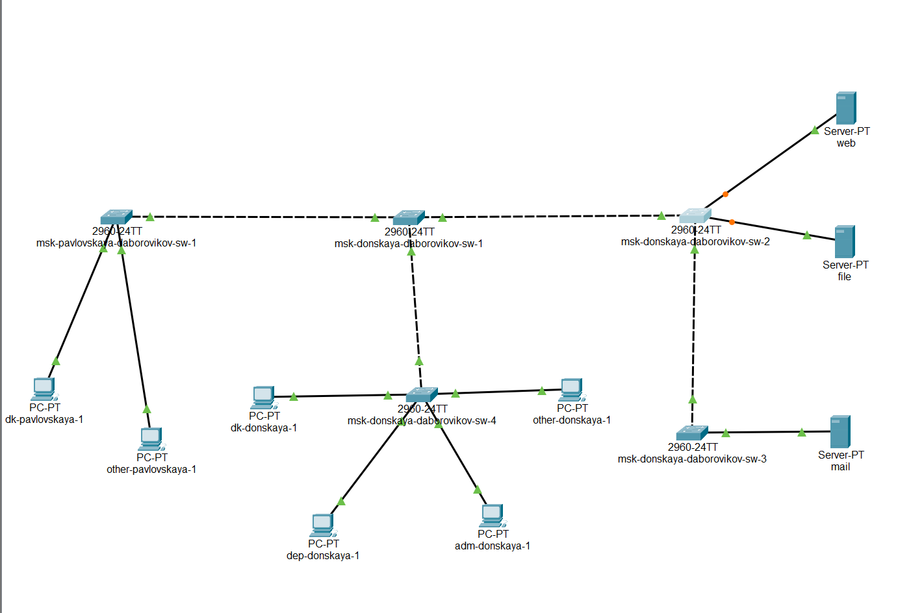
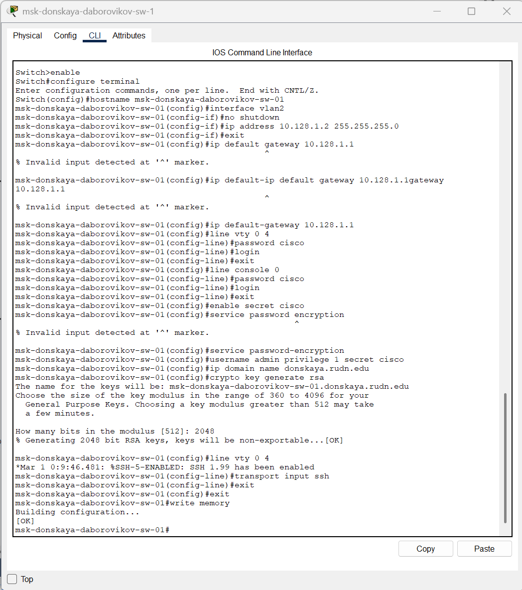
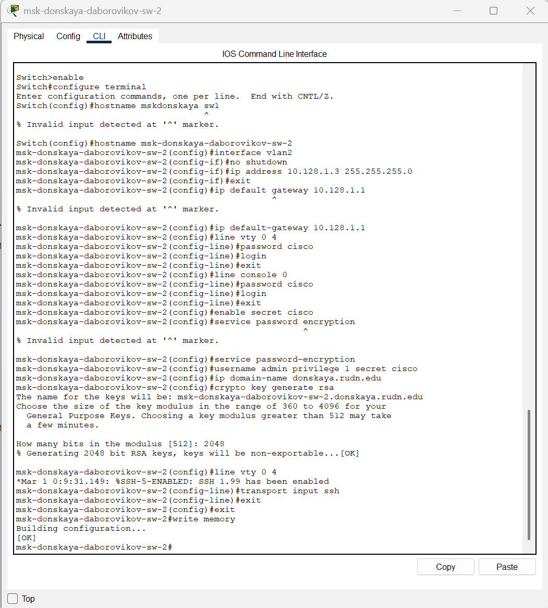
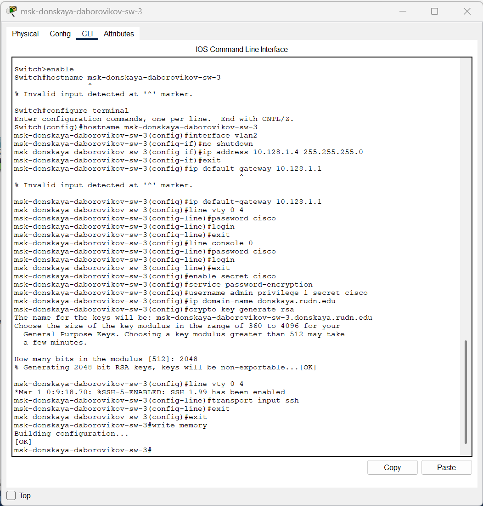
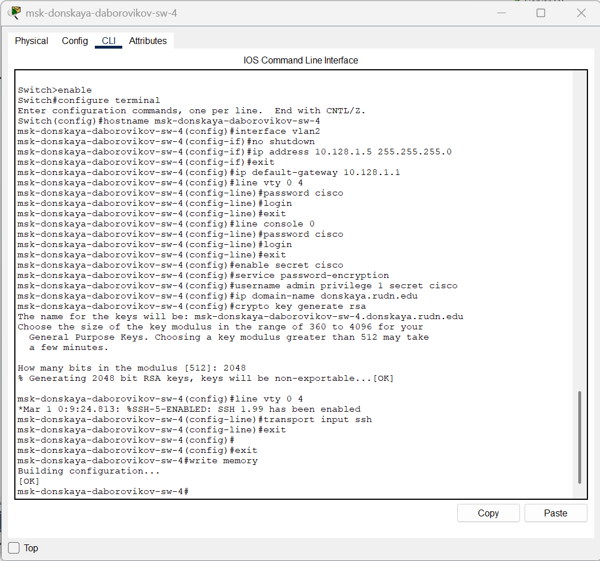
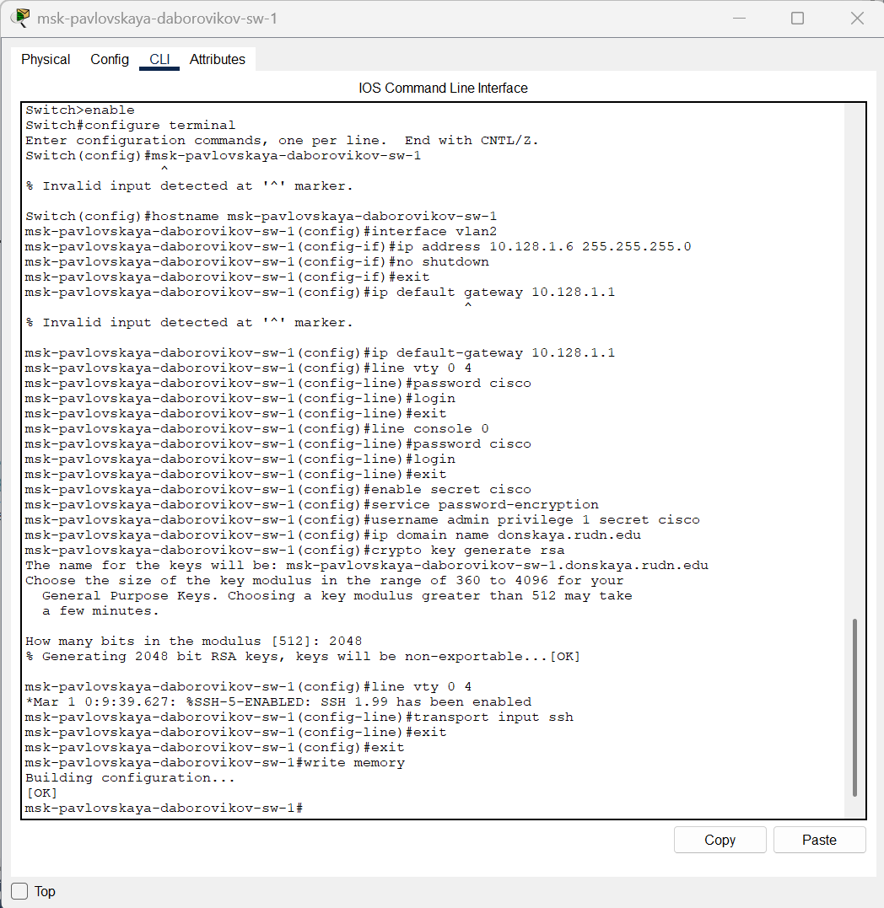

---
## Front matter
title: "Отчёт по лабораторной работе №4"
subtitle: "Дисциплина: Администрирование локальных сетей"
author: "Боровиков Даниил Александрович НПИбд-01-22"

## Generic otions
lang: ru-RU
toc-title: "Содержание"

## Bibliography
bibliography: bib/cite.bib
csl: pandoc/csl/gost-r-7-0-5-2008-numeric.csl

## Pdf output format
toc: true # Table of contents
toc-depth: 2
lof: true # List of figures
lot: true # List of tables
fontsize: 12pt
linestretch: 1.5
papersize: a4
documentclass: scrreprt
## I18n polyglossia
polyglossia-lang:
  name: russian
polyglossia-otherlangs:
  name: english
## I18n babel
babel-lang: russian
babel-otherlangs: english
## Fonts
mainfont: Arial
romanfont: Arial
sansfont: Arial
monofont: Arial
mainfontoptions: Ligatures=TeX
romanfontoptions: Ligatures=TeX
sansfontoptions: Ligatures=TeX,Scale=MatchLowercase
monofontoptions: Scale=MatchLowercase,Scale=0.9
## Biblatex
biblatex: true
biblio-style: "gost-numeric"
biblatexoptions:
  - parentracker=true
  - backend=biber
  - hyperref=auto
  - language=auto
  - autolang=other*
  - citestyle=gost-numeric
## Pandoc-crossref LaTeX customization
figureTitle: "Рис."
tableTitle: "Таблица"
listingTitle: "Листинг"
lofTitle: "Список иллюстраций"
lotTitle: "Список таблиц"
lolTitle: "Листинги"
## Misc options
indent: true
header-includes:
  - \usepackage{indentfirst}
  - \usepackage{float} # keep figures where there are in the text
  - \floatplacement{figure}{H} # keep figures where there are in the text
---

# Цель работы

Провести подготовительную работу по первоначальной настройке коммутаторов сети.

#  Задание

Требуется сделать первоначальную настройку коммутаторов сети, представленной на схеме L1 . Под первоначальной
настройкой понимается указание имени устройства, его IP-адреса, настройка
доступа по паролю к виртуальным терминалам и консоли, настройка удалённого доступа к устройству по ssh. [@wiki:bash]
При выполнении работы необходимо учитывать соглашение об именовании
.

# Выполнение лабораторной работы

В логической рабочей области Packet Tracer разместим коммутаторы и оконечные устройства согласно схеме сети L1  и соединим их через соответствующие интерфейсы . (рис. [-@fig:001])

{ #fig:001 width=70% }

Используя типовую конфигурацию коммутатора, настроим
все коммутаторы, изменяя название устройства и его IP-адрес согласно
плану IP (рис. [-@fig:002]), (рис. [-@fig:003]), (рис. [-@fig:004]), (рис. [-@fig:005]), (рис. [-@fig:006])

{ #fig:002 width=70% }

{ #fig:003 width=70% }

 

{ #fig:004 width=70% }

 

{ #fig:005 width=70% }

{ #fig:006 width=70% }

 
##  Контрольные вопросы

1. При помощи каких команд можно посмотреть конфигурацию сетевого оборудования?
  
   **Для просмотра текущей конфигурации сетевого оборудования Cisco используется команда `show running-config`. Чтобы посмотреть сохранённую конфигурацию, применяется команда `show startup-config`.**

2. При помощи каких команд можно посмотреть стартовый конфигурационный файл оборудования?
  
   **Для просмотра стартового конфигурационного файла (сохранённой конфигурации) используется команда `show startup-config`.**

3. При помощи каких команд можно экспортировать конфигурационный файл оборудования?
  
   **Для экспорта конфигурационного файла оборудования Cisco можно использовать команду `copy running-config tftp` (для сохранения текущей конфигурации на TFTP-сервер) или `copy startup-config tftp` (для сохранения стартовой конфигурации). Например: `copy running-config tftp://<IP-адрес сервера>/filename`.**

4. При помощи каких команд можно импортировать конфигурационный файл оборудования?
  
   **Для импорта конфигурационного файла используется команда `copy tftp running-config` (для загрузки файла в текущую конфигурацию) или `copy tftp startup-config` (для загрузки в стартовую конфигурацию). Например: `copy tftp://<IP-адрес сервера>/filename running-config`.**

# Выводы

В ходе выполнения лабораторной работы я провел подготовительную работу по первоначальной настройке коммутаторов сети.

# Список литературы{.unnumbered}

::: {#refs}
:::
