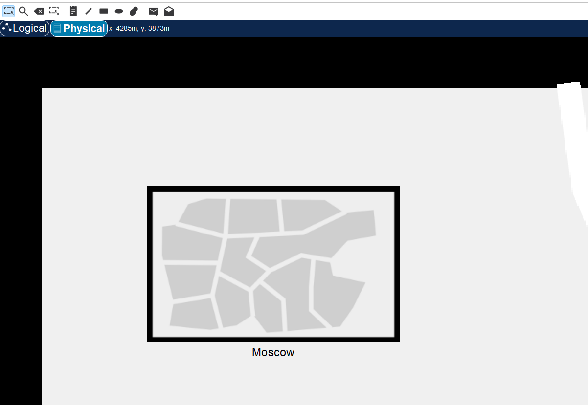
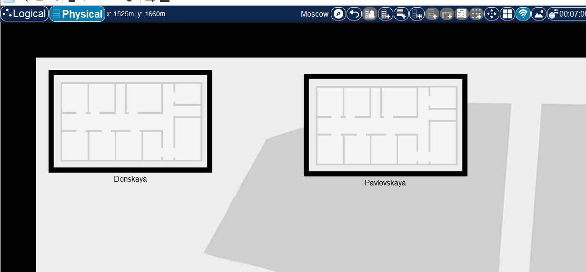
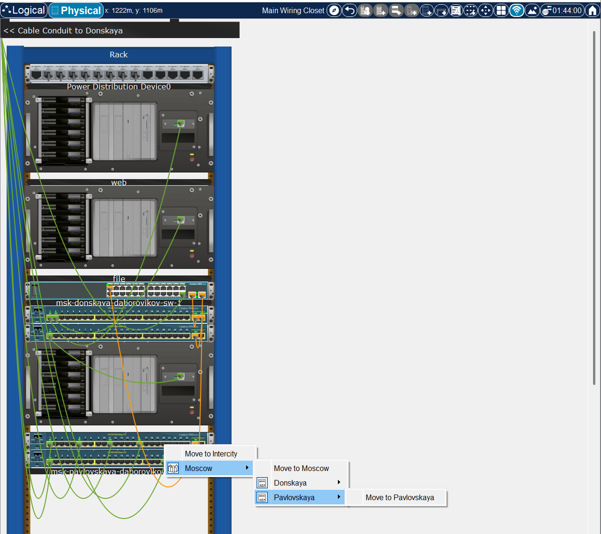
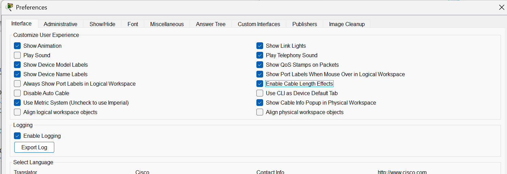
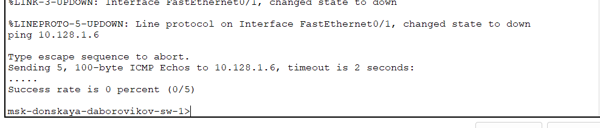
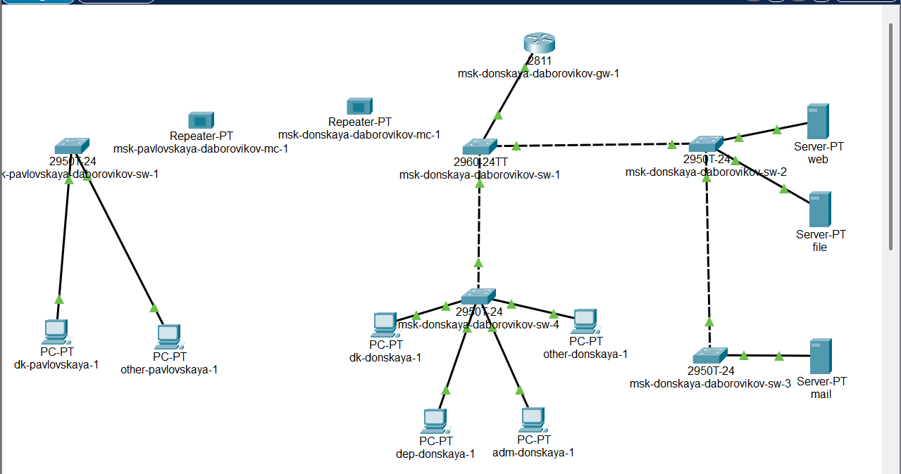
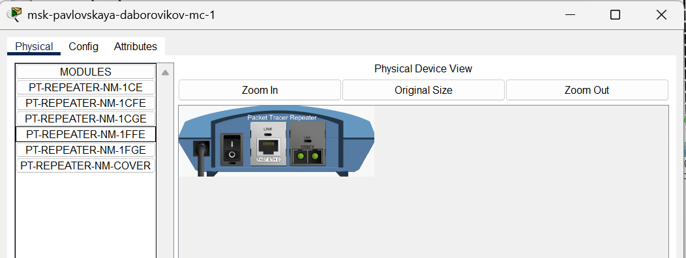
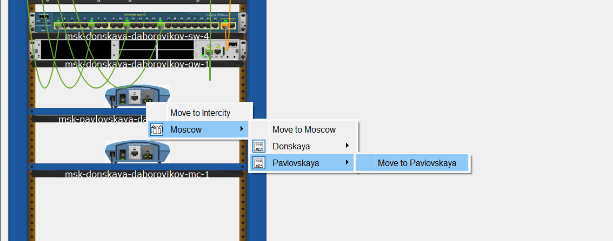

---
## Front matter
lang: ru-RU
title: Лабораторная Работа №7. Учёт физических параметров сети
subtitle: Администрирование локальных сетей 
author:
  - Боровиков Д.А.
institute:
  - Российский университет дружбы народов им. Патриса Лумумбы, Москва, Россия

## i18n babel
babel-lang: russian
babel-otherlangs: english

## Formatting pdf
toc: false
toc-title: Содержание
slide_level: 2
aspectratio: 169
section-titles: true
theme: metropolis
header-includes:
 - \metroset{progressbar=frametitle,sectionpage=progressbar,numbering=fraction}
 - '\makeatletter'
 - '\beamer@ignorenonframefalse'
 - '\makeatother'

## Fonts
mainfont: Arial
romanfont: Arial
sansfont: Arial
monofont: Arial
---

## Докладчик

  * Боровиков Даниил Александрович
  * НПИбд-01-22
  * Российский университет дружбы народов
  * [1132222006@pfur.ru]

## Цели и задачи

Получить навыки работы с физической рабочей областью Packet Tracer,
а также учесть физические параметры сети.

## Присвоение названия города

{#fig:001 width=70%}

## Здания Donskaya и  Pavlovskaya

{#fig:002 width=60%}

## Сервисное помещение

{#fig:003 width=70%}

## Перемещение коммутатора и оконечных устройств

{#fig:004 width=60%}

## Перемещение оконечных устройств

{#fig:005 width=70%}

## ping

{#fig:006 width=60%}

## Разрешение на учет длины

{#fig:007 width=70%}

## Размещение территорий на расстоянии

{#fig:008 width=60%}

## ping

{#fig:009 width=70%}

## Повторители с названиями

{#fig:010 width=60%}

## Замена модулей повторителей

{#fig:011 width=70%}

## Перемещение повторителя

{#fig:012 width=60%}

## Подключение, оптоволокно, витая пара

{#fig:013 width=70%}

## ping

{#fig:014 width=60%}

## Вывод

В ходе выполнения лабораторной работы я получил навыки работы с физической рабочей областью Packet Tracer,
а также учел физические параметры сети.
