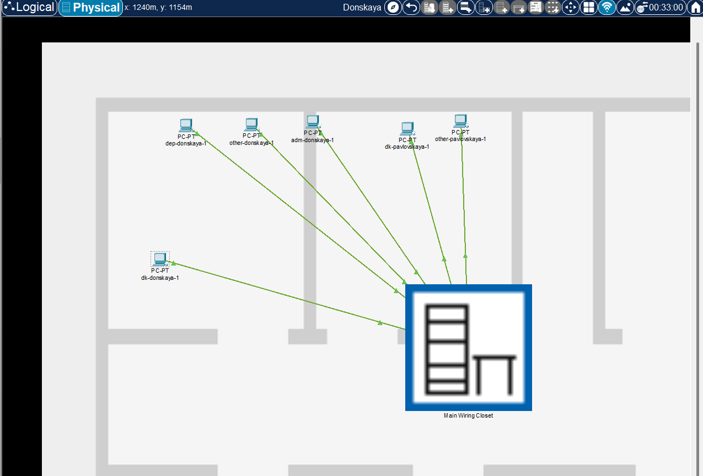
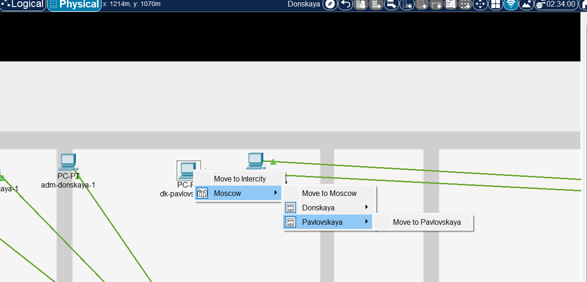
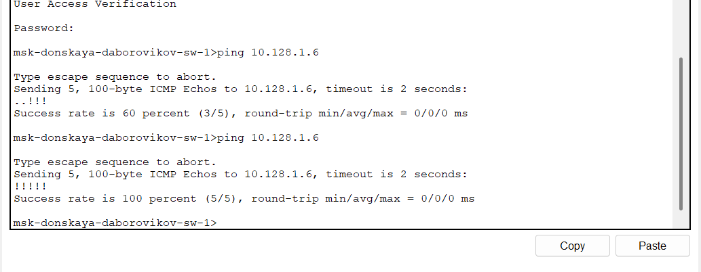
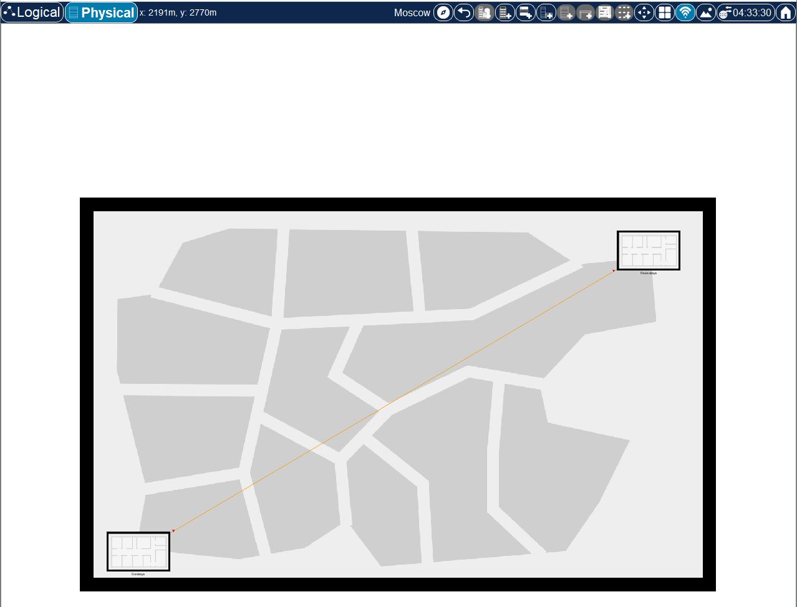
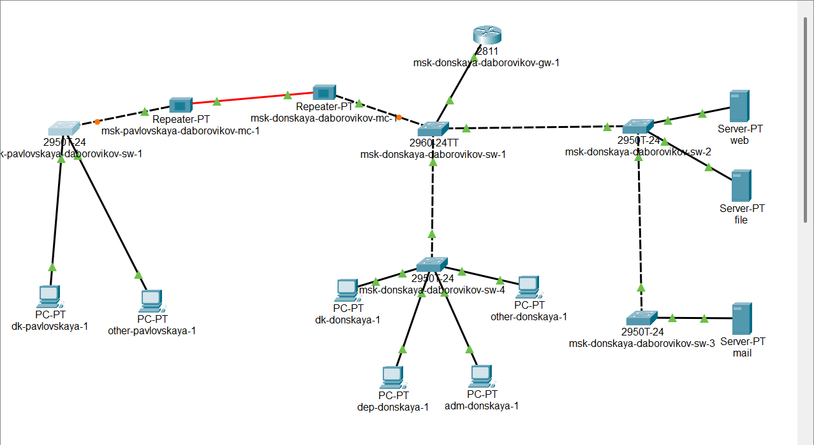
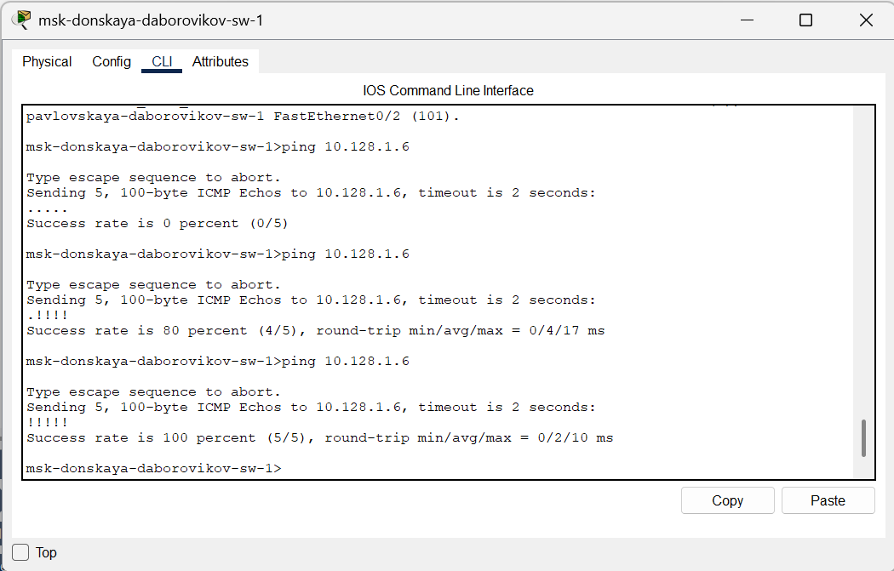

---
## Front matter
title: "Отчёт по лабораторной работе №7"
subtitle: "Дисциплина: Администрирование локальных сетей"
author: "Боровиков Даниил Александрович НПИбд-01-22"

## Generic otions
lang: ru-RU
toc-title: "Содержание"

## Bibliography
bibliography: bib/cite.bib
csl: pandoc/csl/gost-r-7-0-5-2008-numeric.csl

## Pdf output format
toc: true # Table of contents
toc-depth: 2
lof: true # List of figures
lot: true # List of tables
fontsize: 12pt
linestretch: 1.5
papersize: a4
documentclass: scrreprt
## I18n polyglossia
polyglossia-lang:
  name: russian
polyglossia-otherlangs:
  name: english
## I18n babel
babel-lang: russian
babel-otherlangs: english
## Fonts
mainfont: Arial
romanfont: Arial
sansfont: Arial
monofont: Arial
mainfontoptions: Ligatures=TeX
romanfontoptions: Ligatures=TeX
sansfontoptions: Ligatures=TeX,Scale=MatchLowercase
monofontoptions: Scale=MatchLowercase,Scale=0.9
## Biblatex
biblatex: true
biblio-style: "gost-numeric"
biblatexoptions:
  - parentracker=true
  - backend=biber
  - hyperref=auto
  - language=auto
  - autolang=other*
  - citestyle=gost-numeric
## Pandoc-crossref LaTeX customization
figureTitle: "Рис."
tableTitle: "Таблица"
listingTitle: "Листинг"
lofTitle: "Список иллюстраций"
lotTitle: "Список таблиц"
lolTitle: "Листинги"
## Misc options
indent: true
header-includes:
  - \usepackage{indentfirst}
  - \usepackage{float} # keep figures where there are in the text
  - \floatplacement{figure}{H} # keep figures where there are in the text
---

# Цель работы

Получить навыки работы с физической рабочей областью Packet Tracer,
а также учесть физические параметры сети.

#  Задание

Требуется заменить соединение между коммутаторами двух территорий
msk-donskaya-sw-1 и msk-pavlovskaya-sw-1 (рис. 7.1) на соединение, учитывающее физические параметры сети, а именно — расстояние между двумя
территориями.
При выполнении работы необходимо учитывать соглашение об именовании

# Выполнение лабораторной работы

Перейдите в физическую рабочую область Packet Tracer [@wiki:bash]. Присвойте название городу — Moscow(рис. [-@fig:001])

{ #fig:001 width=70% }

 Щёлкнув на изображении города, Вы увидите изображение здания (рис. 7.3).
Присвойте ему название Donskaya. Добавьте здание для территории
Pavlovskaya(рис. [-@fig:002]). 

{ #fig:002 width=70% }

Щёлкнув на изображении здания Donskaya, переместите изображение, обозначающее серверное помещение, в него(рис. [-@fig:003]). 

{ #fig:003 width=70% }

Щёлкнув на изображении серверной, Вы увидите отображение серверных
стоек. Переместите коммутатор msk-pavlovskaya-sw-1 и два оконечных устройства dk-pavlovskaya-1 и other-pavlovskaya-1 на территорию Pavlovskaya,
используя меню Move физической рабочей области Packet Tracer.
(рис. [-@fig:004]). 

{ #fig:004 width=70% }

(рис. [-@fig:005]). 

{ #fig:005 width=70% }

Вернувшись в логическую рабочую область Packet Tracer, пропингуйте с коммутатора msk-donskaya-sw-1 коммутатор msk-pavlovskaya-sw-1.
Убедитесь в работоспособности соединения.(рис. [-@fig:006]). 

{ #fig:006 width=70% }

В меню Options , Preferences во вкладке Interface активируйте разрешение
на учёт физических характеристик среды передачи (Enable Cable Length
Effects).  (рис. [-@fig:007]).

{ #fig:007 width=70% }

В физической рабочей области Packet Tracer разместите две территории на
расстоянии более 100 м друг от друга (рекомендуемое расстояние — около
1000 м или более).(рис. [-@fig:008])

{ #fig:008 width=70% }

Вернувшись в логическую рабочую область Packet Tracer, пропингуйте с коммутатора msk-donskaya-sw-1 коммутатор msk-pavlovskaya-sw-1.
Убедитесь в неработоспособности соединения.(рис. [-@fig:009])

{ #fig:009 width=70% }

Удалите соединение между msk-donskaya-sw-1 и msk-pavlovskaya-sw-1.
Добавьте в логическую рабочую область два повторителя (RepeaterPT). Присвойте им соответствующие названия msk-donskaya-mc-1
и msk-pavlovskaya-mc-1.  (рис. [-@fig:010])

{ #fig:010 width=70% }

 
Замените имеющиеся модули на PT-REPEATERNM-1FFE и PT-REPEATER-NM-1CFE для подключения оптоволокна
и витой пары по технологии Fast Ethernet(рис. [-@fig:011])

{ #fig:011 width=70% }

Переместите msk-pavlovskaya-mc-1 на территорию Pavlovskaya (в физической рабочей области Packet Tracer). (рис. [-@fig:012])

{ #fig:012 width=70% }

Подключите коммутатор msk-donskaya-sw-1 к msk-donskaya-mc-1 по витой паре, msk-donskaya-mc-1 и msk-pavlovskaya-mc-1 — по оптоволокну, msk-pavlovskaya-sw-1 к msk-pavlovskaya-mc-1 — по витой паре(рис. [-@fig:013])

{ #fig:013 width=70% }

Убедитесь в работоспособности соединения между msk-donskaya-sw-1
и msk-pavlovskaya-sw-1.(рис. [-@fig:014])

{ #fig:014 width=70% }

##  Контрольные вопросы

**1. Перечислите возможные среды передачи данных. На какие характеристики среды передачи данных следует обращать внимание при планировании сети?**

Среды передачи данных:

- Медные проводники (витая пара, коаксиальный кабель)

- Оптоволоконные кабели

- Беспроводные среды (радиоволны, микроволны, инфракрасное излучение)

- Электрические линии (PLC - Power Line Communication)

Характеристики при планировании сети:

- Пропускная способность

- Затухание сигнала

- Помехозащищенность

- Безопасность

- Стоимость внедрения и обслуживания

- Масштабируемость

- Совместимость с существующей инфраструктурой

- Физические ограничения

**2. Перечислите категории витой пары. Чем они отличаются? Какая категория в каких условиях может применяться?**

Категории витой пары:

- Cat 3: До 10 Мбит/с, частота до 16 МГц

- Cat 5: До 100 Мбит/с, частота до 100 МГц

- Cat 5e: До 1 Гбит/с, улучшенная версия Cat 5

- Cat 6: До 10 Гбит/с на коротких расстояниях, частота до 250 МГц

- Cat 6a: До 10 Гбит/с на расстоянии до 100 м, частота до 500 МГц

- Cat 7: До 10 Гбит/с, повышенная защита от помех, частота до 600 МГц

- Cat 7a: До 10 Гбит/с, частота до 1000 МГц

- Cat 8: До 40 Гбит/с на коротких расстояниях, частота до 2000 МГц

Отличия: скорость передачи данных, рабочая частота, степень защиты от помех, тип экранирования, максимальная длина сегмента.

Применение:
- Cat 3-5: Устаревшие, редко используются в новых сетях

- Cat 5e: Домашние сети, малый бизнес (1 Гбит/с)

- Cat 6: Сети с высокими требованиями к пропускной способности

- Cat 6a, 7, 7a: Центры обработки данных, корпоративные сети

- Cat 8: Магистральные соединения, ЦОД с потребностью в сверхвысокой скорости

**3. В чем отличие одномодового и многомодового оптоволокна? Какой тип кабеля в каких условиях может применяться?**

Отличия:

Многомодовое оптоволокно:

- Диаметр сердцевины 50 или 62,5 мкм

- Передает несколько световых мод

- Использует LED или VCSEL источники

- Большее затухание сигнала

- Дальность до 550 метров (OM4)

- Обычно оранжевого или бирюзового цвета

Одномодовое оптоволокно:

- Диаметр сердцевины 8-10 мкм

- Передает только одну моду света

- Требует лазерные источники света

- Меньшее затухание сигнала

- Дальность до 100 км и более

- Обычно желтого цвета

Применение:

Многомодовое оптоволокно:

- Внутри зданий и кампусов

- Сети LAN и SAN

- Центры обработки данных

- Короткие расстояния (до 300-500 м)

- Когда важна экономия на активном оборудовании

Одномодовое оптоволокно:

- Магистральные линии

- Соединения между зданиями и городами

- Телекоммуникационные сети на большие расстояния

- Высокая пропускная способность на большом расстоянии

- Перспектива наращивания скорости передачи

**4. Какие разъёмы встречаются на патчах оптоволокна? Чем они отличаются?**

Основные типы разъемов:

- SC (Subscriber Connector):

  - Квадратная форма с защелкой

  - Подключение типа "push-pull"

  - Для одномодового и многомодового волокна

- LC (Lucent Connector):

  - Миниатюрный разъем с язычком-фиксатором

  - Высокая плотность монтажа

  - Наиболее распространен в современном оборудовании

- ST (Straight Tip):

  - Байонетный тип соединения

  - Цилиндрический наконечник

  - Менее популярен в современных сетях

- FC (Ferrule Connector):

  - Резьбовой тип соединения

  - Высокая надежность фиксации

  - Используется в телекоммуникационной инфраструктуре

- MTP/MPO (Multiple-Fiber Push-On/Pull-Off):

  - Многоволоконный разъем (12, 24 или 72 волокна)

  - Для высокоплотных соединений

  - Применяется в центрах обработки данных

Отличия: тип механизма фиксации, размер, количество соединяемых волокон, потери на соединении, область применения, совместимость с оборудованием.

# Выводы

В ходе выполнения лабораторной работы я получил навыки работы с физической рабочей областью Packet Tracer,
а также учел физические параметры сети.

# Список литературы{.unnumbered}

::: {#refs}
:::
