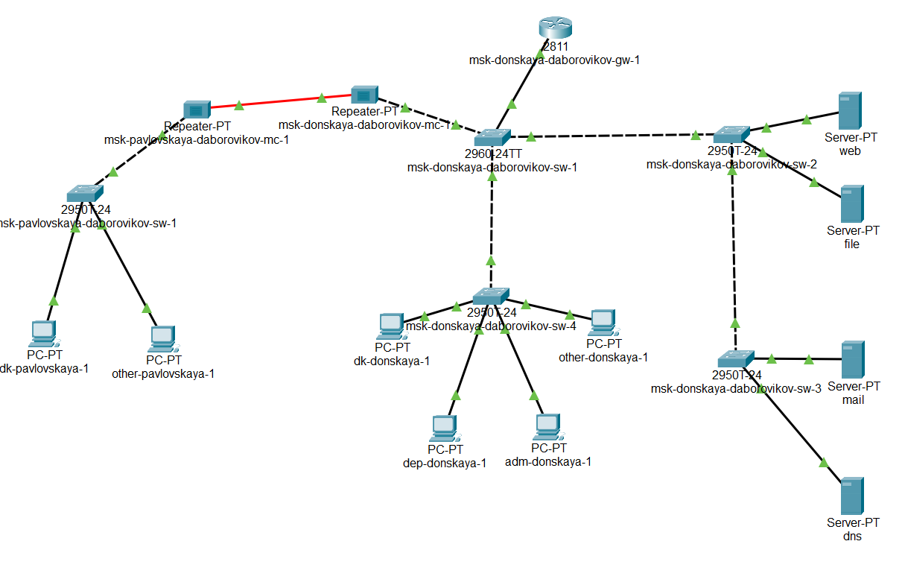
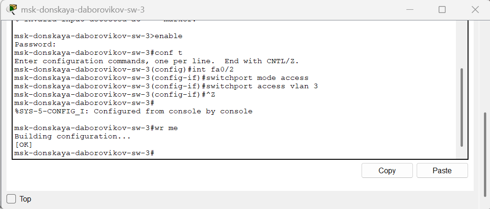
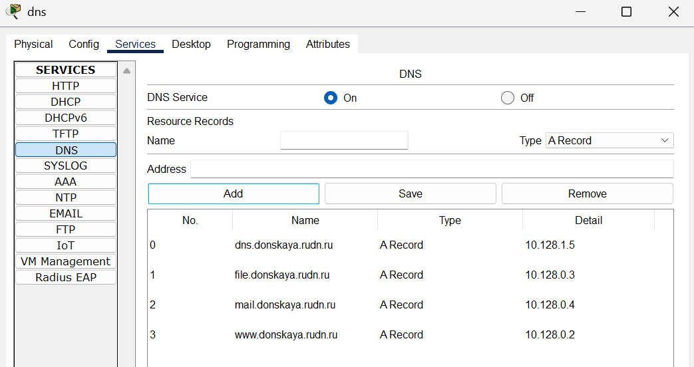

---
## Front matter
title: "Отчёт по лабораторной работе №8"
subtitle: "Дисциплина: Администрирование локальных сетей"
author: "Боровиков Даниил Александрович НПИбд-01-22"

## Generic otions
lang: ru-RU
toc-title: "Содержание"

## Bibliography
bibliography: bib/cite.bib
csl: pandoc/csl/gost-r-7-0-5-2008-numeric.csl

## Pdf output format
toc: true # Table of contents
toc-depth: 2
lof: true # List of figures
lot: true # List of tables
fontsize: 12pt
linestretch: 1.5
papersize: a4
documentclass: scrreprt
## I18n polyglossia
polyglossia-lang:
  name: russian
polyglossia-otherlangs:
  name: english
## I18n babel
babel-lang: russian
babel-otherlangs: english
## Fonts
mainfont: Arial
romanfont: Arial
sansfont: Arial
monofont: Arial
mainfontoptions: Ligatures=TeX
romanfontoptions: Ligatures=TeX
sansfontoptions: Ligatures=TeX,Scale=MatchLowercase
monofontoptions: Scale=MatchLowercase,Scale=0.9
## Biblatex
biblatex: true
biblio-style: "gost-numeric"
biblatexoptions:
  - parentracker=true
  - backend=biber
  - hyperref=auto
  - language=auto
  - autolang=other*
  - citestyle=gost-numeric
## Pandoc-crossref LaTeX customization
figureTitle: "Рис."
tableTitle: "Таблица"
listingTitle: "Листинг"
lofTitle: "Список иллюстраций"
lotTitle: "Список таблиц"
lolTitle: "Листинги"
## Misc options
indent: true
header-includes:
  - \usepackage{indentfirst}
  - \usepackage{float} # keep figures where there are in the text
  - \floatplacement{figure}{H} # keep figures where there are in the text
---

# Цель работы

Приобретение практических навыков по настройке динамического распределения IP-адресов посредством протокола DHCP [@wiki:bash] (Dynamic Host Configuration
Protocol) в локальной сети

#  Задание

1. Добавить DNS-записи для домена donskaya.rudn.ru на сервер dns.

2. Настроить DHCP-сервис на маршрутизаторе.

3. Заменить в конфигурации оконечных устройствах статическое распределение адресов на динамическое.

4. При выполнении работы необходимо учитывать соглашение об именовании

# Выполнение лабораторной работы

В логическую рабочую область проекта добавьте сервер dns и подключите
его к коммутатору msk-donskaya-sw-3 через порт Fa0/2 (рис. [-@fig:001]), не забыв
активировать порт при помощи соответствующих команд на коммутаторе. (рис. [-@fig:002]). 
В конфигурации сервера укажите в качестве адреса шлюза 10.128.0.1,
а в качестве адреса самого сервера — 10.128.0.5 с соответствующей маской
255.255.255.0.  (рис. [-@fig:003]).

{ #fig:001 width=70% }

{ #fig:002 width=70% }

 

{ #fig:003 width=70% }

 Настройте сервис DNS:

– в конфигурации сервера выберите службу DNS, активируйте её (выбрав
флаг On);

– в поле Type в качестве типа записи DNS выберите записи типа A
(A Record);

– в поле Name укажите доменное имя, по которому можно обратиться,
например, к web-серверу — www.donskaya.rudn.ru, затем укажите его
IP-адрес в соответствующем поле 10.128.0.2;

– нажав на кнопку Add , добавьте DNS-запись на сервер;

– аналогичным образом добавьте DNS-записи для серверов mail, file, dns
согласно распределению адресов;

– сохраните конфигурацию сервера.

(рис. [-@fig:004]). 

{ #fig:004 width=70% }

Настройте DHCP-сервис на маршрутизаторе, используя приведённые ниже
команды для каждой выделенной сети: укажите IP-адрес DNS-сервера;
затем перейдите к настройке DHCP; задайте название конфигурируемому
диапазону адресов (пулу адресов), укажите адрес сети, а также адреса шлюза и DNS-сервера; задайте пулы адресов, исключаемых из динамического
распределения (рис. [-@fig:005]). 

{ #fig:005 width=70% }

На оконечных устройствах замените в настройках статическое распределение адресов на динамическое.(рис. [-@fig:006]). 

{ #fig:006 width=70% }

Проверьте, какие адреса выделяются оконечным устройствам (рис. [-@fig:007])., а также
доступность устройств из разных подсетей.  (рис. [-@fig:008])

{ #fig:007 width=70% }

{ #fig:008 width=70% }

В режиме симуляции изучите, каким образом происходит запрос адреса по
протоколу DHCP(рис. [-@fig:009])

{ #fig:009 width=70% }

##  Контрольные вопросы

### 1. За что отвечает протокол DHCP?

**DHCP (Dynamic Host Configuration Protocol)** — это сетевой протокол, который **автоматически назначает IP-адреса и другие параметры конфигурации сети** устройствам в сети, позволяя им взаимодействовать с другими системами.

Он облегчает:

- автоматическую выдачу IP-адресов;

- передачу маски подсети, шлюза, DNS-серверов и других параметров;

- управление временем аренды IP-адресов.

### 2. Какие типы DHCP-сообщений передаются по сети?

Существует 8 основных типов DHCP-сообщений:

| Тип сообщения | Назначение |
|---------------|------------|
| **DHCPDISCOVER** | Клиент ищет DHCP-сервер |
| **DHCPOFFER**    | Сервер предлагает параметры клиенту |
| **DHCPREQUEST**  | Клиент запрашивает предложенные параметры |
| **DHCPACK**      | Сервер подтверждает аренду и передаёт параметры |
| **DHCPNAK**      | Сервер отклоняет запрос (например, неверный IP) |
| **DHCPDECLINE**  | Клиент сообщает, что IP уже занят |
| **DHCPRELEASE**  | Клиент освобождает IP-адрес |
| **DHCPINFORM**   | Клиент запрашивает параметры, не нуждаясь в IP |

### 3. Какие параметры могут быть переданы в сообщениях DHCP?

В сообщениях DHCP могут передаваться следующие параметры (также называются **DHCP-опции**):

- IP-адрес клиента

- Маска подсети

- IP-адрес шлюза по умолчанию (Default Gateway)

- IP-адреса DNS-серверов

- Имя домена

- Время аренды IP-адреса

- WINS-серверы

- Сервер загрузки (для PXE)

- MTU и прочие сетевые параметры

### 4. Что такое DNS?

**DNS (Domain Name System)** — это система, которая **преобразует доменные имена** (например, `example.com`) в **IP-адреса**, необходимые для маршрутизации пакетов в сети.

DNS позволяет людям использовать понятные имена сайтов, а машинам — работать с IP-адресами.

### 5. Какие типы записи описания ресурсов есть в DNS и для чего они используются?

Вот ключевые типы **DNS Resource Records (RR)**:

| Тип записи | Назначение |
|------------|------------|
| **A**      | Преобразует доменное имя в IPv4-адрес |
| **AAAA**   | Преобразует доменное имя в IPv6-адрес |
| **CNAME**  | Указывает псевдоним (canonical name) для другого домена |
| **MX**     | Указывает почтовый сервер домена |
| **NS**     | Указывает авторитетный DNS-сервер для зоны |
| **PTR**    | Обратная запись: IP → доменное имя |
| **SOA**    | Содержит информацию о зоне: основной сервер, контакт, серийный номер и пр. |
| **TXT**    | Хранит произвольный текст (например, SPF-записи, подтверждения владения) |
| **SRV**    | Указывает серверы для определённых сервисов (например, SIP, XMPP) |

# Выводы

В ходе выполнения лабораторной работы я приобрел практические навыки по настройке динамического распределения IP-адресов посредством протокола DHCP (Dynamic Host Configuration
Protocol) в локальной сети

# Список литературы{.unnumbered}

::: {#refs}
:::
